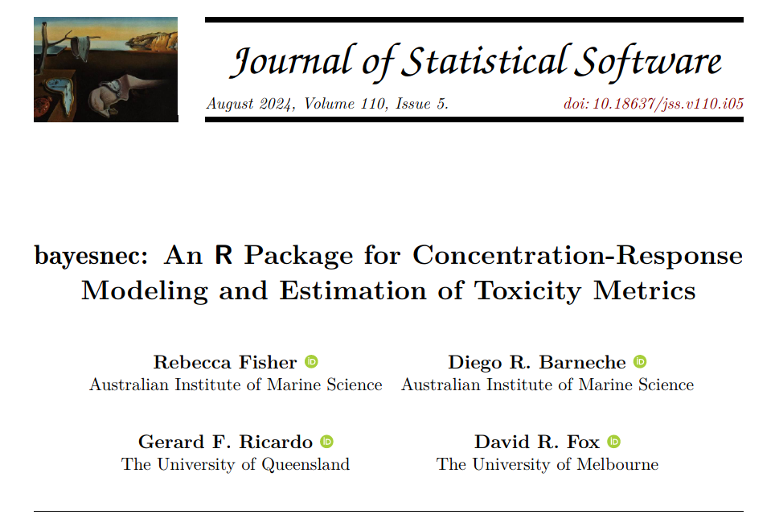

<!--
Slide assets.

The nine introduction slides are exported from the AIMS corporate template deck
`ignore/3.06-T01 - Fisher.pptx`, which is the talk that introduces AIMS, the
tropical ecotoxicology team, the ANZG, and the statistical methods adopted into
it. They are exported rather than rebuilt because they are composite layouts of
photographs, journal headers and a map that no reasonable amount of HTML would
reproduce faithfully.

`ignore/` is git-ignored, so the assets are local to the presenter's machine and
are not published with the repository. That is deliberate: the exported slides
contain screenshots of publisher-typeset journal pages, whose licences
`notes/image-provenance.md` records, and photographs of AIMS staff.

To rebuild them from the source deck:

  cp "ignore/3.06-T01 - Fisher.pptx" ignore/intro_for_export.pptx
  powershell.exe -NoProfile -Command "
  \$app = New-Object -ComObject PowerPoint.Application
  \$p = \$app.Presentations.Open('C:\Rworking\cr_modelling_training\ignore\intro_for_export.pptx', \$false, \$false, \$false)
  \$p.Slides(9).Delete(); \$p.Slides(1).Delete(); \$p.Save()
  foreach (\$s in \$p.Slides) { \$s.Export(('C:\Rworking\cr_modelling_training\ignore\slide_assets\intro{0:d2}.png' -f \$s.SlideIndex), 'PNG', 1600, 900) }
  \$p.Close(); \$app.Quit()"

Slide 1 of the source is its own title slide and slide 9 is a build-up
duplicate of slide 10, so both are dropped. Two headings were renumbered in the
copy, because cutting the talk down left two developments both numbered "2.".

`aims_template.jpg` is the slide master background of the template, taken from
`ppt/media/image4.jpg` inside the same file. `title_bg.png` is slide 1 of the
source deck with its `TextBox 6` deleted and the slide exported the same way,
so that this deck's own title is set in HTML over the front cover.
-->

## {background-image="../ignore/slide_assets/intro01.png" background-size="contain" background-color="#ffffff" .image-slide}

::: {.notes}
Acknowledgement of Country. Wadjuk people of the Noongar nation.
:::

## {background-image="../ignore/slide_assets/intro02.png" background-size="contain" background-color="#ffffff" .image-slide}

::: {.notes}
AIMS: Australia's tropical marine research agency. Townsville, Perth, Darwin.
I am based in Perth.
:::

## {background-image="../ignore/slide_assets/intro03.png" background-size="contain" background-color="#ffffff" .image-slide}

::: {.notes}
The Tropical Ecotoxicology and Risk Assessment team. Darren Koppel, bottom
left, is in the room today as one of the helpers.
:::

## {background-image="../ignore/slide_assets/intro04.png" background-size="contain" background-color="#ffffff" .image-slide}

::: {.notes}
Where the numbers go. The method document at the bottom of the chain is what
the next three slides are about.
:::

## {background-image="../ignore/slide_assets/intro05.png" background-size="contain" background-color="#ffffff" .image-slide}

::: {.notes}
First of three statistical developments: species sensitivity distributions in
`ssdtools`, now approved for use in the ANZG.
:::

## {background-image="../ignore/slide_assets/intro06.png" background-size="contain" background-color="#ffffff" .image-slide}

::: {.notes}
Second: mixture distributions for bimodal sensitivity data.
:::

## {background-image="../ignore/slide_assets/intro07.png" background-size="contain" background-color="#ffffff" .image-slide}

::: {.notes}
Third, and the one this course is built on: the no-significant-effect
concentration, and model averaging across a candidate set.
:::

## {background-image="../ignore/slide_assets/intro08.png" background-size="contain" background-color="#ffffff" .image-slide}

::: {.notes}
Warne et al. (2025) is the current technical guidance. Every method in it is
free and open source, which is why a day like this one is possible at all.
:::

## The package this course uses

:::: {.columns}

::: {.column width="44%"}
{width="100%"}
:::

::: {.column width="52%"}
`bayesnec` was developed at AIMS by Diego Barneche and me, and is described in
*Journal of Statistical Software* 110(5).

It fits concentration-response models in a Bayesian framework through `brms` and
Stan, and derives NEC, NSEC and ECx estimates from one equation or averaged over
a candidate set.

The whole of today is spent in it.
:::

::::

::: {.notes}
Hand over from the ANZG context to the software. Ten minutes gone by here.
:::

## Presenter and helpers

Rebecca Fisher, Australian Institute of Marine Science, presenting.

Alex Bastick and Darren Koppel are helping. They are in the room through every
session where you run code.

Put a hand up and one of them will come to you. Do not wait for the break.

::: {.notes}
Point both of them out. They have the fits bundle, the live scripts, and the
three failures that check_setup.R reports.
:::

## Concentration-response data

```{r}
#| label: crdata
#| fig-width: 8
#| fig-height: 3.3
#| fig-align: center
library(ggplot2)
data("nec_data", package = "bayesnec")
ggplot(nec_data, aes(x = x, y = y)) +
  geom_point(size = 2.4, alpha = 0.75, colour = "#005b9e") +
  labs(x = "Concentration", y = "Response") +
  theme_classic(base_size = 18)
```

An exposure across a concentration series, with a measured response at each
concentration. The response falls as concentration rises, and the question is
where it begins to fall and by how much.

::: {.notes}
One slide only. Everything about how the curve is fitted and read belongs to
modules 2 and 3.
:::

## The outcomes

By the end of the day you will be able to:

- distinguish linear, non-linear and threshold concentration-response models,
  and say which suits a given endpoint;
- identify the statistical distribution appropriate to a response variable;
- fit concentration-response models in R and plot the results;
- derive NEC, NSEC and ECx estimates, and explain what each measures;
- apply model averaging across a candidate set, and interpret the weights;
- produce a complete workflow for estimating no-effect toxicity, suitable for
  use in a species sensitivity distribution.

## The shape of the day

:::: {.columns}

::: {.column width="49%"}
### Morning

::: {.agenda}

| Time | Min | |
|---|---|---|
| 09:30 | 30 | Arrival, coffee, installation check |
| 10:00 | 15 | Welcome and introduction |
| 10:15 | 30 | 1. The software stack [demonstration]{.mode} |
| 10:45 | 15 | Break, coffee in Room 301 |
| 11:00 | 50 | 2. Fitting a single model [hands-on]{.mode} |
| 11:50 | 40 | 3. Toxicity estimation and the model set [hands-on]{.mode} |
| 12:30 | 45 | Lunch, one level below |

:::
:::

::: {.column width="49%"}
### Afternoon

::: {.agenda}

| Time | Min | |
|---|---|---|
| 13:15 | 45 | 4. Model averaging and multi-model inference [hands-on]{.mode} |
| 14:00 | 30 | 5. Response data and distributions [demonstration]{.mode} |
| 14:30 | 15 | Break, coffee and snacks |
| 14:45 | 30 | 6. Priors and Bayesian inference [demonstration]{.mode} |
| 15:15 | 35 | 7. A worked case study, with module 8 shown [walk-through]{.mode} |
| 15:50 | 10 | Close, and what to read next |
| 16:00 | | Finish |
| 16:30 | | Conference opening ceremony |

:::
:::

::::

::: {.notes}
285 teaching minutes. Lunch is bento boxes and can be brought back to the room.

The three modes, if anyone asks: hands-on means you run the code as it is
introduced, demonstration means you watch it run and have the script to run
later, and walk-through means the page is read and its output discussed. The
"Running the code" slide covers this.
:::

## Running the code

The page on the projector is the page on your own screen, and each module shows
the code that produced every result on it.

Every fit appears as three steps: the `bnec()` call, the `save()` that keeps
the result, and the `load()` that reads it back. On the page, the load is what
runs.

A model-averaged set takes minutes to hours to fit. In the live scripts the
short single fits run in the room, and the long fits are commented out and
loaded instead.

The saved objects are the download named in the setup instructions, and they are
on the USB sticks at the front.

::: {.notes}
That three-step sequence is what a real analysis does, which is why it is on the
page rather than hidden.
:::

## The material

<https://open-aims.github.io/cr_modelling_training/>

The site stays available after the workshop, and the source is at
<https://github.com/open-AIMS/cr_modelling_training>. Corrections and questions
are welcome as issues on that repository, including after today.

It includes a reference page fitting the same models with `drc`, which is not
taught today and is there for anyone comparing a frequentist result with a
Bayesian one.

Module 1 is next: what R, Stan, `brms` and `bayesnec` each contribute, and how
they fit together. Open the site, and open Positron beside it.

::: {.notes}
10:15. Hand to module 1.
:::
