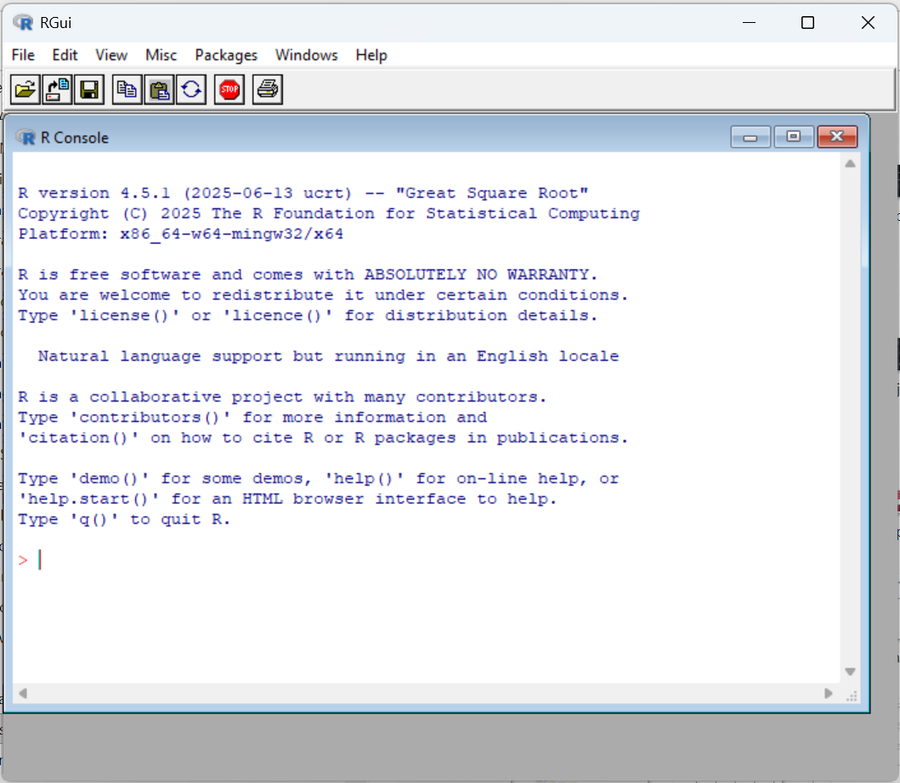
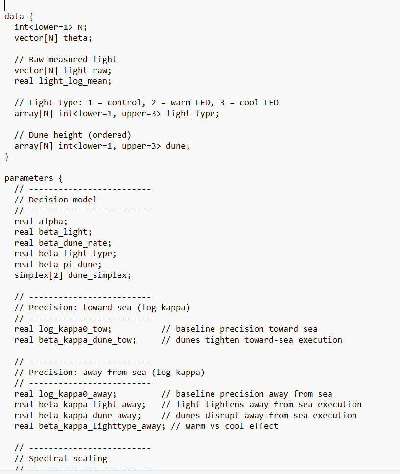
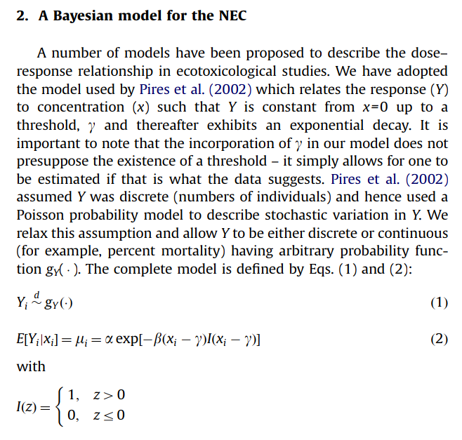

```{r}
#| label: setup
#| include: false
knitr::opts_chunk$set(echo = TRUE)
```

Fitting a concentration-response model using `bayesnec` requires several pieces of
software to work together, and a failure in any of them will mean the model cannot be fitted. 
Knowing what each layer does makes those
errors easier to understand, and it explains several things about the workflow that are
otherwise arbitrary: why the first model of a session is slow, why a C++
compiler has to be installed to fit a curve, and why a fitted object is large.

## The working environment

`bayesnec` is written in the R statistical programming language. 

{#fig-R}

R can be run on its own, through the basic interface in @fig-R, but almost no
one uses it that way. Separate programs provide an interface that makes R
easier to work with.

The course uses the Positron integrated development environment (IDE), which
is free to use and provides an interface to R.

It is available for Windows, macOS and Linux. Positron is the newer of the two
IDEs for R from Posit, the developers of RStudio, and is built on Code OSS, the
open-source core of Visual Studio Code. We expect it to replace RStudio for
many users, and it has features that we think make it worth adopting now.

In Positron, a new session starts essentially empty. The console shows which R version (interpreter) has started. 

{#fig-positron-new}


{#fig-positron-run}

Four parts of that window are worth knowing before we do any modelling.

The editor, top left, holds the script. Run the current line or selection
with `Ctrl`+`Enter` (`Cmd`+`Enter` on macOS) and it is sent to the console below.

The console, bottom left, is the running R session. It echoes what it was
sent, so @fig-positron-run shows the same four lines in both panes.

The Variables pane, top right, lists every object in the session with its type and
contents: `x` as an integer vector of ten values and `y` as a double in the
figure. It is the quickest way to see whether an object is what you expected,
which matters later when a fitted model is a deeply nested list rather than a
vector.

The Plots pane, bottom right, collects the figures produced, with arrows to step back
through earlier ones and a control to save the current figure.

The editor is the most important of the four, because it is where you write
your R code. Code is sent from the script to the console a line or a block at a
time, rather than typed into the console directly, so the script is a
permanent record of everything that was done in the analysis. It can be re-run
from the top to reproduce the results.

This scripting workflow is in many ways a better way of working than most
pre-packaged software, where the user clicks buttons and the software does
things behind the scenes. Reproducibility is a serious problem in science,
including the environmental sciences.

The interpreter in use, which is R in this course, is named at the top right of
the window, with the open project beside it. Check it when something is missing
that you know you installed: more than one R on a machine is common, and each
has its own library, so a package installed under one is absent under another.
You can also run other software, such as Python, from inside the Positron
console, but that is not needed in this course.

Two habits matter more here than in ordinary R work, although we would apply
them to any R project.

The first is to work in a project. A project fixes the working directory, so relative paths
like `read.csv("mydata.csv")` resolve the same way for everyone. Without one, the
same script behaves differently on two machines for reasons that are tedious to
diagnose.

The second is not to save the workspace. R offers to store the objects in memory when a
session ends and to restore them when it starts. Accept that and you will
eventually be working with a fitted model whose provenance you cannot
reconstruct: fitted under code you have since edited, and indistinguishable from
a current one. Start every session empty and re-run the script. The exception is
a Bayesian fit, which takes long enough to sample that it is saved deliberately
to a file, as module 2 shows.

## The dependency chain

```{mermaid}
%%| label: fig-stack
%%| fig-cap: "Each layer is called by the one above it."
flowchart TD
    A["<b>bayesnec</b><br/>concentration-response models,<br/>priors, toxicity estimates"]
    B["<b>brms</b><br/>R formulas to Stan code"]
    C["<b>cmdstanr</b> or <b>rstan</b><br/>the interface to Stan"]
    D["<b>Stan</b><br/>the sampler, written in C++"]
    E["<b>C++ compiler</b><br/>Rtools, Xcode CLT, or gcc"]
    A --> B --> C --> D --> E
```

Stan is the underlying engine. It is a separate piece of software, not an R package,
that performs Bayesian inference by Hamiltonian Monte Carlo. A Stan program
describes a statistical model; Stan translates it to C++, compiles it into an
executable, and runs that executable to draw samples from the posterior. 

A Stan model is a program that has to be built
before it can run, which is why a C++ compiler is required.

This may seem opaque if you are not familiar with Bayesian statistics. Module 6
covers Bayesian inference and how Stan samples in more detail.

`cmdstanr` and `rstan` are two R interfaces to Stan, and `brms` can use
either. This course uses `cmdstanr`, which drives a normal CmdStan installation
as a separate process. `rstan` embeds Stan inside R instead, which couples the
Stan version to the package version and has historically been the more fragile
arrangement on Windows. 

`rstan` still has to be installed, because `brms` imports
it, but we do not use it here because `cmdstanr` is faster and more reliable.

You can set the backend once at the top of any script, and the whole session will use that backend:

```{r}
#| label: backend
#| eval: false
options(brms.backend = "cmdstanr")
```

If you don't set this, `rstan` will be used by default.

`brms` [@Burkner2017; @Burkner2018] is an R package that removes the need to write Stan code.

Coding up models by hand in Stan is quite complicated and beyond the capability of most ecotoxicologists to implement in practice. 

Relatively complex models can be fitted with `brms` using a formula syntax. A
typical model specification might be
`response ~ predictor1 + predictor2 + (1 | group)`, which is the syntax used by
`lme4` and many other R packages.

@fig-stancode shows an example of Stan code written by hand, which is what
`brms` writes for you.

{#fig-stancode}

`brms` is an extremely flexible Bayesian modelling package that supports a wide range of response
distributions and model structures (non-linear and smooth terms, multilevel
structure, censoring, and distributional regression) and provides the methods
for checking a fit once it exists. Later modules use several of these.

`bayesnec` [@fisheretal2024] is the package this course is focused on.
`brms` will fit a
non-linear model, but only if you supply the equation, sensible starting values
and priors for every parameter. For concentration-response work that is the
barrier: the models are non-linear, the priors are not obvious and `brms` provides no defaults, and a poorly
initialised non-linear fit fails in ways that need relatively advanced statistical 
understanding in order to resolve. The greater complexity of implementing Bayesian modelling is a
substantial part of why Bayesian methods are not widely used for *NEC* estimation
in ecotoxicology, where specialist statistical support is rarely available.

`bayesnec` takes a short formula naming a concentration-response equation and,
from it and the data, constructs the full non-linear `brms` formula, generates
priors and initial values, and fits the model. Where no family is given, it
chooses a distribution from the class and range of the response. It then
provides functions for extracting the toxicity estimates used in ecotoxicology
from the fitted model.

The idea behind `bayesnec` was to make non-linear Bayesian concentration-response modelling accessible to 
ecotoxicologists without specialist statistical expertise. 

## Package history

The package began as `jagsNEC` [@Fisher2020], an implementation of the *NEC*
model of @Fox2010 using JAGS. JAGS is a separate Bayesian sampler, widely used
from R, that reads models written in the language of BUGS, one of the earliest
Bayesian software packages.

::: {#fig-fox2010 layout-ncol=2}

{#fig-fox2010-article}

{#fig-fox2010-model}

The *NEC* model of @Fox2010.
:::

@fig-fox2010 gives the model that `jagsNEC` implemented. The mean response is
constant at $\alpha$ up to a threshold concentration $\gamma$ and decays
exponentially above it, at a rate $\beta$. That threshold is the *NEC*, and it
is a parameter of the model, estimated with an interval like any other, rather
than a quantity read off a curve after the fit.

`bayesnec` was rewritten on `brms` and Stan, largely because of the extensive
set of functions `brms` provides for working with Bayesian model output.

`bayesnec` has also been
generalised well beyond the original: the supported response distributions now
include the beta-binomial alongside the Gaussian, Poisson, binomial, gamma,
negative binomial and beta of the original. The development version also supports some of the `brms` hurdle families.

Any `brms` family can in
principle be added.

The model set was also extended. Alongside the threshold models that estimate an
*NEC* directly, `bayesnec` includes smooth concentration-response equations of the
kind used in most frequentist packages such as `drc` [@Ritz2015] — three-, four- and five-parameter
logistic and Weibull curves among them — which model the response as a smooth
function of concentration rather than with a breakpoint. Module 3 sets out the
full set and what each one supports.

## Versions

The versions in use when a model is fitted should always be recorded as part of
the result, because default settings and the behaviour of estimators can change
between releases. They can be printed with:

```{r}
#| label: versions
#| comment: ""
for (p in c("bayesnec", "brms", "cmdstanr", "rstan", "posterior")) {
  cat(sprintf("%-10s %s\n", p, as.character(packageVersion(p))))
}
cat(sprintf("%-10s %s\n", "R", getRversion()))
```

This course is built against the development version of `bayesnec`, which is
newer than the release on CRAN. The development branch adds functions and changes
some behaviour, and modules 7 and 8 use several functions that are not in the
release.

## Documentation and support

The `bayesnec` reference site at
[open-aims.github.io/bayesnec](https://open-aims.github.io/bayesnec/) is the
place to start.

{#fig-website}

*Reference* is the authoritative description of every argument, and is worth
preferring over any transcription of it, including the ones in this course.
*Changelog* matters more than it usually does for a package under active
development: estimator behaviour and default priors have both changed between
recent versions.

### The development site

That address documents the released version. This course teaches the
development version, and the two sites are separate:

| Version | Site |
|---|---|
| released, on CRAN | <https://open-aims.github.io/bayesnec/> |
| development, the `dev` branch | <https://open-aims.github.io/bayesnec/dev/> |

Use the second. `bnec_group()`, `check_fit()`, `screen_models()`,
`failed_models()` and `bnec_record()` are all used in this course and none of
them is on the released site, so looking a course function up at the first
address returns nothing and reads as though the function does not exist.

The two are one `pkgdown` site with the development build published into a
`/dev/` subdirectory, which is why the address is the released one with `dev/`
appended. Any page transposes the same way: the priors article is at
`.../bayesnec/articles/example3.html` for the release and
`.../bayesnec/dev/articles/example3.html` for the development version. The
development site shows the version number in its header in a coloured badge,
labelled "In-development version" when the pointer rests on it, so which of the
two is open can be read off the page.

Check that the version in that badge matches what `packageVersion("bayesnec")`
reports in your session. The `dev` branch changes during the weeks a course is
being prepared, so a site built from a later version than the installed package documents behaviour the
installed package does not have.

The package is developed as open source software. We want to grow `bayesnec` and make it more useful to people.
Please provide feedback and report software bugs.

Please use the [issues](https://github.com/open-aims/bayesnec/issues) page to report any problems.

We can only fix a bug or diagnose a problem if we can reproduce it. That
requires a "reprex", a self-contained reproducible example: code and data that
someone else can run to see the same behaviour. Without a reproducible example a problem cannot
be diagnosed by anyone who does not have your dataset. 
A good resource for understanding how to build a reprex is the [reprex package](https://reprex.tidyverse.org/).

