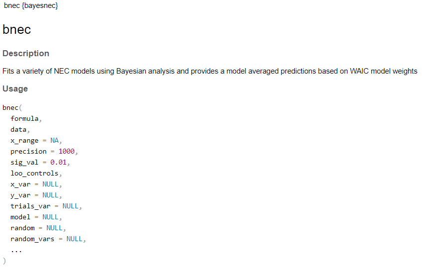
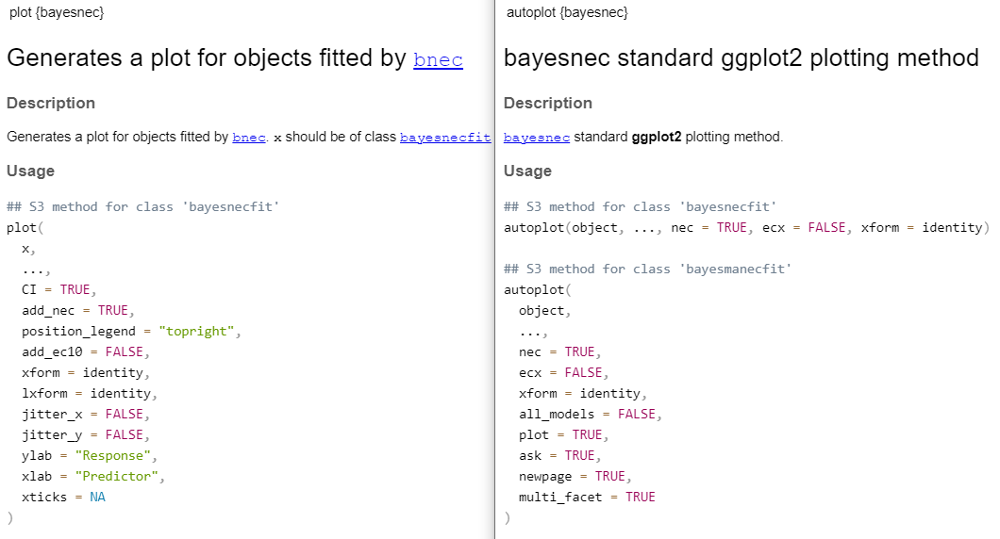

```{r setup, include=FALSE}
knitr::opts_chunk$set(echo = TRUE, cache = TRUE)
library(cmdstanr)
library(posterior)
library(bayesplot)
library(bayesnec)
library(dplyr)
library(ggplot2)
library(tidyr)
set_cmdstan_path("C:/cmdstan")
```

## Background

In our first session we covered a very basic understanding of `bayesnec`, including what it does, why it was developed, the `bayesnec` website and how to obtain help with issues.

We also went through in detail how to install the `bayesnec` dependencies, as this can sometimes be tricky, especially on windows.

Now that you are confident that `brms` is properly compiling, we will install `bayesnec` and run a very simple `bayesnec` model using the provided example dataset and the default `bayesnec` settings.  

The idea is to learn how to use `bayesnec` in the simplest way, and understand the the model fit that is returned and how to use some of the `bayesnec` and `brms` helper functions.

## Installation

Most R packages that are on CRAN have multiple available versions. There is usually a version lodged in CRAN that is considered stable, and will have a specific version number. Installing the latest release version is generally straightforward, and for a CRAN package can either be achieved using the *Install* button on the *Packages* tab of RStudio, or running the following code:

```{r, eval=FALSE}
install.packages("bayesnec")
```

Most CRAN packages are usually developed on a version control code repository open source platform, such as github. Typically, as is the case for `bayesnec`, the master branch reflects the CRAN version. New developments and bug fixes are generally housed on a dedicated development branch;

The current development version of `bayesnec` can be downloaded from GitHub via

```{r, eval=FALSE}
if (!requireNamespace("remotes")) {
  install.packages("remotes")
}
remotes::install_github("open-aims/bayesnec", ref = "dev")
```
It can be worthwhile using the development branch as this can sometimes contain important bug fixes not available on the CRAN version. Note that this can be 'unstable' - i.e. it can change without notice, so re-running code may result in a different outcome. If using the development version it is worth noting the corresponding github commit in your workflow, as this would be critical for complete reproducibility.

```{r dev-branch, fig.align='tight', out.width="100%", echo=FALSE}

```

## Loading bayesnec and the example dataset

Let's start by loading `bayesnec`:

```{r}
library(bayesnec)
```

`baysnec` comes with an example dataset we can use for testing, called nec_data. 
We load this using the data(). This has only two columns: x (concentration) and y (response).

```{r}
data(nec_data)
head(nec_data)
```

We will discuss later what type of response variables can currently be modeled using `bayesnec`, but for now we will just use `bayesnec`'s default settings to fit a `bayesnec` model using the three parameter NEC model of Fox 2010. We will cover what models are available in `bayesnec` and how models can also be called using model sets in later parts of this course.

## Setting seeds

It can be useful to set a seed so that we reproduce the same results. 

```{r, eval=FALSE}
set.seed(333)
```

The set.seed() function in R is used to create reproducible results when writing code that involves creating variables that take on random values. By using the set.seed() function, you guarantee that the same random values are produced each time you run the code, so you always get the same result. This can be useful for Bayesian analysis in particular, because these sample from random distributions as part of their fitting algorithm, and can sometimes produce slightly different results when run multiple times.

## The `bnec` function

The main working function in `bayesnec` is the function `bnec`, which calls the other necessary functions and fits the `brms` model. We have attempted to make the `bnec` function as easy to use as possible, targeting the R user that is familiar with the usual model fitting syntax in R, but without specialist expertise in non-linear modelling and Bayesian statistics.

To see all of the arguments available for `bnec` use `?bnec`.

```{r bnec_function, fig.align='tight', out.width="80%", echo=FALSE}

```

Only the first five arguments to `bnec` are currently in use, the remainder have been deprecated following a major re-write of the software that was a result of editorial review in the Journal of Statistical Software.

Additional arguments can be passed to the underlying `brm` call using `...`. For the full list of arguments that can be set using `brm` use `?brm`

We won't be going into all of the `brm` arguments in detail. Of particular note are the arguments *family*, *priors* and *inits* for which `bayesnec` has inbuilt algorithms for guessing and supplying appropriate values as defaults, that differ to the `brms` defaults.  We have also increased the number of iterations from the default of 2,000 in `brms` to 10,000 in `bayesnec`. This is because we have found that this is often required for more complex non-linear models. We have also set the warm up to be larger, so that the overall number of draws returned is similar to `brms`.

It is of course possible to specify these manually, by passing appropriate values through to the underlying `brm` function.

## The `bnec` formula

The basic formula for a `bayesnec` model is of the form:

```{r, eval=FALSE}
y ~ crf(x, model = "modelname")
```

The left-hand side of the formula contains our response (aka dependent, or y variable, in this case *y*), and this is implemented exactly as in `brms` (including the `trials` term for a binomial, which we will discuss later when we look at the available distributions in `bayesnec`). 

The right-hand side of the formula contains the special internal function `crf`, and takes the predictor or concentration variable (aka independent predictor, or x variable, in this case *x*) and the name of the model we want to fit. We can also include any simple transformations of the predictor, such as `log`.

The internal function `crf` is a custom `bayesnec` syntax that allows us to specify the model we want to fit, and stands for **c**oncentration-**r**esponse **f**unction. We use this to call the model that we want to fit using the predictor specified, via the model name. 

The complete list of currently available models in `bnec` is `r models()$all `

The models available in `bayesnec` are discussed in the [Model details](https://open-aims.github.io/bayesnec/articles/example2b.html) Vignette, and we will cover these in more detail later in this course. 


You can also specify a suite of models, a custom set of models, or all of the models, which is discussed in the [Multi model usage](https://open-aims.github.io/bayesnec/articles/example2.html) Vignette and also covered in more detail later.

As with any formula in R, the names of the terms need to be exactly as they are in the input data.frame.


## Calling `bnec`

As mentioned, we can run `bnec` by supplying only a formula and the data.frame containing the data - 
`bayesnec` will use default settings for all other arguments.

```{r}
set.seed(333)
bnec_fit <- bnec(y ~ crf(x, model = "nec3param"), data = nec_data)
```

When you run this model, it will first take some time compiling. Stan programs are written in the Stan modeling language, translated to C++ code, and then compiled to a dynamic shared object (DSO). The DSO is then loaded by R and executed to draw the posterior sample.

Once the model compiles, it will start sampling. How long the compiling and sampling take will depend on a range of factors, such as the speed of the computer you are using, how many chains you run, and how many iterations you ask for. It is worthwhile using at least as many cores as you have chains when you run a `bayesnec` model. More than that requires some additional set-up, so generally there is not much point.

You can set the number of cores used via `options(mc.cores = 4)`.

Once the model is fit `bayesnec` prints a message indicating which model was fit, and the statistical distribution (family) that was used. In this case the response variable was modeled as a *nec3param* model using a beta distribution.

There may be other warnings also printed, and some of these are worth noting. In this case the messages relate to estimating model weights, which is irrelevant for our single model usage case. We will discuss these in more detail later.

## Saving the `bayesnec` model

Once we have fitted our model, there are many functions that we can use to explore the model fit, check it fitted properly, plot and extract the toxicity metrics of interest. 

However, before we do any of that, we highly recommend saving the model fit as a .RData file as soon as it is finished, so that it can be retrieved and explored at a later date. We can do this by simply using `save`.

```{r}
save(bnec_fit, file = "fitted_model.RData")
```

Note that saved Bayesian model objects can be very large - so be mindful of where you are saving these and if that is a sensible place (ie onedrive is not always a good idea).

```{r rdata-object, fig.align='tight', out.width="80%", echo=FALSE}
knitr::include_graphics("images/rdata_object.PNG")
```

## The `bayesnecfit` summary()

Let's start by re-loading our fitted model and showing a simple summary using:

```{r}
load("fitted_model.RData")
summary(bnec_fit)
```

This tells us that we have an object of class `bayesnecfit` containing the non-linear model *nec3param*. `bayesnec` will return a `bayesnecfit` object when only a single model is fit. A `bayesmanecfit` class is returned if there are more than one model (discussed in more detail later). Again, it shows the family that was used for the fit, in this case the beta, with identity links for both of the family parameters. Again we will discuss this in more detail later.

The actual `brm` formula of the model that was fitted is printed, which can also be very useful.
The Bayesian R2 values give an indication of model fit, and in this case is very high.

Note the Rhat values in this example are one, indicating convergence.

## Evaluating the `brm` model fit

There are a range of model diagnostics that can be explored for brms model fits. We encourage you to explore the rich material already on GitHub regarding use and validation of brms models, and will only touch on this briefly here.

We can extract the underlying `brm` model using the function `pull_brmsfit`.

```{r}
brm_fit <- pull_brmsfit(bnec_fit)
```

One of the most valuable ways to see how well a Bayesian model has converged is to inspect the chains. This can be done visually using:


```{r}
plot(brm_fit)
```

From this plot you can see a histogram of the estimated parameters, and assess mixing of the four chains. The model fit looks great!

## Contents of the `bayesnecfit` model object

The `bayesbecfit` model object is basically a list of useful information associated with the fitted model, as well as the underlying `brm` model which we already showed can be extracted. 


```{r}
names(bnec_fit)
```

This includes summaries all of the parameter estimates, as well as a data.frame of predicted values that can be used for custom plotting if desired. 

```{r}
head(bnec_fit$pred_vals$data)
```

All `bayesnec` fitted models have a posterior estimate of the "No-Effect" toxicity. This is currently labelled nec_posterior (regardless of the type of model, NEC- or ECx - see latter discussion on model types). For NEC type models this the posterior of the actual NEC paramter, for ECx models this is the posterior of the estimated NSEC [@fisherfox2023]. We will cover this in more detail in the next tutorial.

```{r}
hist(bnec_fit$nec_posterior)
```

```

## Options for plotting the fitted model

The functions `plot` (extending `base` plot method) and `autoplot` (extending `ggplot2` plot method) can be used to plot the fitted model. These have a range of arguments to allow some customization of the plots.

```{r plot-args, fig.align='tight', out.width="100%", echo=FALSE}

```

You can also make your own plot from the *pred_vals* data element included in the returned object (class `bayesnecfit`) from the call to `bnec`.


## autoplot()

Most of you will be most familiar with using ggplot2, so we will use that here via *autoplot()* for plotting our model.

```{r}
autoplot(bnec_fit) +
  xlab("Concentration")
```

We are using the normal `ggplot` syntax with `+` to customize the access label - and most of the typical `ggplot` functions that allow annotation should work with a `bayesnec` autoplot call.

By default autoplot will return fitted NEC value, and print an estimate with 95% CI's in the upper right hand corner. The plot is labelled with the fitted model, in this case the *nec3param*. By default the NEC is labelled as the N(S)EC which probably isn't appropriate for this model (it is in fact an NEC model) and should be changed to NEC. We will discuss this in a lot more detail later.

## Toxicity estimates

Aside from automatically returning a posterior estimate of the no-effect toxicity based on default settings, we have developed a few helper functions for extracting toxicity estimates from the fitted models that allow the user to specify relevant arguments. 

The main functions are `ecx`, `nec` and `nsec`. We will cover these in detail when we discuss the models available in `bayesnec` next. For now, lets just extract the **NEC** and the **EC10**.


```{r}
ecx(bnec_fit)
nec(bnec_fit)
nsec(bnec_fit)
```

You can see these return by default summarised estimates, showing the median and the 95% probability density interval. By default the function `ecx` returns the **EC10** value, and this information is captured as an attributed of the returned object.


The default NSEC is based on a 0.01 signifivant value, and this is also shown as an attribute.
I'll describe the NSEC concept to you in more detail in the next tutorial.

The next tutorial will explain in detail the types of models that can be fitted in `bayesnec` and how these link to the toxicity estimates that can be derived. This will then make it easier to understand the specific usaer controlled arguments that can be passed to these different functions.

For this example EC10, NEC and NSEC all return very similar values.


