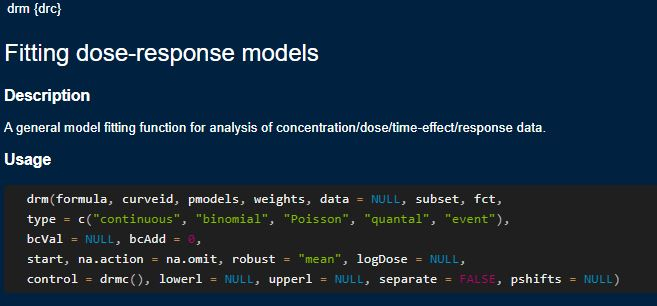
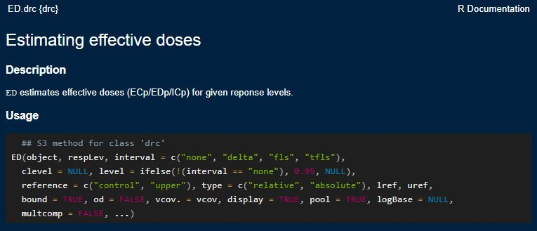

```{r setup, include=FALSE}
knitr::opts_chunk$set(echo = TRUE, cache = F, warning=F)
library(drc)
library(tidyverse)
library(bayesnec)
```

## Background and installation
The package `drc` is provides a suite of flexible and versatile model fitting and after-fitting functions. It was developed by Professor Christian Ritz (National Institute of Public Health, Denmark) and Professor Emeritus Jens Streibig (University of Copenhagen, Denmark).


A range of resources exist that can help you in your dose-response modelling journey:

- Christian Ritz's dose response modelling [website](https://bioassay.dk/)

- The drc package Plos One [paper](https://doi.org/10.1371/journal.pone.0146021) (and it's supplementary information which has worked examples) 

- User generated online [content](https://rstats4ag.org/dose-response-curves.html)


Install `drc` like any other R package. Use the *Install* button on the *Packages* tab of RStudio, or run the following code:

```{r, eval=FALSE}
install.packages("drc")
```

## Loading drc and the dataset

Installed packages need to be loaded before their functions can be used. Load `drc` using the library function in the code below. We plot a concentration-response curve using the same dataset  used in the `bayesnec` example, so let's load `bayesnec` as well: 

```{r, warning=FALSE}
library(drc)
library(bayesnec)

```


Data is loaded using the data() function. We can do this because the dataset exists within the `bayesnec` package. If we need to import data from an excel spreadsheet, we would use RStudio's import tool or a package like `readxl`. 

```{r}
data(nec_data)
head(nec_data)
```
The data has only two columns: x (concentration) and y (response).

## The `drm` function

The dose response model fitting function in `drc` is `drm`. As with any function in a package, you can check the help file for the types of arguments that the function takes. 

To see all of the arguments available for `drm` use `?drm`.

```{r drm_help, fig.align='tight', out.width="80%", echo=FALSE}

```

The key arguments we need are: 

- **formula**: description of the model to be fit, takes the form y~x or y/weights~x for binomial and quantal data 

- **weights**: a vector (list of numbers) of weights for binomial and quantal type data

- **data**: the data frame for the variables (i.e, concentration and response values) in the model  

- **fct**: the function (model) to be applied 

- **type**: the type of data being used in the model (if a value is not supplied it will default to continuous)

Typical code for a model looks like: 

```{r, eval=FALSE}
drm(response~concentration, data=datafile, fct=LL.3(), type="continuous")
```

Running the code above will fit the model but not save it. We usually want to save the model so we can use after-fitting functions (needed to calculate ECx values):

```{r, eval=FALSE}
model<- drm(response~concentration, data=datafile, fct=LL.3(), type="continuous")
```

Like with `bayesnec`, the left-hand side of the formula is the response and the right hand side is the concentration. The terms *response* and *concentration* need to exactly match the columns in the data file (and it is case sensitive!). 

## Fitting a model

Let's fit our first model. The log-logistic 4-parameter is a good default starting point for most applications. 

We won't provide anything for the 'type' argument because we know it defaults to 'continuous'. 

```{r}
model_LL4<- drm(y~x, data=nec_data, fct=LL.4()) 
plot(model_LL4)
```


Because drc operates in the land of frequentist statistics, we don't need to set a seed to create reproducible results like with Bayesian approaches. We also don't need to save the model output data to our computer because it will be a very small data file and is not computationally intensive to rerun. 


## Binomial data 

Binomial data measures response as one of two possible outcomes. In ecotoxicology this is most commonly used for acute toxicity tests with 'alive' vs 'dead' measurements.

To fit a concentration-response model to binary data in `drc`, we need to provide additional information to the `drm` function because we model the probability of the binary response for a given concentration. 

Let's look at one of the `drc` datasets, *daphnid*:

```{r daphnids}
data(daphnids)
head(daphnids)
```
From the data description: The number of immobile daphnids –in contrast to mobile daphnids– out of a total of 20 daphnids was counted for several concentrations of a toxic substance.

There are 4 columns in this dataset, our concentration *dose*, the number of immobile daphnids *no*, the total number of daphnids in each replicate *total*, and the time of observation *time* (24 or 48h). 
 
We need to supply *weights* to the `drm` function for every measured response for binary data. This allows the model to convert the response (count of immobile daphnids) to a probability. 

Because we have daphnid immobility data from two timepoints, identified by the *time* column in the dataset, we can use a the *curveid* argument to fit separate models to each time point. 

```{r}
daphnids.m1 <- drm(no/total~dose, weights = total,curveid = time,
                   data = daphnids, fct = LL.2(), type = "binomial")

plot(daphnids.m1)

```


## Inspecting our `drc` model

We can inspect our model using a range of after-fitting functions in drc. 

The first step should be to use the *summary()* function: 

```{r}
summary(model_LL4)
```

The summary gives us information about the parameter estimates (the estimated value and their standard error) as well as the outcome of a statistical test that takes the form "is the parameter value different from 0". 

The parameter estimates for any of the drc 4-parameter models are labelled b, c, d, and e by default.These parameters refer to: 

- **b** slope (sometimes called hillslope)

- **c** lower asymptote 

- **d** upper asymptote 

- **e** model midpoint or inflection point (or threshold no-effect level for `nec` models)

When the lower and upper asymptotes represent the maximum possible response range (i.e., 0 to 1 or 0 to 100%), then the 'e' parameter will be equivalent to the EC50. 

For the most part, the model parameters should be significantly different from 0 (*b*, *d*, and *e*, the it could be that the lower asymptote should be 0!)

Another check may be of the normality of residuals. `drc` has a function to easily extract residuals which can then be plotted and tested for normality via a Shapiro–Wilk test. This is not appropriate for binomial or count (quantal) data. 

```{r}
model_residuals<- residuals(model_LL4)
hist(model_residuals)

shapiro.test(model_residuals)
```

The histogram of the residuals looks normal and the outcome of the Shapiro-Wilks test gives a p-value > 0.05 implying that the distribution of the data are not significantly different from normal distribution.

## Calculating ECx values from our model with *ED*

Once we are happy with our model fit, we can calculate the ECx values using the *ED* function. 

Let's first check what arguments are required for `ED` using `?ED`.

```{r drm_function, fig.align='tight', out.width="80%", echo=FALSE}

```

At a minimum, *ED* takes: 

- **object**: this is our saved drc model, model_LL4

- **respLev**: the effect size that we want to estimate (i.e., 10 for an EC10)

- **interval**: this is the method used to estimate a uncertainty around the ECx estimates

Putting it together we get: 

```{r}
LL4_ED<- ED(model_LL4, c(10,50), interval="delta")
```

Where the estimate is our ECx value which is bounded by the confidence intervals *lower* and *upper* (defaults to 95%)

Note that `drc` will by default calculate a relative ECx value. That is, the concentration that results in a x% effect relative to the upper and lower asymptote of the model (the c and d parameters). This is the opposite of `bayesnec` and may or may not be important, depending on your data! 


```{r 4para_models, echo=FALSE, results='hide',message=FALSE}
ggplot()+
  scale_x_log10(limits=c(0.1,10))+
  scale_y_continuous(limits=c(0,100), breaks = c(0,20,40,50,60,80,100))+
  
  geom_segment(aes(x=0, y=100, xend=0.2, yend=100), lwd=1, colour = "darkblue")+
  geom_segment(aes(x=5, y=20, xend=10, yend=20), lwd=1, colour = "darkblue")+
  geom_segment(aes(x=0.2, y=100, xend=5, yend=20), lwd=1, colour = "darkblue")+
  geom_hline(yintercept=60, linetype=2,lwd=1)+
  geom_hline(yintercept=50, linetype=3,lwd=1)+
  geom_label(aes(x=1.4, y=65, label="Midpoint"))+
  geom_label(aes(x=1.3, y=45, label="EC50"))+ 
  geom_point(aes(x=c(1,1.5), y=c(60,50)), cex=5, colour="grey30")+
  
  theme_bw()+
  labs(x="Concentration", y="Response")

```

## Plotting your `drc` model

Two common ways of plotting your `drc` model include with base R or the package ggplot2 (part of the Tidyverse package set). 

We've already plotted some models using R's in-built *plot* function. This is the simplest approach and directly takes the `drc` model object. There are a wide range of arguments that will allow you to customise your model. 

```{r}
plot(model_LL4, log="x", xlab="Concentration", ylab="Response")
```

To plot using ggplot (from the `tidyverse` suite of packages), we need to use the *predict* function to create a dataframe for the model line and confidence intervals. We can use the original dataset to plot the individual data points.

To use the *predict* function we first need to create a dataframe with a concentration range we want the model line and confidence interval to be plotted on. *seq* is a handy function that will create a list of numbers starting at the 'from' argument ending at the 'to' argument, with the number of numbers equal to the length inbetween. Here we start at the minimum value in our original dataset and end at the maximum value. 

```{r}
pred_data <- expand.grid(x=seq(from=min(nec_data$x), to=max(nec_data$x), length=1000))
```

Now we can use the *predict* function to predict corresponding model values from the 'x' values we have created in our dummy data set "pred_data". The rest of the code adds the predicted values back to the dummy data frame so everything is in one place. 

```{r}
pm <- predict(model_LL4, newdata=pred_data, interval="confidence", level=.95)
pred_data$p <- pm[,1]
pred_data$pmin <- pm[,2]
pred_data$pmax <- pm[,3]
```


Now we can pull everything together to make a ggplot. 


```{r}
ggplot()+
  geom_line(data=pred_data, aes(x=x, y=p))+ #model line
  geom_ribbon(data=pred_data, aes(y=p,ymin=pmin, ymax=pmax, x=x), alpha=0.3)+
  geom_point(data=nec_data, aes(y=y, x=x), pch=21) #pch is an argument that defines the point shape
```

There is an infinite number of arguments that you can use to customise these plots to your aesthetics. 


```{r}
ggplot()+
  geom_line(data=pred_data, aes(x=x, y=p), colour="#808080", lwd=0.8, linetype=2)+ #model line
  geom_ribbon(data=pred_data, aes(y=p,ymin=pmin, ymax=pmax, x=x), alpha=0.3, fill="#F7B9D7")+
  geom_point(data=nec_data, aes(y=y, x=x), pch=21, fill='#E0218A')+ #pch is an argument that defines the point shape

scale_x_log10(labels = scales::trans_format("log10", scales::math_format(10^.x)),
              breaks= scales::trans_breaks("log10", function(x) 10^x, n=3))+
  
annotation_logticks(base = 10, side = "b")+
  
labs(x=("Concentration"~(mg~L^{-1})), y="Response")+  
theme_minimal()+
theme(axis.title = element_text(size=rel(1.2), colour='pink4', face='bold'), 
      axis.line=element_line(arrow=arrow()))
```


