```{r setup, include=FALSE}
knitr::opts_chunk$set(echo = TRUE, cache = TRUE)
library(posterior)
library(bayesplot)
library(bayesnec)
library(dplyr)
library(ggplot2)
library(tidyr)
```

## Background

Now we have covered the very basics of fitting a `bayesnec` model and working with and interpreting the output, we will now delve into more detail what models are currently available to be fit using `bayesnec`, and what toxicity estimates can be provided by different types of models. 

In particular, as `bayesnec` was designed for estimating no-effects toxicity concentration values, we will explain exactly how these estimates are derived, based on the specific model being fitted.

By the end of this tutorial, you will understand what models are available and specific details associated with this graphic from our recent ET&C paper [@fisherfox2023].


```{r etnc_fig2, fig.align='tight', out.width="60%", echo=FALSE}
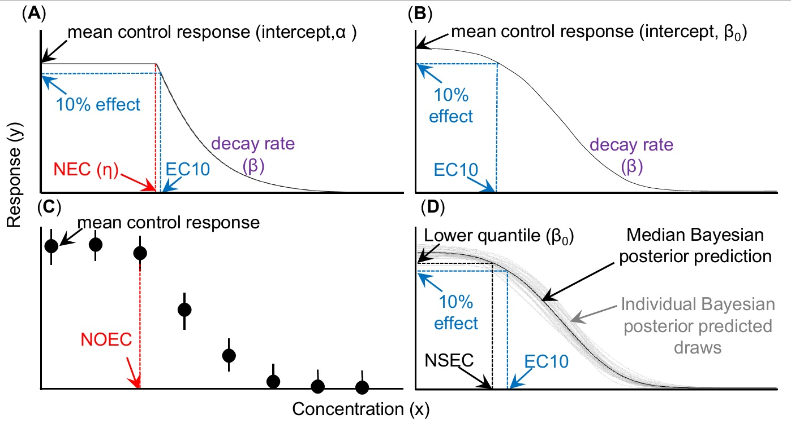
```


## Models in `bayesnec`

There are a range of models available in `bayesnec` and the working `bnec` function supports individual model fitting, as well as multi-model fitting with Bayesian model averaging, which we will discuss in more detail later.

The argument `model` in a `bayesnecformula` is a character string indicating the name(s) of the desired model. The complete list of currently available models in `bnec` includes: `r models()$all`. There are also several model sets, which we will explain in more detail later.

You can see that the model names are divided into two types, those with the prefix **nec** and those with the prefix **ecx**. This separation delineates between "threshold" (**NEC**) and non-threshold (**EC~x~**) models.


```{r etnc_fig1, out.width="50%", echo=FALSE}
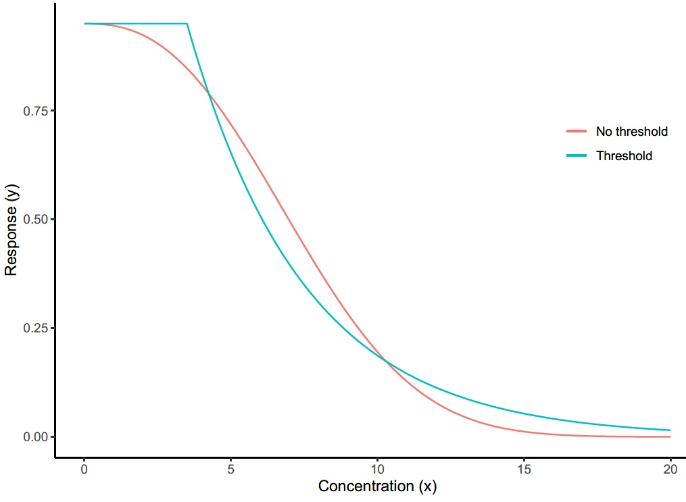
```


## Parameter definitions

Where possible we have aimed for consistency in the interpretable meaning of the individual parameters across models. Across the currently implemented model set, models contain from two (basic linear or exponential decay, see **ecxlin** or **ecxexp**) to five possible parameters (**nechorme4**), including:

$\tau = \text{top}$, usually interpretable as either the y-intercept or the upper plateau representing the mean concentration of the response at zero concentration;

$\eta = \text{NEC}$, the No-Effect-Concentration value (the x concentration value where the threshold in the regression is estimated at, discussed in detail next;

$\beta = \text{beta}$, generally the exponential decay rate of response, either from 0 concentration or from the estimated $\eta$ value, with the exception of the **neclinhorme** model where it represents a linear decay from $\eta$ because slope ($\alpha$) is required for the linear increase;

$\delta = \text{bottom}$, representing the lower plateau for the response at infinite concentration;

$\alpha = \text{slope}$, the linear decay rate in the models **neclin** and **ecxlin**, or the linear increase rate prior to $\eta$ for all hormesis models;

$\omega$ = $\text{EC50}$ notionally the 50% effect concentration but may be influenced by scaling and should therefore not be strictly interpreted;

$\epsilon = \text{d}$, the exponent in the **ecxsigm** and **necisgm** models; and

$\zeta = \text{f}$ - A scaling exponent exclusive to model **ecxll5**.

In addition to the model parameters, all **nec**-containing models have a step function used to define the threshold breakpoint in the regression, given by

$$
f(x_i, \eta) = \begin{cases} 
      0, & x_i - \eta < 0 \\
      1, & x_i - \eta \geq 0 \\
   \end{cases}
$$


## Threshold (**NEC**) models

For model types with *nec* as a prefix, the **NEC** is directly estimated as parameter $\eta = \text{NEC}$ in the model, as per [@Fox2010]. 

```{r necmod_fox2010, out.width="50%", echo=FALSE}
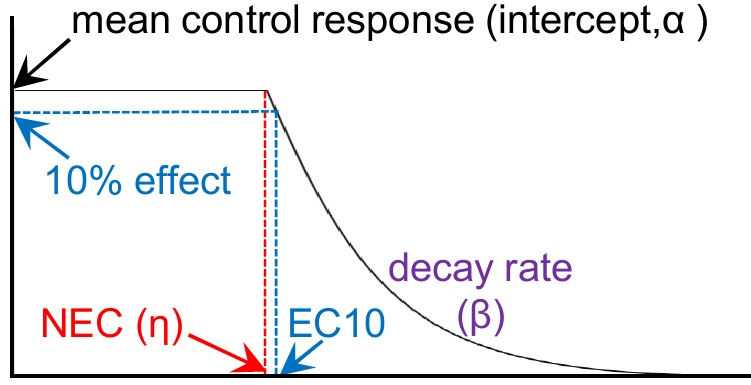
```

These models assume there is some relatively stable value of the response similar to the mean of the control across a range of lower value concentrations. This value is maintained until the threshold concentration is reached. This threshold is the estimated **NEC**. At this point the response declines with increasing concentration, according to some decay rate. The original model of Fox [@Fox2010] assumed an exponential decline following the threshold (**NEC**) concentration (*nec3param*) - but we have also allowed a linear decline in `bayesnec` (*neclin*).

While such a model can be used to estimate an **EC~x~** value, their main value is providing a clear estimate of the no-effect toxicity concentration. They are currently the only way of estimating a TRUE **N**o-**E**ffect-**C**oncentration (**NEC**).

## No threshold (**EC~x~**) models

Models with **ecx** as a prefix are continuous curve models. These models also have an intercept term (mean control of the response), but they have no threshold. The response value starts to decline with any increasing concentration, according to some decay rate (or more complex function).

```{r ecxmod, out.width="50%", echo=FALSE}
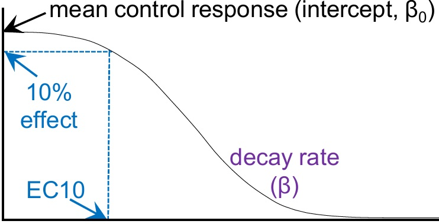
```

These are appropriate to use when the data show no threshold like effects.
They are typically used for extracting **EC~x~** values, such as the EC10 - that has been widely used in SSD modelling. 

## The **N**o-**S**ignificant-**E**ffect **C**oncentration (**NSEC**)

While smooth **EC~x~** models do not have a threshold with which to determine the **NEC**, we have developed a method to extract a **N**o-**S**ignificant-**E**ffect **C**oncentration (**NSEC**) instead. 


```{r nsec, out.width="50%", echo=FALSE}
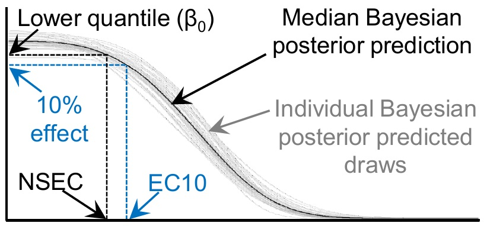
```

The full mathematical details of this method are described in both a frequentist and Bayesian context in our recent paper [@fisherfox2023].

We start with our fitted smooth **EC~x~** model, with it's estimated intercept (mean response at the control). Using the posterior estimate of this parameter, we calculate a lower confidence bound for that mean response. 

From there we can interpolate from the fitted model the concentration at which that lower bound estimate crosses the predicted posterior fitted value of the response.

Because we can do that with all of the individual posterior draws, using the Bayesian method we can also get an estimate of the confidence interval around the estimated **NSEC** value. Dont worry we'll explain the details of Bayesian statistics a bit more later.

## The link between **NSEC** and  **NOEC**

The NSEC is actually directly analogous to the NOEC, in that you are determining the concentration at which the response is now significantly different to the control.

```{r noec, out.width="50%", echo=FALSE}
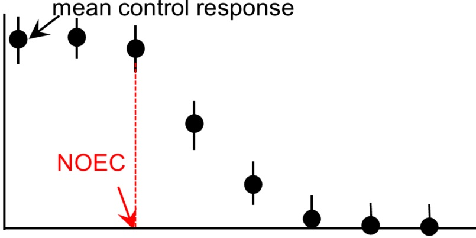
```

However, because it uses the fitted curve to interpolate between the treatment concentrations, the NSEC avoids one of the biggest issues with the NOEC - That the value is constrained to one of the treatment concentrations in the dataset, and so is directly determined by the experimental design.

Because it is based on significance testing, it will be sensitive to very poorly designed experiments. High variability in the control will lead to *less conservative* toxicity estimates - so this is important to keep in mind.

To obtain valid **NSEC** values it is critical that the estimate of the variability in the control is accurate. We want this to be a good representation of the natural variability seen across the non-impacted population. A "significant" deviation relative to this natural variability is how we define the concentration of *effect*. One way to ensure this is done well is to have a good understanding of the natural scaling of your response variable, and to understand what statistical families are appropriate for modelling what type of data and why. This is something we will cover in a later tutorial.

## What toxicity estimate to use?

For any risk assessment application that relies on estimation of *no-effect*, it is clear that the **NEC** represents the most robust estimate of a TRUE no-effect-effect concentration (**NEC**) in situations where data exhibit a threshold-like response. However, such threshold models do not always fit the data well, and can actually lead to relatively *non-conservative* outcomes if they are fit to smoothly declining data. 

This is something we explored in our recently accepted paper in [IEAM](https://setac.onlinelibrary.wiley.com/doi/abs/10.1002/ieam.4809).

```{r ieam, out.width="58%", echo=FALSE}
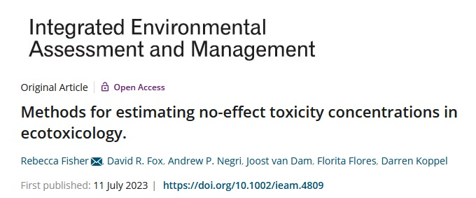
```
```{r svariolis, out.width="38%", echo=FALSE}
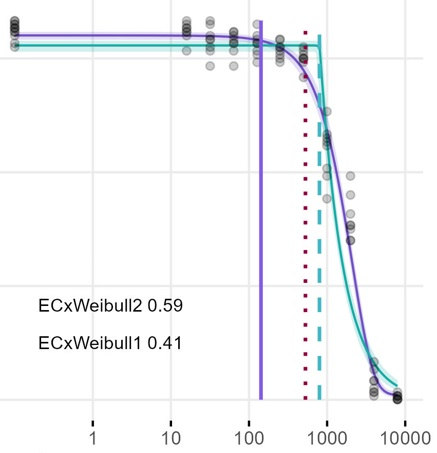
```

In this case, using an **NEC** from a threshold model can result in highly *non conservative* no-effect toxicity estimates, that sometimes have an *effect* greater than even 10% effect (or even higher).

When there is no threshold-effects, what value can we use to represent *no-effect* for a given species CR curve?


## **NSEC** versus **EC~x~**

When there are no threshold effects and the **NEC** cannot be readily estimated, we must choose between either a **NOEC**, **EC~x~** (of some arbitrary *low* value of *x*), or now **NSEC** as an appropriate estimate of *no-effect*.

The **NOEC** has long been discarded as an appropriate measure of toxicity, and is the least preferred method according to the current Australian and New Zealand Guidelines [@warne2008; @warne2018]. There should be a concerted effort to move away from experimental designs that support **EC~x~** estimation, and instead are optimised for regression type modelling.

**EC~x~**, particularly *EC10* is the preferred method currently specified by the Australian and New Zealand Guidelines [@warne2018], and is also widely adopted globally. An **EC~x~** value where *x* is either 5 or 10 has long been endorsed by the OECD [@vanderhoeven1997].

We would argue that in the case where an estimate of *no-effect* is required, the use of **EC~x~** is inappropriate, because by definition this estimate represents an *effect* of magnitude *x*. 

The **NSEC**, like the **NOEC** before it [@mebane2015], will represent some level of non-zero *effect* - because by definition, for any smoothly sigmoidal model any concentration > 0 will represent an effect. However, for the **NSEC**, this effect is defined as the concentration below which there is no significant deviation from the control response. 

Significant deviations from the control can occur well before a 10% *effect* as estimated by the *EC10*. Unless there is some other evidence that this effect will have no negative consequence on the population, it may in fact represent a substantial non-zero effect, and such values cannot be considered truly protective of that species.


## Hormesis

`bayesnec` includes as an underlying sub-type of model within both the *nec* and *ecx* types, models that contain the prefix *horme*. These are all hormesis models - models that allow an initial increase in the response [see @Mattson2008] and include models with the character string `horme` in their name.

Hormesis occurs when their is an initial stimulation of the response at low concentrations, which is something we have observed reasonably regularly with mixed discharge WET testing and can occur for a variety of reasons.

`bayesnec` includes several **NEC** based hormesis models (`r intersect(models()$horme, models()$nec)`). These almost all assume a linear increase in the response until the *nec* threshold concentration, and allow various decay functions following that threshold. Hormesis in this sense poses no problem in the context of defining an **NEC** concentration. It is always the threshold concentration at which a negative response starts to occur.

`bayesnec` also includes two **EC~x~** hormesis models (`r intersect(models()$horme, models()$ecx)`). These can cause ambiguity in the definition of **EC~x~** estimates, because we need to decide what baseline response to use for estimating the *effect* (i.e. relative to the control, or the peak value of the response). This is why we have an argument *hormesis_def* in the `ecx` function in `bayesnec` (discussed shortly). 

```{r nec_horme, out.width="48%", echo=FALSE}
knitr::include_graphics("images/horme_nec.jpg")
```
```{r ecx_horme, out.width="48%", echo=FALSE}
knitr::include_graphics("images/horme_ecx.jpg")
```


## Toxicity estimation in `bayesnec`: **NEC**

Now that you have an understanding of the different types of models available in `bayesnec` and how these lend themselves to different way of estimating toxicity, let's take a look at the three key functions for extracting toxicity estimates from `bayesnec` objects, the functions `ecx`, `nec` and `nsec`.

The simplest is the **NEC**, for which the toxicity estimate of interest is actually a parameter estimate in the model itself. For this reason, there are very few arguments to the `nec` function. You simply specify the model fit (*object*), if you want a *posterior* or summary, any transformation (*xform*) that should be imposed, and the probability values (*prob_vals*) if a summary should be returned (which is the default).

```{r nec_function, out.width="70%", echo=FALSE}
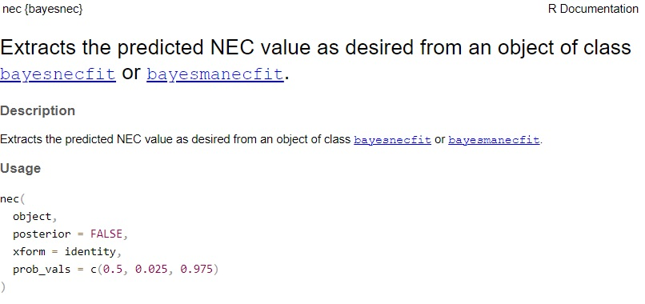
```

**object** - An object of class *bayesnecfit* or
*bayesmanecfit* returned by `bnec`.

**posterior** - A *logical* value indicating if the full
posterior sample of calculated NEC values should be returned instead of
just the median and 95% credible intervals.

**xform** - A function to apply to the returned estimated concentration
values.

**prob_vals** - A vector indicating the probability values over which to
return the estimated NEC value. Defaults to 0.5 (median) and 0.025 and
0.975 (95 percent credible intervals).

## Toxicity estimation in `bayesnec`: **EC~x~**

The *ecx* function extracts predicted **EC~x~** values and will work for both *nec* and *ecx* type models. The function contains some of the same arguments as the *nec* function (*object*, *posterior*, *xform* and *prob_vals*). 


```{r ecx_function, fig.align='tight', out.width="70%", echo=FALSE}
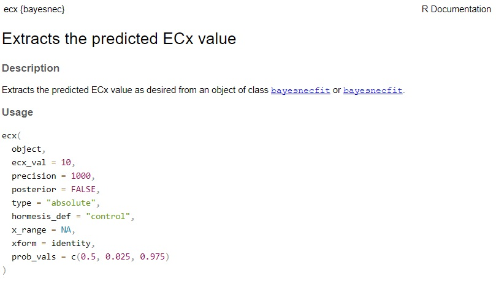
```

In addition, 
you can also specify:

**ecx_val** - The desired percentage effect value. This must be a value
between 1 and 99 (for type = "relative" and "absolute"), defaults to 10.

**precision** - The number of unique x values over which to find **EC~x~**. 
The argument controls how accurately the backwards interpolation method will estimate the concentration value. Future versions of `bayesnec` plan to abolish this algorithm in favor of mathematical backwards interpolation, which will also significantly speed up the performance of this algorithm. Large values of precision will yield more precise results, but can be slow when there are many posterior draws.


**type** - A `character` vector, taking values of
"relative", "absolute" (the default) or "direct". 
Type "relative" is calculated as the percentage decrease
from the maximum predicted value of the response (top) to the minimum
predicted value of the response. Type "absolute" (the default) is
calculated as the percentage decrease from the maximum value of the
response (top) to 0. Type "direct"
provides a direct estimate of the x value for a given y.


**hormesis_def** - A `character` vector, taking values
of "max" or "control".  If hormesis_def is "max", then **EC~x~** values are calculated as a
decline from the maximum estimates (i.e. the peak at **NEC**);
if "control", then ECx values are calculated relative to the control, which
is assumed to be the lowest observed concentration.

**x_range** - A range of x values over which to consider extracting ECx. This is useful if you need to interpolate beyond the observed x-range.


## Toxicity estimation in `bayesnec`: **NSEC**

The `nsec` function extracts the predicted **NSEC** value as desired from an object of class
`bayesnecfit` or `bayesmanecfit`. The function contains some of the same arguments as both the *nec* and *ecx* functions, including (*object*, *posterior*, *xform*, *prob_vals*, *precision*, *x_range*, and *hormesis_def*).


```{r nsec_function, fig.align='tight', out.width="70%", echo=FALSE}
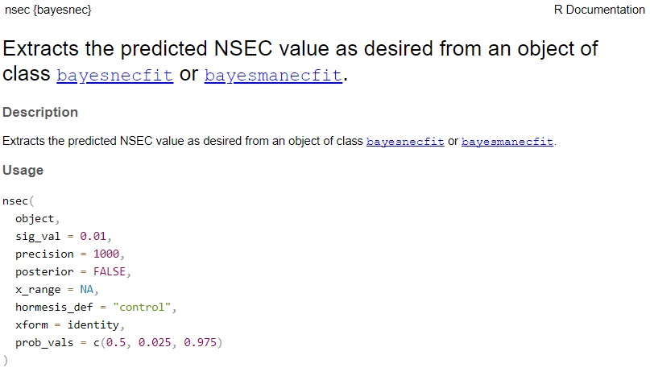
```


The main new argument is:
 
**sig_val** - The probability value to use as the lower quantile to test
significance of the predicted posterior values, 
against the lowest observed concentration (assumed to be the control). The default is set at 0.01 (i.e. 99% certainty of a decline relative to control). We have found this value to generally yield sensible results. When this is not the case, in the context of extracting **NSEC** values for SSD modelling, we have found it is generally better to consider if the statistical model is appropriate, rather than selecting other values of significance. 

Other values of significance might be relevant in other decision science contexts.


## References


