```{r}
#| label: setup
#| include: false
knitr::opts_chunk$set(echo = TRUE)
library(bayesnec)

# args() returns a function whose body is NULL, which print() then shows on its
# own line. Deparsing and dropping that line gives the signature alone, which is
# what these sections are for.
signature <- function(fun, class = "bayesnecfit") {
  txt <- deparse(args(getS3method(fun, class)))
  cat(paste(utils::head(txt, -1), collapse = "\n"), "\n")
}
```

## Background

A toxicity estimate is rarely the end of an analysis. In guideline derivation it
becomes one point in a species sensitivity distribution, from which the
concentration protecting a stated proportion of the community is read. For that
guideline to achieve the level of protection it states, each point entering the
distribution should be the highest concentration at which that species shows no
effect [@fisheretal2023].

Module 2 fitted one model and extracted estimates from it without saying much
about either choice. This module sets out the equations `bayesnec` can fit and
which toxicity estimate each one supports. The distinction that organises
everything below is between models with a threshold and models without one, and
it determines what a no-effect estimate can mean.

@fig-etnc2 sets out the four estimates and how each is obtained. It is
reproduced in *The estimates side by side* at the end of the module, once each
part of it has been covered.

```{r}
#| label: fig-etnc2
#| out-width: "100%"
#| fig-align: center
#| echo: false
#| fig-cap: "The four toxicity estimates. (A) A threshold model, giving the *NEC* directly as a parameter and an EC10 by interpolation. (B) A smooth model, giving an EC10 only. (C) The *NOEC*, read from the treatment means. (D) The *NSEC*, read from a smooth model against a lower quantile of the control posterior. Reproduced from @fisherfox2023."
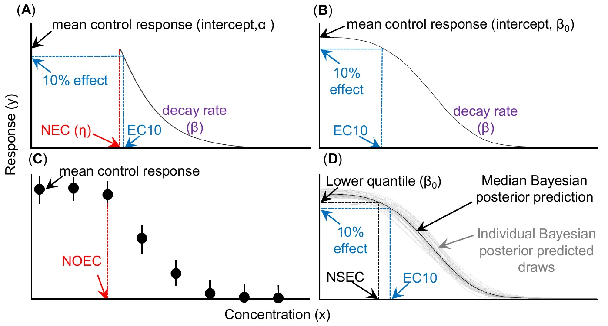
```

## The estimates in use

Four estimates are in common use, and they differ in what they measure and in
what produces them.

The **NEC**, the no-effect concentration, is the minimum concentration above
which an effect is predicted to occur. It is a parameter of a threshold model
and is estimated directly [@Fox2010; @Pires2002; @vanderhoeven1997].

The **EC~x~**, the *x*% effect concentration, is the concentration expected to
produce an effect of size *x*. It is obtained by interpolation from a fitted
curve, and it reports an effect by construction.

The **NOEC**, the no-observed-effect concentration, is the highest tested
concentration at which the mean response is statistically indistinguishable from
the control. It comes from Dunnett's test on a one-way analysis of variance, so
its value is always one of the concentrations that happened to be tested.

The **NSEC**, the no-significant-effect concentration, is the concentration at
which the modelled mean response becomes statistically distinguishable from the
control [@fisherfox2023]. Like the **EC~x~** it is obtained by interpolation from
a fitted curve, so it is not restricted to the tested concentrations.

## The model set

The `model` argument of a `bayesnecformula` names the equation or equations to
fit. The complete set is:

```{r}
#| label: model-set
models()$all
```

The names divide into two prefixes. Those beginning `nec` are threshold models;
those beginning `ecx` are smooth models with no threshold.

```{r}
#| label: fig-necmods
#| out-width: "75%"
#| fig-align: center
#| echo: false
#| fig-cap: "The threshold equations. Each is flat to a breakpoint and then declines, and the breakpoint is the *NEC*. They differ in the decline after it and in whether the response rises first."
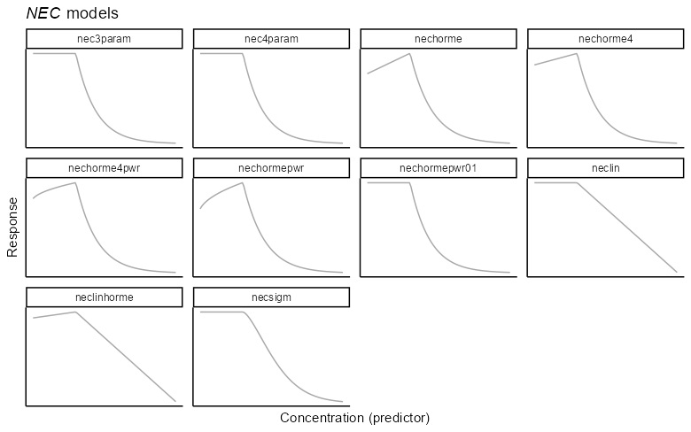
```

```{r}
#| label: fig-ecxmods
#| out-width: "75%"
#| fig-align: center
#| echo: false
#| fig-cap: "The smooth equations. None has a breakpoint, so each declines from the intercept onwards and supports an **EC~x~** or an *NSEC* rather than an *NEC*."
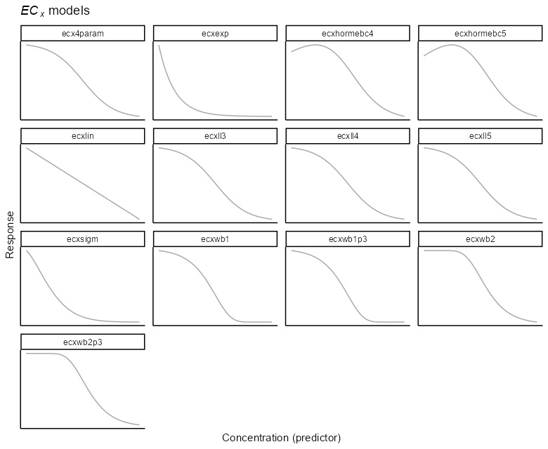
```

Fitted to the same response range the two shapes cross twice, so neither is
uniformly the more conservative.

```{r}
#| label: fig-etnc1
#| out-width: "100%"
#| fig-align: center
#| echo: false
#| fig-cap: "A threshold curve and a smooth curve fitted to the same response range. The threshold curve is flat until the break and then falls steeply; the smooth curve is already declining at the lowest concentrations. Reproduced from @fisherfox2023."
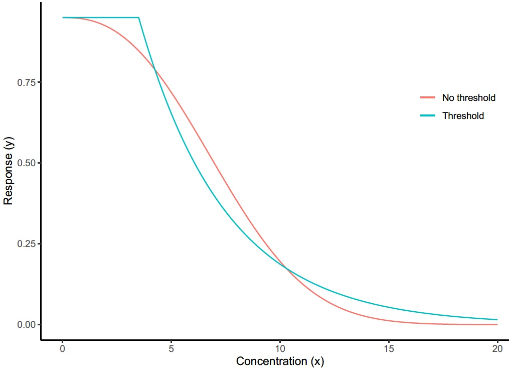
```

Named subsets of the full set are also available, and are how a group of
equations is requested rather than a single one:

```{r}
#| label: model-groups
names(models())
```

`hormesis` names the equations that allow the response to rise before it
declines, which the *Hormesis* section below covers. Module 4 covers fitting a
set and averaging across it to derive a model-averaged toxicity estimate.

## Parameter definitions

The parameters have been given consistent meanings across equations wherever
possible, so that a parameter named `top` means the same thing in every model
that has it. The equations range from two parameters, in the linear and
exponential decay models `ecxlin` and `ecxexp`, to five in `nechorme4` and
`ecxll5`.

| Symbol | Name | Meaning |
|:--|:--|:-----|
| $\tau$ | `top` | The y-intercept or upper plateau: the mean response at zero concentration. |
| $\eta$ | `nec` | The no-effect concentration: the value of the predictor at which the threshold in the regression is estimated to lie. |
| $\beta$ | `beta` | The exponential decay rate of the response, either from zero concentration or from $\eta$. |
| $\delta$ | `bot` | The lower plateau: the response at infinite concentration. |
| $\alpha$ | `slope` | The linear decay rate in `neclin` and `ecxlin`, or the linear increase before $\eta$ in the hormesis models. |
| $\omega$ | `ec50` | Nominally the 50% effect concentration, though it is affected by scaling and should not be read strictly as an EC50. |
| $\epsilon$ | `d` | The exponent in `ecxsigm` and `necsigm`. |
| $\zeta$ | `f` | A scaling exponent used only by `ecxll5`. |

`neclinhorme` is the exception on $\beta$, where it is a linear decay from
$\eta$, because the slope $\alpha$ is already used for the linear increase.

Every `nec` model also uses a step function to define the breakpoint:

$$
f(x_i, \eta) = \begin{cases}
      0, & x_i - \eta < 0 \\
      1, & x_i - \eta \geq 0 \\
   \end{cases}
$$

## Threshold models

For models prefixed `nec`, the no-effect concentration is a parameter of the
model itself, $\eta$, and is estimated directly, following the approach of
@Fox2010.

```{r}
#| label: fig-necmod
#| out-width: "90%"
#| fig-align: center
#| echo: false
#| fig-cap: "Panel A of @fig-etnc2. The *NEC* ($\\eta$) is the breakpoint itself. The EC10 is read from the curve and sits above it."
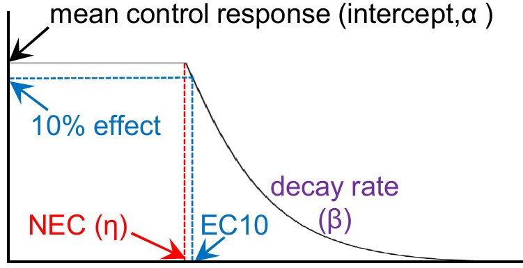
```

These models assume the response remains at a stable level, near the control
mean, across the lower concentrations, until a threshold is reached. That
threshold is the *NEC*. Beyond it the response declines with increasing
concentration at some rate. The original formulation of @Fox2010 assumed
exponential decline after the threshold, which is `nec3param`; `bayesnec` also
provides a linear decline in `neclin`.

These models can also be used to estimate an **EC~x~**, though the estimate of
the threshold is what they are for. They are the only way to estimate a true
no-effect concentration.

An **EC~x~** taken from a threshold equation and one taken from a smooth
equation fitted to the same data will usually differ, and which is larger depends
on which shape suits the data. Where the response really does decline smoothly, a
broken-stick curve is flat before the break and then falls sharply, so its
**EC~x~** is the higher and less conservative of the two. Where a threshold is
genuinely present, the smooth equation begins declining below it and returns the
lower value.

@fisheretal2023 measured how large that difference becomes. Simulating from
smooth curves of known shape and fitting a threshold equation to the result, the
*NEC* returned represented an actual effect of 15% to 40% depending on the
design. That percentage did not necessarily fall as sampling effort increased,
because the problem is the shape of the equation rather than the amount of data.
Choosing between the two shapes in advance therefore matters, and module 4 covers
fitting both and letting the data weight them.

## Smooth models

Models prefixed with `ecx` are continuous or smooth curves. They have an
intercept, the mean control response, but no threshold: the response begins to
decline at any concentration above zero, at a rate set by the equation.

```{r}
#| label: fig-ecxmod
#| out-width: "90%"
#| fig-align: center
#| echo: false
#| fig-cap: "Panel B of @fig-etnc2. There is no breakpoint, so the only estimate the curve supports directly is an **EC~x~**."
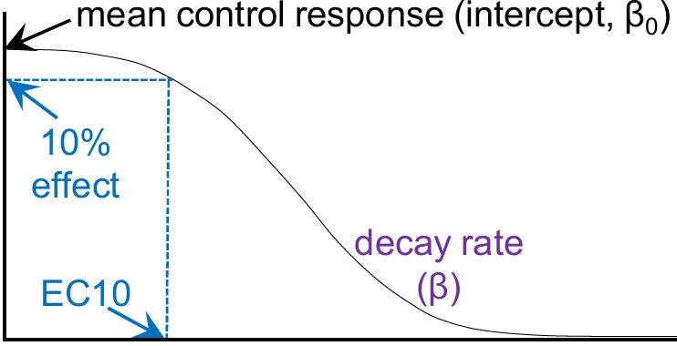
```

They are appropriate where the data show no threshold, and are used to extract
**EC~x~** values such as the EC10 or EC50, which are widely used in species
sensitivity distribution modelling for deriving water quality criteria.

In the strictest sense they are not appropriate for estimating a no-effect
concentration, because an **EC~x~** value, by definition, represents an effect of
size *x*.

## The no-significant-effect concentration

A smooth model has no threshold parameter, so the *NEC* cannot be read from it.
The *NSEC* is a way of obtaining a no-effect estimate from such a model
[@fisherfox2023].

```{r}
#| label: fig-nsec
#| out-width: "90%"
#| fig-align: center
#| echo: false
#| fig-cap: "Panel D of @fig-etnc2. The *NSEC* is where the fitted curve crosses a lower quantile of the control posterior. The EC10 for the same curve sits above it."
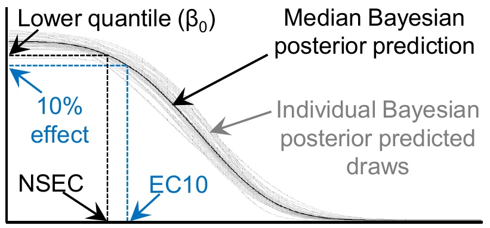
```

The construction starts from the fitted intercept, the mean response at the
control. From the posterior of that parameter a lower bound on the control
response is calculated. The *NSEC* is the concentration at which the fitted curve
crosses that bound.

Because the calculation is done for every posterior draw, the result is a
posterior distribution for the *NSEC* rather than a point estimate, and a
credible interval follows from it directly. Module 6 covers what a posterior is
and where it comes from.

The full derivation, in both frequentist and Bayesian form, is in @fisherfox2023.

### The effect size at the NSEC

The *NSEC* is the concentration at which the response becomes distinguishable
from the control, and that concentration corresponds to some decline on the
fitted curve. The **ECNSEC** is that decline, expressed as a percentage: the
effect size the *NSEC* represents. It is the quantity that says whether an *NSEC*
is a no-effect estimate in any practical sense, or a low-effect estimate wearing
the name.

`nsec()` reports it as an attribute of the value it returns, and `ecnsec()`
computes it directly:

```{r}
#| label: ecnsec-demo
#| eval: false
nsec_value <- nsec(bnec_fit)
attr(nsec_value, "ecnsec_relativeP")

ecnsec(bnec_fit, nsec = nsec_value)
```

For the `nec3param` fit of module 2 the *NSEC* of 1.54 corresponds to an ECNSEC
of 1.4%, with a 95% credible interval from 0.2% to 2.4%. The effect being allowed
is small, and it is not zero.

`ecnsec()` takes the same `type` argument as `ecx()`, described below, and
measures against the same reference, so the two are on the same footing by
construction. This matters for reporting: the current Australian and New Zealand
method states that an *NSEC* whose measured effect size exceeds 20% should
probably not be used to derive a guideline value [@warne2025], and the ECNSEC is
how that condition is checked.

## The NSEC and the NOEC

The *NSEC* is analogous to the *NOEC*: both identify the concentration at which
the response becomes significantly different from the control.

```{r}
#| label: fig-noec
#| out-width: "90%"
#| fig-align: center
#| echo: false
#| fig-cap: "Panel C of @fig-etnc2. The *NOEC* is one of the tested concentrations, chosen by a test on the treatment means with no curve fitted."
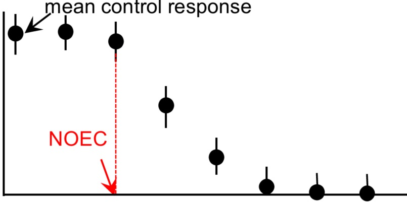
```

The difference is that the *NSEC* interpolates from a fitted curve, so it is not
restricted to the concentrations that happen to have been tested. This removes
the most serious defect of the *NOEC*, whose value can only ever be one of the
treatment concentrations and is therefore determined by the experimental design
as much as by the toxicity.

Because it rests on a comparison against control variability, the *NSEC* is
sensitive to poorly designed experiments. High variability in the control
produces a *less* conservative estimate, which is the opposite of what intuition
suggests, and it is the single most important thing to watch when using it.

A valid *NSEC* therefore depends on the control variability being a good
representation of natural variability in an unimpacted population. That in turn
depends on modelling the response with an appropriate statistical distribution,
which module 5 covers, and on the fitted model reproducing the variability the
data show, which module 2 covers under `check_fit()`.

The same exposure applies to an **EC~x~**. @mebane2015 states the limit directly:
where the control mean has a standard error of 20%, an EC10 is not a meaningful
quantity, whatever the fitting routine returns.

## Choosing an estimate

Where no threshold can be estimated, the available options are the *NOEC*, an
**EC~x~** at some low value of *x*, or the *NSEC*.

The Australian and New Zealand method sets out a hierarchy, and it was revised in
2025 [@warne2025]. The *NEC* and the *NSEC* are now the two most preferred
estimates, both being negligible-effect concentrations estimated directly from
the concentration-response relationship. An **EC~x~** at *x* of 10 or less, and
the BEC10, are listed as other appropriate estimates. An **EC~x~** between 10 and
20, and the *NOEC*, are less preferred. The LOEC, the MATC and an EC50 require a
conversion factor before they can be used at all.

Two things follow for practice. The *NSEC* no longer needs justifying as a novel
method in an Australian guideline derivation. And because it sits in the
preferred tier alongside the *NEC*, the condition attached to it applies: an
*NSEC* with a measured effect size above 20% should probably not be used to
derive a guideline value, which is what the ECNSEC above is for.

The *NOEC* has been discarded as a measure of toxicity and is among the least
preferred methods [@warne2008; @warne2018; @warne2025].

An **EC~x~**, and the EC10 in particular, is the method the earlier guidelines
specify [@warne2018] and is widely used internationally. An **EC~x~** at *x* of 5
or 10 has been endorsed by the OECD since @vanderhoeven1997.

Where an estimate of no effect is required, an **EC~x~** is arguably the wrong
instrument, because it reports the concentration producing an effect of magnitude
*x*. It is an effect concentration by construction.

The *NSEC*, like the *NOEC* before it [@mebane2015], also represents some
non-zero effect: for a smooth sigmoidal model any concentration above zero
produces one. The difference is where the line is drawn. The *NSEC* is the
concentration below which the response does not deviate significantly from the
control, and a significant deviation can occur well before the effect reaches the
10% that an EC10 reports. Unless there is separate evidence that a 10% effect has
no consequence for the population, an EC10 cannot be assumed protective.

## Hormesis

Some equations in both groups allow an initial *increase* in the response at low
concentrations before the decline begins [see @Mattson2008]. These are the
hormesis models, and their names contain `horme`. The behaviour occurs for
several reasons and is seen regularly in whole-effluent toxicity testing of mixed
discharges.

The threshold hormesis models are:

```{r}
#| label: horme-nec
intersect(models()$hormesis, models()$nec)
```

These assume a linear increase up to the threshold and allow various decay
functions after it. Hormesis raises no difficulty for the *NEC*, which remains
the concentration at which the response begins to decline.

```{r}
#| label: fig-hormenec
#| out-width: "85%"
#| fig-align: center
#| echo: false
#| fig-cap: "Two threshold hormesis equations. The response rises linearly to the threshold and declines after it, so the *NEC* is still the breakpoint."
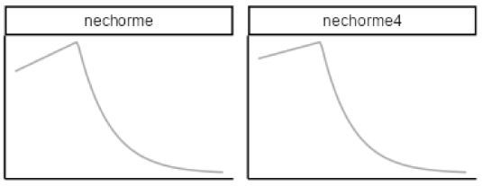
```

The smooth hormesis models are:

```{r}
#| label: horme-ecx
intersect(models()$hormesis, models()$ecx)
```

```{r}
#| label: fig-hormeecx
#| out-width: "85%"
#| fig-align: center
#| echo: false
#| fig-cap: "Two smooth hormesis equations. The curve peaks above the control response, so an effect measured from the control and one measured from the peak differ."
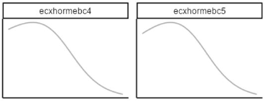
```

These do raise a difficulty for **EC~x~**, because an effect has to be measured
against something, and a hormetic curve offers two candidates: the control, and
the peak of the curve. `bayesnec` measures every **EC~x~**, *NSEC* and ECNSEC
from the control, the predicted mean at the lowest concentration in the data,
taken separately for each posterior draw. The two references coincide for a
monotonically declining curve and differ for a hormetic one, so this choice
changes the reported **EC~x~** for a hormesis equation and no other.

## Extracting estimates

Three functions extract toxicity estimates from a fitted model: `nec()`, `ecx()`
and `nsec()`. Their full documentation is in the help files, which are the
authoritative source; what follows covers the arguments that require a decision
rather than every argument.

### `nec()`

The *NEC* is a parameter of the model, so the function has little to do beyond
summarising its posterior.

```{r}
#| label: nec-args
#| comment: ""
signature("nec")
```

`posterior` returns the full posterior sample rather than a summary. `xform`
applies a function to the returned values, which is how estimates are returned to
the original scale when the predictor was transformed in the formula. `prob_vals`
sets the quantiles summarised, by default the median and a 95% credible interval.

`nec()` applies only to models that have the parameter. Calling it on a smooth
model is an error rather than a silent substitution.

### `ecx()`

```{r}
#| label: ecx-args
#| comment: ""
signature("ecx")
```

`ecx_val` is the effect percentage, defaulting to 10 for an EC10.

`type` determines what the percentage is measured against, which is the
substantive decision here. `"absolute"`, the default, measures from the control
to zero. `"relative"` measures from the control to the equation's theoretical
asymptote, the `bot` parameter where the equation has one. `"range"` measures from
the control to the lowest response the fitted curve predicts. `"direct"` takes a
response value rather than a percentage and returns the concentration at which
the curve reaches it.

`resolution` sets the number of predictor values over which the crossing is
located, and defaults to 200. `x_range` allows estimates outside the observed
range of the predictor, which should be used deliberately, since it extrapolates
the fitted curve.

Every one of these measures *from* the control, which `bayesnec` takes to be the
predicted mean at the lowest concentration in the data, evaluated separately for
each posterior draw. `type` names what the percentage is measured *towards*. The
control is identified by its position in the series rather than by its value,
which keeps the convention intact under the usual preparation in which a small
constant is added to the concentrations so that a zero control can be plotted on
a logarithmic axis. An experiment whose lowest treatment is not a control is
being analysed as though it were, and should say so.

Three changes arrived in `bayesnec` 2.2.0 and matter when returning to an older
analysis. `"range"` computes what `"relative"` computed up to version 2.1.3, and
passing `type = "relative"` explicitly now raises a warning naming `"range"`.
`"relative"` is refused where the equation has no `bot` and the family is
unbounded below, because there is then no finite quantity to measure against. And
the `hormesis_def` argument has been removed from `ecx()`, `nsec()`, `ecnsec()`
and the comparison functions: with the control always the reference it selected
nothing. A call still passing it is refused by name rather than ignored.

### Targets the curve never reaches

A target the fitted curve does not reach within the range of the predictor
returns `NA` for the affected draws, together with a warning naming how many.
Earlier versions returned the grid point nearest the target, which for such a
curve is the highest concentration tested, reported as an estimate with nothing
said about it.

An estimate summarised over the remaining draws is a **censored** estimate and has
to be reported as one, naming how many draws were excluded and stating that the
value is bounded below by the highest concentration tested. Reported without that
label it reads as an ordinary estimate and understates the true value. This is a
result about the experiment: the design did not reach the effect size asked for.

### `nsec()`

```{r}
#| label: nsec-args
#| comment: ""
signature("nsec")
```

`sig_val` is the quantile of the control posterior used to define a significant
decline, defaulting to 0.01, that is 99% certainty of a decline relative to the
control. That value generally produces sensible results. Where it does not, the
better response in a guideline-derivation context is usually to reconsider
whether the statistical model suits the data, rather than to adjust the
significance level. Other values may be appropriate in other decision contexts.

Raising `sig_val` makes the estimate more conservative, because it places the
reference higher on the control posterior and the curve crosses it sooner.

One consequence of the construction catches people out. The reference is the
`sig_val` quantile of the control posterior, so that proportion of draws have a
control at or below the reference and reach it at the control concentration
itself. Those draws sit at the bottom of the *NSEC* posterior. Where `sig_val`
exceeds the quantile at which the lower credible bound is read, which is 0.025 for
a 95% interval, the lower bound of the *NSEC* is therefore zero, or the lowest
concentration tested where that is not zero. @fisherfox2023 report exactly this in
their Table 3. A lower bound of zero at a high `sig_val` is the construction
behaving as defined, and it reflects a real possibility: for a smooth curve, a
decline in the response may begin at the lowest concentration applied.

## The estimates side by side

@fig-etnc2 from the start of the module sets the four estimates against one
another.

```{r}
#| label: fig-etnc2-again
#| out-width: "100%"
#| fig-align: center
#| echo: false
#| fig-cap: "The four estimates again. Reproduced from @fisherfox2023."

```

Panel A is a threshold equation, where the *NEC* is the breakpoint parameter and
the EC10 lies above it. Panel B is a smooth equation, which has no breakpoint, so
the EC10 is the only estimate it supports directly. Panel C is the *NOEC*,
obtained from the treatment means with no curve fitted, which is why it can only
ever take one of the tested values. Panel D is the *NSEC*, the concentration at
which the fitted curve crosses a lower quantile of the control posterior, with the
EC10 for the same curve above it. In both panels B and D the EC10 is the larger
and therefore the less conservative estimate.

@tbl-definitions gives the published wording for each estimate, which is the
form to quote in a methods section, together with the statistical method that
produces it.

```{r}
#| label: tbl-definitions
#| out-width: "100%"
#| fig-align: center
#| echo: false
#| fig-cap: "Toxicity estimates used for no and low effects in species sensitivity distribution modelling. Reproduced from @fisheretal2023."
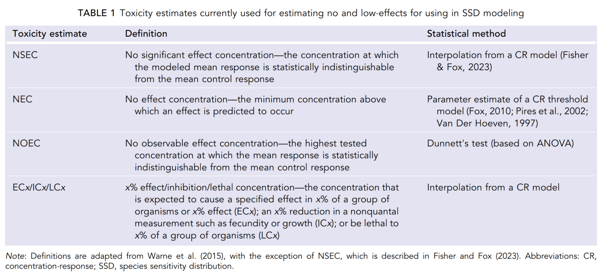
```

## References

::: {#refs}
:::
