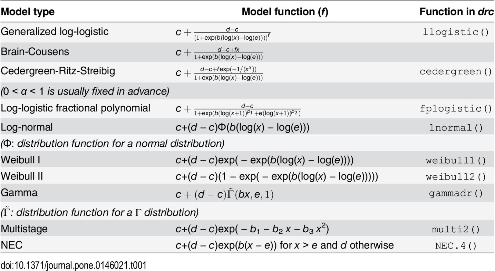

```{r setup, include=FALSE}
knitr::opts_chunk$set(echo = TRUE)
library(tidyverse)
library(drc)
```

## Models in drc

Now we have fit our very first `drc` model, we can dive into the different models available in the `drc` package. 


A range of models exist in drc, some of the most popular are:  

```{r drcmodels, fig.align='tight', out.width="60%", echo=FALSE}

```

As with `bayesnec` we have models for sigmoidal curves (log-logistic, log-normal, weibull),  a model where there is a threshold effect (nec), and models to handle hormesis effects (Brain-Cousens and Cedergreen-Ritz-Streibig). More detail can be found in drc package paper [@Ritz2015]. 

The parameters in each model are generally consistent with what we defined in our earlier chapter: 

- **b** slope (sometimes called hillslope)

- **c** lower asymptote 

- **d** upper asymptote 

- **e** model midpoint or inflection point (in NEC models **e** is the threshold effect)

However, some new ones in the list include: 

- **f** asymmetry parameter (for hormesis or 5 parameter models) 

Though, it is always prudent to double check the parameters for the model you are using in the help files. 

## `drc` models are nested

The `drm` function gives you the option of models with different numbers of parameters. Log-logistic models come in 2, 3, 4, or 5 parameter versions: LL.2(), LL.3(), LL.4(), or LL.5(). Weibull type 1 and 2 models, come in 3 or 4 parameter versions: W1.3()and W1.4() or W2.3() and W2.4(). Models of the same type with different numbers of parameters are actually nested. That is, they are the same model but some parameters are fixed at certain values to reduce the number of parameters being estimated. 

Calling the function with the lower number of parameters automatically applies these fixed values but you can do it manually, too. The `fct` argument calls the model being used, such as `LL.4()`, and each model can take a 'fixed' argument which lets you pass a value to a model parameter.  

```{r, eval=FALSE}
model<- drm(response~concentration, data=datafile, fct=LL.5(fixed=c(NA, NA, NA, NA, 1)), type="continuous")
```


The general nesting order is: 

- Fixing *f* to 1 turns a 5 parameter model into a 4-parameter model, `LL.4()`. 

- Fixing *f* to 1 and the lower asymptote (*c*) to 0 turns it into a 3-parameter model, `LL.3()`. 

- Fixing *f* to 1, *c* to 0, and the upper asymptote (*d*) to 1 turns it into a 2-parameter model, `LL.2()`. 

This means that the following models are identical: 

```{r, eval=FALSE}
model<- drm(response~concentration, data=datafile, fct=LL.5(fixed=c(NA, 0, 1, NA, 1)), type="continuous")
model<- drm(response~concentration, data=datafile, fct=LL.2(), type="continuous")
```

We use *NA* to indicate that the model must estimate this parameter value. Note that the order of model parameters is *b*, *c*, *d*, *e*, *f*. 

Fixing manually is particularly useful when you know the upper asymptote of your data range. For example, normalising microalgae growth rates (measured in doublings per day) to a percent of the control growth rate means the models *should* start at 100%. The lowest possible growth rate is 0% so we really only need to estimate the slope and midpoint for a sigmoidal model. 

```{r, eval=FALSE}
model<- drm(response~concentration, data=datafile, fct=LL.3(fixed=c(NA, 100, NA)), type="continuous")
```

## Model differences 

The non-statistics version is that different types of models (Weibull, log-logsitic, log-normal, nec, etc.) fit different shapes. 

To demonstrate, let's take a dataset contained in the drc package called "ryegrass".

```{r data example}
data(ryegrass)
str(ryegrass)
```
As we can see, the data contains 24 observations of two variables, a response which reports root length "rootl" and a herbicide dose "conc". 

```{r differences, echo=TRUE}
rye_W1<-  drm(rootl~conc, data=ryegrass, fct=W1.4(names = c("Slope", "Lower Limit", "Upper Limit", "ED50")))
rye_W2<-  drm(rootl~conc, data=ryegrass, fct=W2.4(names = c("Slope", "Lower Limit", "Upper Limit", "ED50")))
rye_LL4 <-  drm(rootl~conc, data=ryegrass, fct=LL.4(names = c("Slope", "Lower Limit", "Upper Limit", "ED50")))
rye_LN4 <-  drm(rootl~conc, data=ryegrass, fct=LN.4(names = c("Slope", "Lower Limit", "Upper Limit", "ED50")))
rye_NEC4 <-  drm(rootl~conc, data=ryegrass, fct=NEC.4(names = c("Slope", "Lower Limit", "Upper Limit", "ED50")))

plot(rye_W2, broken = TRUE, xlab="Concentration", ylab="Response", type='all',lty=1, lwd=2)
plot(rye_LL4, add=TRUE,col="orange",lty=1, lwd=2)
plot(rye_W1, add=TRUE,col="blue",lty=1, lwd=2)
plot(rye_LN4, add=TRUE,col="pink",lty=1, lwd=2)
plot(rye_NEC4, add=TRUE,col="green",lty=1, lwd=2)
```

The `type = 'all'` argument in the base R function `plot` displays all the data points on the plot...the default is to hide some. I'm really not sure why. 


Key features of these common models: 

- Log logistic
  + Symmetrical about the midpoint 
- Weibull type 1
  + Asymmetrical, its first shoulder (at the EC05-EC10) starts **later** than a log-logistic  
- Weibull type 2
  + Asymmetrical, its first shoulder (at the EC05-EC10) starts **earlier** than a log-logistic model  
- No effect concentration
  + Horizontal upper asymptote with an abrupt decline where a threshold response is observed

Sometimes the differences are subtle! Sometimes they are not (looking at you green NEC model). Sometimes there are warnings about the fit of the model to the data. In the next section we will diagnose model fits to determine the better fitting models. 

## Choosing the best model 

If we want to fit a single model to the data, we need to choose a model that best fits the data. 

The `drc` package is kind enough to have a function made to compare models, `mselect`. 
The inputs include a model (any model), and the argument `fctList` which is a list of models you want to compare the initial model to. You can also include a comparison to a linear (or cubic or quadratic) regression using the `linreg` argument.

```{r mselect, echo=TRUE, message=FALSE, warnings=FALSE}
rye_LL4 <-  drm(rootl~conc, data=ryegrass, fct=LL.4(names = c("Slope", "Lower Limit", "Upper Limit", "ED50")))
mselect(rye_LL4, fctList = list(W1.4(),W2.4(), LN.4(), NEC.4()),linreg=TRUE) 
```

The mselect function reports four measures of model fit. Here's what the package documentation says:

_For Akaike's information criterion and the residual standard error: the smaller the better and for lack-of-fit test (against a one-way ANOVA model): the larger (the p-value) the better. Note that the residual standard error is only available for continuous dose-response data. Log likelihood values cannot be used for comparison unless the models are nested._

For the most part, I care about the "IC" (which defaults to the Akaike's Information Criterion, AIC). The rule of thumb is that the smaller the better and differences of more than 10 indicates "significantly" better model fits. 

Our results here suggest the Weibull 2 provides the best fit, but is roughly as good as the LL.4, LN.4, and W1.4 models (IC value <10 difference). 

Often the purpose of applying a concentration response model is to calculate an ECx value. When there are many suitable models, we can use drc's model averaging tools to come up with a model averaged ECx value. 

