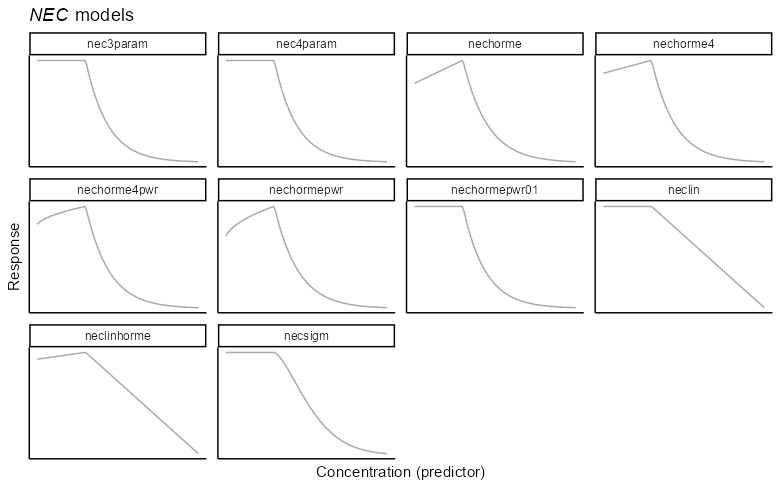
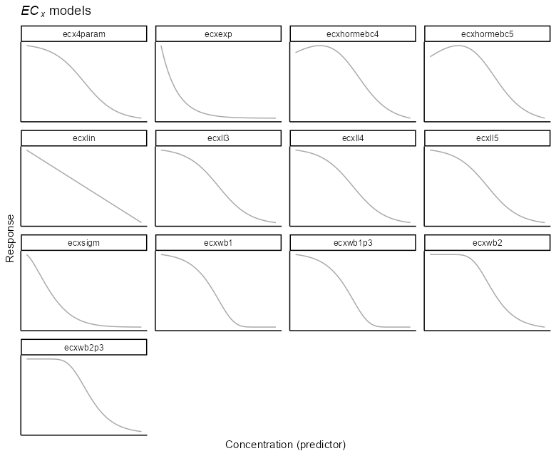
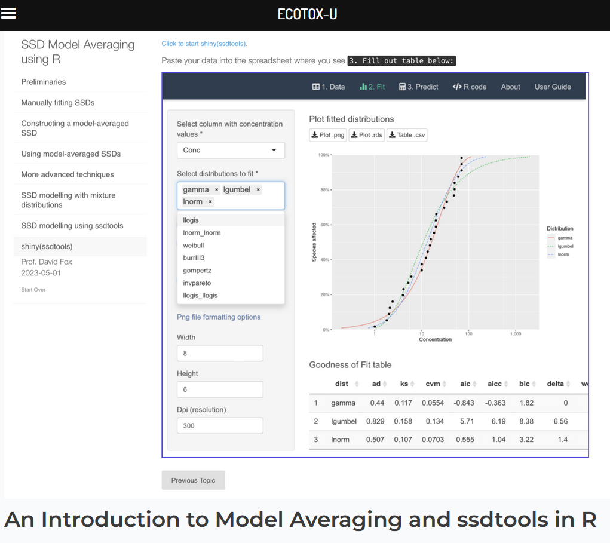

```{r setup, include=FALSE}
knitr::opts_chunk$set(echo = TRUE, cache = TRUE)
library(cmdstanr)
library(posterior)
library(bayesplot)
library(bayesnec)
library(dplyr)
library(ggplot2)
library(tidyr)
set_cmdstan_path("C:/cmdstan")
round_digits <- function(x) sprintf("%.2f", x)

#qwraps2::lazyload_cache_labels("fullbayesmanec_ametryn", path = "vignettes/data/article_cache/latex")
#save(ametryn, manecfit_ametryn, file="vignettes/ametryn.RData")
load("fitted_model.RData")
#summary(bnec_fit)
load("ametryn.RData")
```

## Background

So far we have explored how to fit individual models via the function `bnec`, discussed the range of models that can be fit to CR data, and how these models differ in the resulting toxicity metrics that can be derived from them.

As we have seen in the last tutorial, there is a wide range of possible CR models that we can use. 

Both `bayesnec` and drc (Ritz et al. 2015) contain upward of 23 non-linear functions for modelling CR data.

## Threshold (**NEC**) models
 
As we just discussed these include multiple threshold models, 

```{r necmods, out.width="80%", echo=FALSE}

```

## Smooth models (**ECx** and **NSEC**) model

As well as a wide array of models representing a smooth decline with increasing toxicant concentration. 


```{r ecxmods, out.width="80%", echo=FALSE}

```

## Deciding which model to use

With so many models, how do we decide which model to use?

### Theoretical basis

Sometimes there may be underlying physiological and toxicological mechanisms suggesting a threshold model is appropriate in some cases (Chapman and Wang 2000). However, this is not always known and clear thresholds may not always be apparent in the observed response relationship.

If if you decide a threshold is appropriate, the functional form of that might still not be clear.


### No-theoretical basis

Without a theoretical basis for model selection, it becomes difficult to a-priori determine the best model to use for a given set of data. 

There are metrics available for evaluating the relative fits of models that can be used to select the best fitting model. These include:

- Akaike Information Criterion (AIC) in the frquentist setting

- DIC, WAIC, BIC and a range of other criteria in the Bayesian setting

However, given the many possible (yet often similar) curves that may be used to describe the data, model uncertainty can be very high and model selection ambiguous when many of these appear to fit the data equally well. 


## Multi-model inference

Instead of selecting a single model, it is possible to use all the models at once for our inference. 

This is a form of "multi-model" inference can be useful where there are a range of plausible models and no theoretical basis for selection.

This is the basis of "Model averaging" [@Burnham2002] and can provide a robust way of accommodating model uncertainty. 

It is already widely used in ecology (Dormann et al. 2018).

```{r modav_ecol, out.width="60%", echo=FALSE}

```


## Model averaging

Model averaging involves fitting a candidate set of models to the data and obtaining weighted averaged estimates of the metrics of interest [@Burnham2002].

Weights are based on the relative fit of each model to the data. 

In the frequentist case weights are usually AICc model weights [@Burnham2002]. 

With model averaging, the idea is that well-fitting models have high weights, dominating the model averaged outcome. Conversely, poorly fitting models will have very low model weights and will therefore have little influence on the outcome. Where multiple models fit the data equally well, these can equally influence the outcome, and the resultant posterior predictions reflect that model uncertainty.

AICc based Model averaging has been recently adopted in ecotoxicology for modelling Species Sensitivity Distributions (SSDs) [@Thorley2018; @fox2020; @Dalgarno]. We highly recommend taking David Fox's online training course on [SSD Model Averaging using R](https://training.ecotox.science/courses/an-introduction-to-model-averaging-using-ssdtools-in-r/).


```{r ssd, out.width="60%", echo=FALSE}

```

## Model averaging in `bayesnec`

The `bayesnec` package also supports model averaging. 

In `bayesnec`
you can fit a custom selection of specific models, a pre-specified sets of models, or even all the available models in the package. 

- If a recognized model name is provided, a single model of the specified type is fit, and `bnec` returns an object of class `bayesnecfit`. 

- If a vector of two or more of the available models are supplied, or if one of the model-sets is specified (more on model sets later), `bnec` returns a model object of class `bayesmanecfit` containing Bayesian model averaged predictions for the supplied models, providing they were successfully fitted.

Note that as these are Bayesian methods requiring multiple Hamiltonian Monte Carlo (HMC) chains, using `bnec` can be very slow when large model sets are specified. Note also, that the resulting model objects can be quite large, so be mindful of both compute time and required data storage when using the model-averaging functionality in `bayesnec` for very large model sets.

## Adding models to a `bayesnecfit`

Models fitted by `bnec` will invariably inherit a class `bnecfit`. This carries two exclusive methods: `+` and `c`, both of which are used to append one or multiple models to an existing fit. These can be used to take two or more single model fit of class `bayesnecfit` and combine these into a model averaged `bayesmanecfit` object.

Let's try converting a single model fit into a model averaged fit, using our example fit from our previous tutorial. We first take the same data set form our `bayesnec` example, and fit a different model. Let's try a different 3-parameter model, but an ecx model this time:

```{r}
set.seed(333)
data(nec_data)
bnec_fit_new <- bnec(y ~ crf(x, model = "ecxll3"), data = nec_data)
```

Plotting our model, we can see this fit is not too bad. The **NEC** shown on the plot is an **NSEC** in this case, because the *ecxll3* model is a three-parameter log-logistic model that is a smooth curve and has no threshold.

```{r}
plot(bnec_fit_new)
```

We can add our two single model fits together using `c` and `bayesnec` tells us which two models we have fitted.

```{r}
bmanecfit <- c(bnec_fit_new, bnec_fit)
```

You can see we combined our two individual `bayesnecfit` objects, and returned a new `bayesmanecfit` object.

```{r results='hold'}
class(bnec_fit_new)
class(bnec_fit)
class(bmanecfit)
```

Several helper functions have been included that allow the user to add or drop models from a `bayesmanecfit` object, or change the model weighting method (`amend`); extract a single or subset of models from the `bayesmanecfit` object (`pull_out`). 

Let's add one more model to our `bayesmanecfit` model set using `amend`:

```{r}
bmanecfit_more <- amend(bmanecfit, add = "ecxexp")
```

## Plotting a `bayesmanecfit` model

We have created some plotting method functions for both the `bayesnecfit` and `bayesmanecfit` model fits, so we can plot a `bayesmanecfit` model object simply with `autoplot`.


```{r}
autoplot(bmanecfit_more)
```

The default plot looks exactly the same as our regular `bayesnecfit` plot, but the output is based on a weighted average of all the models contained within the current set that we have fitted in the `bayesmanecfit` object. 

The **NEC** estimate on this plot (and in the summary output below) is based on a mix of actual **NEC** estimates from any *nec* models, as well as the **NSEC** [@fisherfox2023] estimates that are used as an approximation to **NEC** for all the *ecx*- models in the set. 

## `bayesmanecfit` summary method

We can view a summary of the model fit by using the `summary` method for a `bayesmanecfit` object. A list of fitted models, and model weights are provided. In addition, the model averaged **NEC** is reported, however a warning is provided indicating it contains **NSEC** values.

The summary would also include a warning if there were fits with divergent transitions. 

You can see there is a very high weight for the *nec3param* model, which makes sense as this was the underlying generating model for these data.

The summary also shows the Bayesian R^2^ estimates, and you can see that the variance explained by the smooth exponential decline model is very low.

```{r}
summary(bmanecfit_more)
```

## `bayesmanecfit` object elements

The `mod_stats` elment contains the table of model fit statistics for all the fitted models. This includes the model name, the WAIC (as returned from `brms`), wi (the model weight, currently defaulting to `"pseudobma"` using Bayesian bootstrap from `loo`), and the dispersion estimates (only reported if response is modelled with a Poisson or Binomial distribution, otherwise NA) - more on this in another tutorial.


```{r}
bmanecfit_more$mod_stats
```

The `bayesmanecfit` object also contains all of the individual `brms` model fits, which can be extracted using the `pull_out` function. For example, we can pull out the model *ecxexp* that we added using `amend`, and save this as separate `bayesnecfit` object.


```{r}
bmanec_ecxexp <- pull_out(bmanecfit_more, model = "ecxexp")
```

## Plotting all the models in a `bayesmanecfit`

All of the models in the `bayesmanecfit` can be simultaneously plotted using the argument `all_models = TRUE`.


```{r}
autoplot(bmanecfit_more, all_models = TRUE)
```

You can see that the *ecxexp* model represents a very bad fit. This reflects it's extremely low model weight. There is no harm in leaving in poor models with low weight, precisely because they have such a low model weight and therefore will not influence posterior predictions. However, it is important to assess the adequacy of model fits of all models, because a poor fit may be more to do with a model that has not converged.

## Assessing `bayesmanecfit` model fits

We can use our `pull_out` function to extract individual models and assess their fit, using any of the already mentioned `brms` diagnostic functions.

Let's examine chain mixing for this worst model, to check it is actually ok.

```{r}
plot(pull_brmsfit(bmanecfit_more, "ecxexp"))
```

You can see that the actual model convergence is fine, even though visually this model is a terrible fit.

Assessing chains for all the models in `bayesmanecfit` does not work as well using the default `brms` plotting method. Instead use `check_chains` and make sure to pass a `filename` argument, which means plots are automatically saved to pdf in your working direction.

```{r, eval=TRUE}
check_chains(bmanecfit_more, filename = "bmanecfit_more_all_chains")
```
```{r, eval=TRUE, echo=FALSE, warning=FALSE, message=FALSE}
check_chains(bmanecfit_more)
```

## Weighting methods


```{r dumbbell, out.width="25%", echo=FALSE}

```


In the frequentist setting AICc based model weights are widely accepted, and are related to the likelihood of the data given the model. Again, I'll point you towards David's virtual [course](https://training.ecotox.science/courses/an-introduction-to-model-averaging-using-ssdtools-in-r/) that covers this topic in more detail. 


```{r weights, out.width="30%", echo=FALSE}

```

In the Bayesian setting, modelling weighting is a bit more complex, and there are a large number of potential weighting methods available. A detailed treatment of Bayesian weighting methods is beyond the scope of this course. 


Here we touch on the methods `bayesnec` uses, but skip over the technical details.

## `bayesnec` model weights

`bayesnec` adopts the weighting methods implemented in the `loo` [@vehtari2020] package in `R`. 

`loo` provides an efficient approximate leave-one-out cross-validation (LOO) algorithm for Bayesian models fit using Markov chain Monte Carlo, as described in [@vehtari2017](doi:10.1007/s11222-016-9696-4). 

The approximation uses Pareto smoothed importance sampling (PSIS), a new procedure for regularizing importance weights and follows the implementation described in [@Vehtari2019]. 

The `loo` package offers two weighting methods, the "stacking" method, aimed to minimise prediction error [@Yao2018], and the "pseudobma" method, with and without Bayesian bootstrap [@vehtari2020; @vehtari2017]. 

- method="stacking" combines all models by maximizing the leave-one-out predictive density of the combination distribution [@vehtari2020]. This prioritises the joint **prediction** accuracy.

- method="pseudobma" finds the relative weights proportional to the theoretical expected log pointwise predictive density of each model [@vehtari2020]. This estimates relative model **pediction** accuracy.

There is also Bayesian bootstrap that can be used when method="pseudobma". This takes into account the uncertainty of finite data points and regularizes the weights away from the extremes of 0 and 1 [@vehtari2020]. 

`bayesnec` currently uses by default the "pseudobma" method (method = "pseudobma") with Bayesian bootstrap (BB = TRUE), but this can be easily modified via argument "loo_controls". We selected this method based on some initial trials, that suggested that the pseudobma method provides weights that behave in a more similar way to AICc weights, but this needs more testing.


## Final thoughts

The model averaging approach implemented in `bayesnec` is widely used in a range of settings [in ecology for example, see @Dormann2018 for a thorough review]. However, model averaging is relatively new to ecotoxicology [but see, for example, @Shao2014; @Thorley2018; @fox2020; @Wheeler2009]. In `bayesnec` we have implemented a broad range of potential models. More research is required to understand how model-set selection influences model inference. While some studies suggest using a broad range of models may be optimal [@Wheeler2009], others indicate that including multiple models of similar shape may overweight the representation of that shape in model averaged predictions [@fox2020]. In addition, it is important to understand that when models are added or removed from the model-set, this can sometimes have a substantial influence on model predictions (potentially changing estimated ECx values, for example). As the model-set in `bayesnec` may change through time it is important to keep a record of the models that were actually fitted in a given analysis, in the event it is necessary to reproduce a set of results. 


## References


