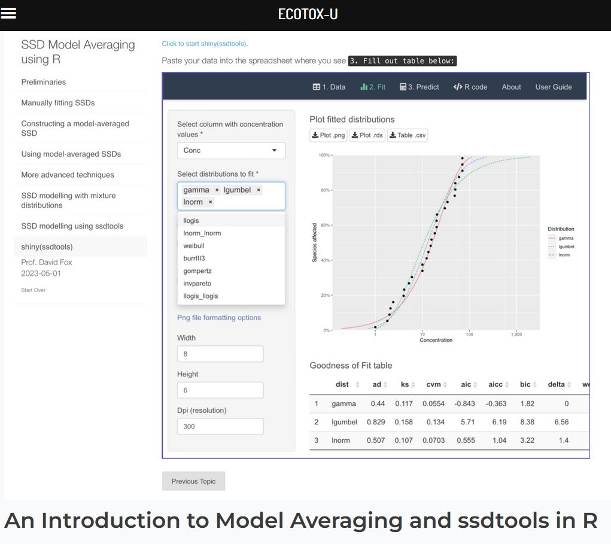
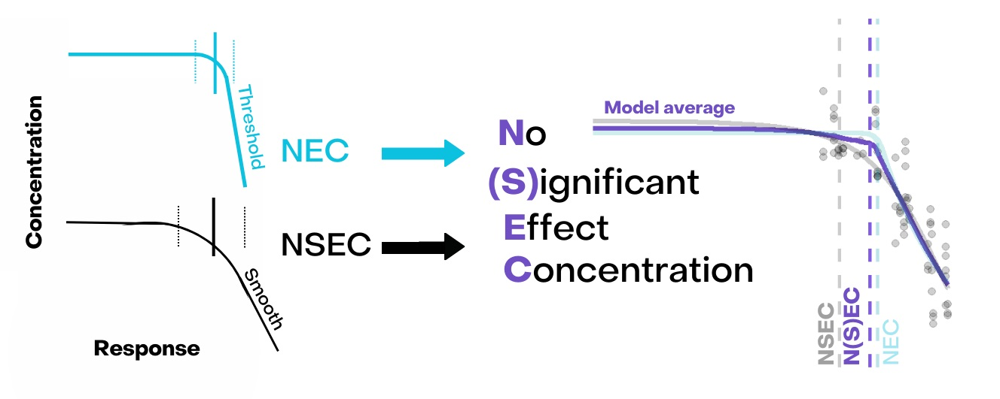
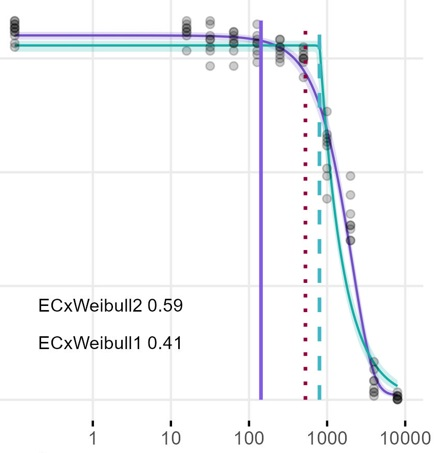

```{r}
#| label: setup
#| include: false
knitr::opts_chunk$set(echo = TRUE)
library(bayesnec)
options(mc.cores = 4)
set.seed(333)
data(nec_data)
```

## Background

Modules 2 and 3 fitted single models and set out the equations available. Both
`bayesnec` and `drc` [@Ritz2015] offer more than twenty non-linear functions for
concentration-response data, in two broad shapes: those beginning `nec`, which
hold a threshold as a parameter, and those beginning `ecx`, which decline
smoothly from the intercept. Module 3 plots both groups and says which toxicity
estimate each one supports.

This module fits more than one of them at a time, and reports an estimate that
uses all of them.

## Choosing among the equations

Sometimes physiological or toxicological mechanism argues for a threshold
(Chapman and Wang 2000). That is not always known, a threshold is not always visible in
the data, and even where a threshold is appropriate the functional form of the
decline after it may not be.

Without a mechanistic argument, the choice has to be made from the data. Metrics
exist for this — AICc in the frequentist setting, and WAIC, DIC, model
probabilities and others in the Bayesian setting. The difficulty is that many of
these curves are similar in shape, so several will often fit a dataset about
equally well. Model uncertainty is then high and the selection is close to
arbitrary, while the estimate reported depends on which equation was picked.

@Krull2020 measured how hard the choice is. They simulated threshold estimation
by maximum likelihood, by MCMC and by piecewise regression, across a range of
curve slopes, background mortalities and designs. All three performed poorly on
shallow and intermediate curves, and accuracy improved as the curve steepened.
Information criteria weights usually did not provide strong evidence in favour of
the generating model.

## Multi-model inference

The alternative is not to choose. All the plausible models are fitted and used
together, which is multi-model inference, and it is useful in exactly the case
above: several plausible models and no basis for preferring one.

This is the basis of model averaging [@Burnham2002], which is long established
in ecology [see @Dormann2018 for a review].

```{r}
#| label: fig-modav
#| out-width: "90%"
#| fig-align: center
#| echo: false

```

## Model averaging

Model averaging fits a candidate set and combines the estimates of interest,
weighted by how well each model fits the data [@Burnham2002]. In the frequentist
case the weights are usually AICc weights.

A well-fitting model takes a high weight and dominates the result. A poorly
fitting one takes a weight near zero and has little influence. Where several
models fit equally well they contribute comparably, and the resulting posterior
reflects the uncertainty in model shape as well as in the parameters. That is the
substantive gain: an interval from a single chosen equation is conditional on
that equation being right, and does not reflect the fact that it was chosen.

AICc-based averaging has been adopted in ecotoxicology for species sensitivity
distributions [@Thorley2018; @fox2020; @Dalgarno]. David Fox's course on [SSD
model averaging in
R](https://training.ecotox.science/courses/an-introduction-to-model-averaging-using-ssdtools-in-r/)
covers that application.

```{r}
#| label: fig-ssd
#| out-width: "60%"
#| fig-align: center
#| echo: false

```

## The N(S)EC

Module 3 set out two no-effect estimates: the *NEC*, which is a parameter of a
threshold equation, and the *NSEC*, which is read from a smooth equation where no
threshold parameter exists. A candidate set holding both kinds of equation
therefore holds both kinds of estimate.

Averaging over such a set removes the need to decide in advance which shape the
data have. A `nec` equation contributes its *NEC* parameter, an `ecx` equation
contributes its *NSEC*, and each is weighted by how well that equation fits the
data. The averaged quantity is written **N(S)EC**, to record that it mixes the
two [@fisheretal2023].

```{r}
#| label: fig-nsecieam
#| out-width: "100%"
#| fig-align: center
#| echo: false
#| fig-cap: "The N(S)EC. *NEC* values from threshold equations and *NSEC* values from smooth equations are combined by weight into one estimate, shown on the right against the *NEC* and *NSEC* it sits between. Reproduced from @fisheretal2023."

```

## Model averaging in `bayesnec`

What `bnec` returns depends on how many equations it is given.

A single recognised model name fits one model and returns a `bayesnecfit`, which
is what modules 2 and 3 used. Two or more names, or the name of a model set,
fits each in turn and returns a `bayesmanecfit` holding the Bayesian
model-averaged predictions over those that fitted successfully.

Both compute time and object size scale with the size of the set. Every model is
sampled by Hamiltonian Monte Carlo, so a large set is slow and the result is
large. Module 2 measured a single `nec3param` fit of these data at a little over
two minutes; a set of twenty-three is not twenty-three times more convenient.

## Fitting a named set

`bnec()` takes the name of a set in the same `model` argument that names a
single equation, and fits every equation the set contains:

```{r}
#| label: fit-named-set
#| eval: false
fit_set <- bnec(y ~ crf(x, model = "decline"), data = nec_data, seed = 333)
```

`models()` lists the sets and their members:

```{r}
#| label: model-sets
models()
```

`nec` and `ecx` are the threshold and smooth equations respectively.

`decline` excludes the hormesis equations and is the most generally useful set
where there is no evidence of hormesis.

`hormesis` are the equations allowing an initial increase.

`bot_free` are the equations with no lower asymptote, which are useful when the
response curve is incomplete and estimates are needed beyond the observed range.

`zero_bounded` are those for which negative response values are invalid.

`all` is every available equation. It currently includes `necsigm`, which should
not be used; remove it with `amend()` if fitting the whole set.

The sets are not mutually exclusive, and `bayesnec` discards any model in the set
that is unsuitable for the statistical distribution of the response, which module
5 covers. `bnec_record()`, from module 2, names anything excluded that way.

The worked example below uses three equations rather than a named set, so that
this page renders in reasonable time. Everything shown of a three-equation
`bayesmanecfit` holds for one of eleven. *Fitting a set in parallel* covers what
to do once a set is large enough for the wait to matter.

## Combining single fits

A set can also be assembled from fits made separately. Any model fitted by
`bnec` inherits class `bnecfit`, which has two methods of its own, `+` and `c`.
Either will append fits to one another, so two or more `bayesnecfit` objects can
be combined into a model-averaged `bayesmanecfit`.

Starting from the `nec3param` fit of module 2:

```{r}
#| label: fit-nec3param
#| eval: false
set.seed(333)
data(nec_data)
bnec_fit <- bnec(y ~ crf(x, model = "nec3param"), data = nec_data)

save(bnec_fit, file = "fits/m4_bnec_fit.RData")
```

```{r}
#| label: load-fit-nec3param
load("fits/m4_bnec_fit.RData")
```

and adding a second equation of a different shape — `ecxll3`, a three-parameter
log-logistic curve with no threshold:

```{r}
#| label: fit-ecxll3
#| eval: false
set.seed(333)
bnec_fit_new <- bnec(y ~ crf(x, model = "ecxll3"), data = nec_data)

save(bnec_fit_new, file = "fits/m4_bnec_fit_new.RData")
```

```{r}
#| label: load-fit-ecxll3
load("fits/m4_bnec_fit_new.RData")
```

```{r}
#| label: fig-ecxll3
#| fig-height: 4.5
#| fig-cap: "The `ecxll3` fit. The annotated no-effect estimate is an *NSEC*, because this equation has no threshold parameter."
autoplot(bnec_fit_new)
```

The two are combined with `c()`:

```{r}
#| label: combine
bmanecfit <- c(bnec_fit_new, bnec_fit)
```

```{r}
#| label: classes
#| results: hold
class(bnec_fit_new)
class(bnec_fit)
class(bmanecfit)
```

`amend()` adds or drops models from an existing set, or changes the weighting
method, and `pull_out()` extracts one or more models back out of it. Adding a
third equation:

```{r}
#| label: amend
#| eval: false
bmanecfit_more <- amend(bmanecfit, add = "ecxexp")

save(bmanecfit_more, file = "fits/m4_bmanecfit_more.RData")
```

```{r}
#| label: load-amend
load("fits/m4_bmanecfit_more.RData")
```

## Plotting an averaged fit

`autoplot()` works on a `bayesmanecfit` as it does on a single fit.

```{r}
#| label: fig-manec
#| fig-height: 4.5
#| fig-cap: "The model-averaged fit over three equations."
autoplot(bmanecfit_more)
```

The plot looks like the single-model plot, but the curve and its interval are a
weighted average over the set. The intervals often look less smooth than those
from a single fit, because they now include uncertainty in the shape of the
curve and not only in its parameters.

The no-effect estimate annotated here, and reported in the summary below, is the
N(S)EC: *NEC* values from the threshold equations in the set and *NSEC* values
[@fisherfox2023] from the smooth ones, combined by weight. Module 3 covers why
the two are different.

## The summary

```{r}
#| label: summary
summary(bmanecfit_more)
```

The fitted models are listed with their weights. The summary warns that the
averaged no-effect estimate contains *NSEC* values, and would warn again if any
fit had divergent transitions.

`nec3param` takes most of the weight here, which is what should happen: these
data were simulated from that equation. The Bayesian R² values show how little of
the variation the smooth exponential decline accounts for.

The summary also warns that `ecxexp` reproduces the observed variability at the
control poorly. That is the check module 2 introduced as `check_fit()`, applied
here to every equation in the set and reported where it fails. It is a statement
about how well that equation describes the data rather than a fault in the
fitting, and `ecxexp` holds almost none of the weight, so it does not reach the
averaged estimate. The same warning against a heavily weighted equation would
need acting on.

## The weighting method

The summary reports a weight against each equation, and those weights decide
what the averaged estimate is. How they are calculated is therefore worth
knowing before reading any further output.


```{r}
#| label: fig-dumbbell
#| out-width: "50%"
#| fig-align: center
#| echo: false

```

In the frequentist setting AICc weights are standard and relate to the
likelihood of the data given each model. The SSD course linked above treats them
in detail.

```{r}
#| label: fig-weights
#| out-width: "50%"
#| fig-align: center
#| echo: false

```

Bayesian weighting is less settled and there are many candidate methods. A full
treatment is outside the scope of this course; what follows is what `bayesnec`
does and why.


`bayesnec` uses the weighting implemented in `loo` [@vehtari2020], which performs
approximate leave-one-out cross-validation for models fitted by MCMC
[@vehtari2017], using Pareto-smoothed importance sampling to regularise the
importance weights [@Vehtari2019].

`loo` offers two methods.

*Stacking* minimises prediction error by maximising the leave-one-out
predictive density of the combined distribution [@Yao2018; @vehtari2020]. It
prioritises the accuracy of the joint prediction.

*Pseudo-BMA* takes weights proportional to the expected log pointwise
predictive density of each model [@vehtari2020], estimating relative predictive
accuracy. It can be combined with a Bayesian bootstrap, which accounts for the
uncertainty of a finite sample and pulls the weights away from 0 and 1.

Pseudo-BMA with the Bayesian bootstrap is the default, and `bayesnec` passes it
explicitly. The summary above names it, as `Method: pseudobma_bb_weights`. The
reasoning is that the purpose of averaging here is to represent uncertainty about
the shape of the curve rather than to minimise prediction error, and that
stacking is not well suited to the sample sizes concentration-response
experiments produce.

The default has not always been applied consistently, which matters when reading
an older analysis. `loo::loo_model_weights()` resolves an unspecified method to
stacking, and some paths through earlier versions of `bayesnec` left it
unspecified. A set assembled with `c()` or `amend()` could therefore be weighted
by stacking while the same set fitted in one `bnec()` call was weighted by
pseudo-BMA. Both routes now pass pseudo-BMA. Weights from an older analysis are
not necessarily comparable with weights computed now, which is one more reason to
record the package version alongside the models fitted.

The method is changed through the `loo_controls` argument of `bnec()` or
`amend()`, which takes a named list with elements `fitting` and `weights`:

```{r}
#| label: loo-controls
#| eval: false
bnec(y ~ crf(x, model = "decline"), data = nec_data,
     loo_controls = list(weights = list(method = "stacking")))
```

## Elements of the fitted object

`mod_stats` holds the fit statistics for every model in the set: the model name,
the WAIC as returned by `brms`, the weight `wi`, and dispersion estimates where
the response is modelled with a Poisson or binomial distribution.

```{r}
#| label: modstats
bmanecfit_more$mod_stats
```

The individual fits are retained and can be extracted with `pull_out()`:

```{r}
#| label: pullout
bmanec_ecxexp <- pull_out(bmanecfit_more, model = "ecxexp")
```

`pull_best()` extracts the highest-weighted model without needing you to read the
weights first, and returns a `bayesnecfit` whichever it finds:

```{r}
#| label: pullbest
#| message: true
best <- pull_best(bmanecfit_more)
```

It reports the weight alongside the number of candidates it chose from, because
the two together say whether the selection means anything. The largest weight in
a flat set of twenty is barely more than the equal share of 0.05, and a model
holding it describes the averaged prediction hardly at all. That model is the one
worth putting through the fit checks of module 2, since it contributes most to
the reported estimate.

`summary()` gives the weights, the dispersion, the no-effect estimate and the
Bayesian R², and no parameter estimates at all. `curve_params()` returns those:

```{r}
#| label: curve-params-set
curve_params(bmanecfit_more)
```

The rows are per equation and nothing is averaged across them, because the
equations do not share a parameter list: `ecxexp` has no `bot`, and only the
threshold equations estimate `nec`. Averaging a parameter over whichever
equations happen to estimate it would average over a different subset of the set
for each parameter, under weights computed for the set as a whole. The model
weight is reported beside each row instead, which is what makes the table
readable: a `nec` row holding a thousandth of the weight is not describing the
averaged estimate.

## Every model in the set

```{r}
#| label: fig-allmodels
#| fig-height: 5
#| fig-cap: "Each equation in the set plotted separately."
autoplot(bmanecfit_more, all_models = TRUE)
```

`ecxexp` fits these data badly, which is why its weight is near zero. A model
whose *shape* does not suit the data can be left in the set at a negligible
weight, because it cannot influence the averaged prediction.

That holds for shape and it does not hold for convergence. A model the sampler
never explored properly still contributes to the averaged prediction, and its
weight was computed from that same unexplored posterior, so a low weight is no
evidence that keeping it is safe. A model that has not converged is removed; a
converged model of the wrong shape can stay.

Telling the two apart is the subject of the next section.

## Diagnostics across a set

`pull_out()` gives back a single fit, so any of the `brms` diagnostics apply.
Taking the worst model in the set:

```{r}
#| label: fig-worstchains
#| fig-height: 5
#| fig-cap: "Chains for `ecxexp`, the worst-fitting equation in the set."
plot(pull_brmsfit(bmanecfit_more, "ecxexp"))
```

The chains are well mixed. The model is a bad description of these data and a
perfectly converged fit, which are different things.

Checking every model this way does not scale. `check_chains()` handles a whole
set, and given a `filename` it writes the plots to a PDF in the working
directory rather than to the screen:

```{r}
#| label: checkchains-file
#| eval: false
check_chains(bmanecfit_more, filename = "bmanecfit_more_all_chains")
```

```{r}
#| label: fig-checkchains
#| fig-height: 5
#| warning: false
#| message: false
check_chains(bmanecfit_more)
```

## Screening the set

Reading plots for a set of twenty-three is not a workable check. Module 2
introduced `check_sampling()` on a single fit; on a set it returns one row per
model:

```{r}
#| label: check-sampling-set
check_sampling(bmanecfit_more)
```

The three diagnostics and their cutoffs are the ones module 2 describes: R-hat
against 1.01 [@Vehtari2021], the smallest effective sample size against 400, and
the number of divergent transitions against 10. `failed` is `TRUE` where any of
the three is missed. All three cutoffs are arguments and can be changed, which is
why the values used belong in the write-up.

`rhat()` reports the first of them on its own, keyed by model name:

```{r}
#| label: rhat-set
rhat(bmanecfit_more) |> sapply("[[", "failed")
```

Note the shape of that object. `rhat()` on a `bayesmanecfit` returns a list with
one element per model, each holding the R-hat values and a logical `failed`.
Reaching for `rhat(fit)$failed` returns `NULL` and silently finds nothing, which
is a quiet way to conclude that every model converged.

`screen_models()` applies all three diagnostics and drops what failed:

```{r}
#| label: screen
#| message: true
screened <- screen_models(bmanecfit_more)
```

It reports what it removed and why, one line per model, naming every threshold a
model missed rather than only the first. That message is the record of the
exclusion, and an exclusion with no record is not reproducible, which is why
`quiet = TRUE` should not be used in an analysis that will be written up. Where
every candidate fails it stops with an error listing the reasons, rather than
returning an average of nothing. Where none fails, as here, it says so and
returns the set unchanged.

`screen_models()` does its work through `amend()`, which is the only route by
which a model leaves a `bayesmanecfit`. `amend()` recomputes the weights across
the models that remain rather than rescaling those retained, so the weights of a
screened set are read from the screened object rather than adjusted by hand, and
the reported no-effect estimate changes with them.

### Models that never fitted

A model can also fail earlier, by producing no draws at all. `failed_models()`
names those:

```{r}
#| label: failed
names(failed_models(bmanecfit_more))
```

`NULL` here, because all three equations fitted. Where it is not `NULL`, it
returns more than the names: the priors and initial values each failed model was
given, which are built inside `bnec()` and are otherwise unrecoverable, so they
are the starting point for a retry. Module 6 covers what a sensible adjustment
looks like and states the limit: a prior wide enough to make an
over-parameterised equation fit is doing the work the data cannot, and the
estimate it produces is a property of that prior.

`bnec_record()`, from module 2, completes the account by naming any equation
excluded before fitting and the reason for it. A set requested as `"decline"` or
`"all"` commonly excludes several.

### Acting on a failure

The three diagnostics fail for different reasons and the response differs. A
model that misses the effective sample size or R-hat cutoff, with no divergent
transitions, was sampled from a posterior the sampler could traverse and was not
sampled for long enough; refit it at a higher `iter`. A model failing on
divergent transitions is reporting the shape of its posterior rather than the
length of the run, and will produce them again at any setting. A model appearing
in `failed_models()` is the same problem further along.

The second and third are results about the experiment and are reportable as such.
Adjusting the settings until enough equations survive is not the right response
to either.

Module 7 works through this against two datasets that ship with the package,
which between them produce all three outcomes. It sits there rather than here
because reading a divergent transition means knowing how the sampler explores a
posterior, which module 6 covers.

## Fitting a set in parallel

Module 2 covered the chains of a single model running at the same time on
different cores. A set of models is a second opportunity, and usually a larger
one, because the models do not depend on one another and there are more of them
than there are chains.

`bnec()` and `amend()` fit their models under whatever
[`future`](https://cran.r-project.org/package=future) plan is set when they are
called. Setting one before the call is the whole of it:

```{r}
#| label: parallel-basic
#| eval: false
library(future)
plan(multisession, workers = 8)
fit_par <- bnec(y ~ crf(x, model = "decline"), data = nec_data, seed = 322)
plan(sequential)
```

There is no argument to `bnec()` that turns this on. The plan already records how
much of the machine you are willing to use, and a second way of saying it would
disagree with the first the moment both were set. `future` and `future.apply` are
suggested rather than required packages, so a session without them, or without a
plan, fits the models one after another exactly as earlier versions did.

The two levels nest rather than compete. Under a plan of more than one worker,
`bnec()` passes `cores = 1` to `brm()`, because otherwise `workers` multiplied by
`chains` processes would be requested, which is sixteen for four workers and the
default four chains. Passing `cores` yourself is left alone, and is how the two
levels are divided deliberately:

```{r}
#| label: parallel-nested
#| eval: false
plan(multisession, workers = 5)
fit_nested <- bnec(y ~ crf(x, model = "decline"), data = nec_data,
                   cores = 4, seed = 322)
plan(sequential)
```

That fits five models at a time with four chains each, so twenty chains sample at
once. It is the arrangement that suits a cluster allocation, where the number of
cores is known in advance and is larger than any one model can use.

### Choosing a plan

`plan(multisession)` starts fresh R processes that communicate over local
sockets, and is available on every platform. `plan(multicore)` forks the current
process instead, which starts faster and shares memory rather than copying it,
but forking is unavailable on Windows and inside RStudio and Positron, where the
plan resolves quietly to a single worker. `bnec()` reports the number of workers
it was given, so a plan that has collapsed to one is visible rather than merely
slow.

Under a forked plan, use the `cmdstanr` backend. `rstan` compiles each model into
the session's temporary directory, which a forked worker shares with the process
it was forked from, so several models compiling at once collide there.

Test a plan on something small before committing a long run to it. Fit two models
with a low `iter` under the plan you intend to use and confirm that it returns.
The socket layer `multisession` depends on is outside R's control, and where it
misbehaves the symptom is a run that neither finishes nor errors.

### The effect of a parallel plan

The `bayesnec` documentation reports the whole `decline` set fitted five ways on
an otherwise idle 22-core workstation, from a fresh session each time with the
compiled-program cache emptied first:

| plan | seconds |
|---|---|
| no plan, four chains on four cores | 299.5 |
| two workers | 226.4 |
| four workers | 174.2 |
| eight workers | 149.9 |

Run again with the programs already compiled, the same five configurations took
99, 114, 108, 101 and 94 seconds. Two workers then took longer than no plan at
all.

The difference between the two tables is which run is being timed. A first fit on
a machine where the Stan programs have not been built is dominated by
compilation, which is single-threaded per program, so a plan of *n* workers
compiles *n* at a time and the elapsed time halves at eight workers. A repeat
against a warm cache is dominated by sampling, and for models as small as these
there is nothing left to gain. Where a single model takes minutes rather than
seconds, sampling dominates in both cases and the first table describes the
repeat run as well.

### Reproducibility under a plan

Each individual model reproduces exactly under a plan, given the same `seed`.
The model-averaged quantities do not, and the reason is mechanical: once the
models are fitted, `bnec()` draws a seed from the session's random number stream
to decide which posterior draws each model contributes to the averaged estimate.
A sequential run has advanced that stream, through the seed each initial-value
search sets; a parallel run leaves it untouched. The averaged no-effect estimate,
its credible interval and the stored prediction grid therefore differ between the
two. Neither is wrong, and they are two draws from the same weighting. Calling
`set.seed()` in your own session before `bnec()` fixes the draw, after which two
parallel runs agree.

### Memory

Each worker holds a complete fit while it is working, and fits are large. Eight
workers on a large dataset can exhaust memory where eight cores would not have,
and a worker killed by the operating system ends the whole call rather than the
one model it was fitting. Where a run dies without an R error, reduce the worker
count before looking anywhere else.

## Evidence from the simulation study

@fisheretal2023 simulated concentration-response data from four known curves, two
threshold and two smooth, across designs varying in the number of test
concentrations, the number of replicates within each, and the number of
individuals per replicate. Because the generating curve was known, both the
weights and the true effect size behind each estimate could be measured.

```{r}
#| label: fig-ieam
#| out-width: "100%"
#| fig-align: center
#| echo: false
#| fig-cap: "@fisheretal2023, the source of the simulation and case study results in this section. The paper is open access and the code for every result in it is at <https://github.com/open-AIMS/NSEC_IEAM>."

```

### Replication across treatments

Increasing the number of test concentrations resolved the model weights better
than increasing replication within concentrations did. In one scenario the weight
on the generating equation was 0.987 for twelve concentrations with five
replicates of ten individuals, and 0.984 for eight concentrations with five
replicates of twenty, from a third more individuals in total.

Designs in commercial testing laboratories commonly favour replication within
treatments, because that is what the one-way analysis of variance behind a *NOEC*
requires. Redistributing that replication across more treatment concentrations
can often be achieved without spending more on the experiment.

### The effect the estimate represents

The *NSEC* and the N(S)EC represented effects nearing 10% on average for the
designs with the poorest sampling effort, falling to about 1% on average for the
most replicated design simulated. For data generated from a threshold curve the
averaged estimate was close to the true *NEC*, because the threshold equations
took the weight; for data generated from a smooth curve it was close to the
*NSEC*. That is the behaviour model averaging is relied on for, measured rather
than assumed.

Design also affected the **EC~x~** estimates, which tended to be larger than
their theoretical value where sampling effort was low, with the bias decreasing
as effort increased.

### A case study

The same comparison was made on real data. For *Stylophora variolaris*, the
weight was divided between two smooth equations and the *NEC* returned by the set
was definitively higher than the EC10.

```{r}
#| label: fig-svariolis
#| out-width: "70%"
#| fig-align: center
#| echo: false
#| fig-cap: "The *S. variolaris* case study of @fisheretal2023. Two smooth Weibull equations take the weight, 0.59 and 0.41. The solid line is the N(S)EC at 140 µg L^-1^, the dotted line the EC10 at 530 µg L^-1^, and the dashed line the *NEC* at 800 µg L^-1^."

```

The N(S)EC of 140 µg L^-1^ was the most conservative of the three and represented
a measured effect of about 1.5%. The *NEC* of 800 µg L^-1^ was the least
conservative, which is what fitting a threshold to smooth data produces. Across
the case studies examined, the measured effect at the N(S)EC ran from 1.5% to
6.6%, and in every case the N(S)EC was higher than the *NOEC* calculated from the
same data.

## Open questions

Model averaging is well established in ecology [@Dormann2018] but relatively new
to ecotoxicology [see @Thorley2018; @fox2020; @Wheeler2009].

How the composition of the candidate set affects inference is not settled. Some
work suggests a broad set is preferable [@Wheeler2009]; other work indicates that
including several equations of similar shape over-represents that shape in the
averaged prediction [@fox2020]. Adding or removing models can change the
averaged estimates substantially, ECx values included.

The set available in `bayesnec` changes between versions. Record which equations
were fitted in an analysis rather than which set was requested, or the
result cannot be reproduced later.

## References

::: {#refs}
:::
