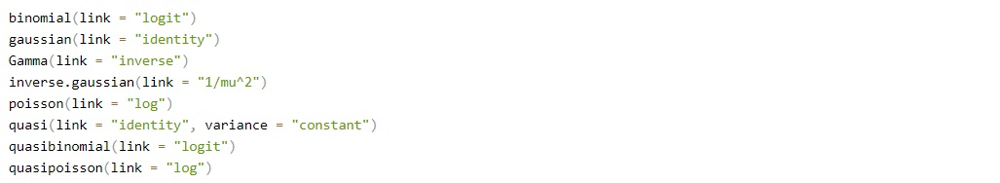
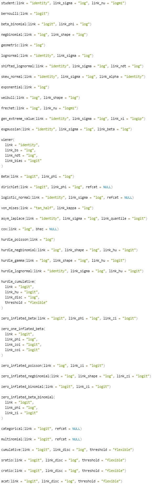

```{r}
#| label: setup
#| include: false
knitr::opts_chunk$set(echo = TRUE)
library(bayesnec)
library(dplyr)
library(ggplot2)
options(brms.backend = "cmdstanr")
options(mc.cores = 4)
set.seed(333)
```

## Background

Concentration-response data are of varied kinds, and the measured response
follows a correspondingly wide range of natural distributions. The examples
below are drawn at random to show the shape of each.

**Binary**, modelled by the binomial or beta-binomial. Individual survival,
`r paste(rbinom(10, 1, 0.5), collapse = " ")`, or counts of survivors out of a
total.

**Bounded continuous**, modelled by the beta. Proportions or ratios that are not
counts out of a total: `r paste(round(rbeta(10, 1, 0.5), 3), collapse = " ")`.

**Counts**, modelled by the Poisson or negative binomial. Numbers of whole
animals: `r paste(rpois(10, 4), collapse = " ")`.

**Positive continuous**, modelled by the gamma. Growth where shrinkage is not
possible: `r paste(round(rgamma(10, 1, 0.5), 2), collapse = " ")`.

**Unbounded continuous**, modelled by the Gaussian. Growth where shrinkage is
possible: `r paste(round(rnorm(10, 0, 0.5), 2), collapse = " ")`.

## Generalised modelling

Generalised modelling fits data with a statistical distribution matched to the
natural range and scaling of the response, rather than assuming one.

Fitting a linear model with `lm()` assumes a Gaussian distribution, and so do
many non-linear routines such as `nls()`. The normality assumption familiar from
analysis of variance is the most common case of non-generalised modelling. It is
sometimes reasonable, but it was adopted largely because it makes the
mathematics of fitting and interval estimation tractable.

That constraint no longer applies. Matching the response to an appropriate
statistical family is now standard practice, and the theory is covered well
elsewhere; this module is concerned with making the right choice in `bayesnec`
rather than with the underlying mathematics.

{width=100% fig-align="center"}

## Families available in `brms`

`brms` supports many families, including most of those in the base `stats`
package that other R fitting routines use:

{width=100% fig-align="center"}

and a number that are specific to it:

{width=60% fig-align="center"}

## Link functions

Every statistical family has a link function. A generalised linear model relates
the linear predictor to the response through it — a logit link, for example,
maps the probabilities of a binary response onto an unbounded continuous scale.
Generalised linear models were formulated by Nelder and Wedderburn as a
unification of linear regression, logistic regression and Poisson regression,
with maximum likelihood estimation of the parameters. Logistic regression is the
familiar case.

The native link for a family — logit for the binomial, log for the Poisson —
imposes a non-linear transformation. Concentration-response models are already
non-linear and do not use linear predictors, so any further non-linearity from a
link changes the model being fitted.

`bayesnec` therefore uses the identity link for every family. The Bayesian
machinery makes this possible, because the parameters can be estimated without
mapping the response onto an unbounded scale. It keeps `top`, `bot` and `nec` on
the scale of the response, where they are directly interpretable.

```{r}
#| label: links
#| comment: ""
bayesnec:::supported_links()
```

This matters when comparing a `bayesnec` fit against a `brms` model written by
hand. `brms` defaults to logit for a beta response and log for a Poisson, so
unless the link is passed explicitly the two are different models. ECx and NSEC
estimates from a fit using any link other than the identity may not behave as
expected.

## Families implemented in `bayesnec`

```{r}
#| label: families
#| comment: ""
names(bayesnec:::mod_fams)
```

The first eight are the ordinary cases covered below. `hurdle_gamma`,
`zero_inflated_beta`, `zero_inflated_poisson` and `zero_inflated_negbinomial`
handle responses with an excess of zeros — a separate topic, treated in the
`bayesnec` article on hurdle families.

Adding a family is not trivial, because `bayesnec` generates priors and initial
values by algorithms specific to each one. Requests go to the
[issue tracker](https://github.com/open-AIMS/bayesnec/issues).

## Default behaviour

With default settings `bnec` infers the most likely distribution from the
response. That inference must be checked rather than trusted. Two questions
decide whether a distribution is adequate:

- does it capture the variability present in the data?
- does it produce sensibly shaped credible bounds across the whole curve?

Getting the dispersion right matters directly for toxicity estimates, because it
sets the width of their intervals. It matters most for the *NSEC*, which is
defined against the estimated variability in the control: overstate that
variability and the estimate becomes less conservative
[@fisheretal2023; @fisherfox2023].

The sections below fit a threshold and a smooth model to each of several
response types. Several of the examples come from [Gerard Ricardo's
repository](https://github.com/gerard-ricardo/NECs/blob/master/NECs).

*Preparing the response*, near the end of the module, covers what to do where a
response has already been divided by its control mean or by its observed
maximum.

## Binomial

A response is binomial when it is a count out of a total, such as the number of
survivors out of a number exposed.

```{r}
#| label: binom-data
binom_data <- read.csv("vignettes/example_binomial.csv") |>
  mutate(log.x = log(raw_x))
summary(binom_data$raw_x)
head(binom_data)
```

The predictor runs from 0.1 to 400 and is strongly right skewed, which is
typical of a dilution series. Transforming the predictor, usually by a
logarithm, often makes fitting more stable, and the design is generally
logarithmic in any case, so this example is fitted on `log.x`. Estimates then
come back on the log scale and are returned to concentrations with the `xform`
argument of `nec()`, `nsec()` and `ecx()`, which module 7 works through.

`suc` holds the number of successes and `tot` the number of trials.

For a binomial or beta-binomial response the formula takes a `trials` term,
exactly as in `brms`:

```{r}
#| label: binom-formula
#| eval: false
suc | trials(tot) ~ crf(log.x, model = "your_model")
```

The column to the left of the `|` holds the successes — survivors, fertilised
eggs — and the one inside `trials()` the total associated with each. The names
are whatever they are in your data frame.

```{r}
#| label: fit-binom-nec
#| eval: false
set.seed(333)
exp_1nec <- bnec(suc | trials(tot) ~ crf(log.x, model = "nec3param"),
                 data = binom_data, seed = 333)

save(exp_1nec, file = "vignettes/fits/m5_exp_1nec.RData")
```

```{r}
#| label: load-fit-binom-nec
load("vignettes/fits/m5_exp_1nec.RData")
```

```{r}
#| label: fig-binom-nec
#| fig-height: 4.5
autoplot(exp_1nec)
```

The credible bounds are very tight. The threshold model itself fits reasonably
and the *NEC* is in a plausible place.

### The dispersion screen

Bounds that look too tight are a judgement by eye, and the judgement can be made
properly. `dispersion()` compares the variability in the data against the
variability the fitted model implies:

```{r}
#| label: dispersion-binom
dispersion(exp_1nec, summary = TRUE)
```

For each posterior draw it forms the ratio of the observed to the simulated sum
of squared Pearson residuals, and summarises those ratios to a median, a 95%
interval, and `P(>1)`, the posterior probability that the ratio exceeds 1. A
value near 1 means the family's variance assumption holds. A value well above 1
means the data are more variable than the model allows, which is
**over-dispersion**.

Read `P(>1)` rather than the median, because a point estimate says nothing about
how well determined it is. The statistic is symmetric, so `1 - P(>1)` is the
posterior probability of under-dispersion, which nothing else reports.

Here the ratio is about 18 with a 95% interval well clear of 1, and `P(>1)` is 1.
The data are roughly eighteen times more variable than a binomial allows, which
is why the credible bounds above are as narrow as they are. The eye was right in
this case, and the number is what would be reported.

Two limitations apply. Each draw compares one observed residual sum against a
single simulated replicate, so the spread of the result is dominated by
simulation noise rather than by uncertainty about a dispersion parameter; on a
small design it will detect gross over-dispersion and little else. And the screen
is conditional on the model it was computed from, because a dispersion ratio
cannot distinguish genuine over-dispersion from a shape that fits badly. Check
that the screening fit sampled adequately, with `check_sampling()`, before
relying on the number it reports.

`dispersion()` is defined for the binomial and Poisson families only, and returns
an empty vector for any other. Those two are the families whose variance is fixed
by their mean, so they are the only ones for which over-dispersion is a question
about the family rather than a parameter the fit estimates.

Fitting a smooth curve to the same data instead:

```{r}
#| label: fit-binom-ecx
#| eval: false
set.seed(333)
exp_1ecx <- bnec(suc | trials(tot) ~ crf(log.x, model = "ecxll3"),
                 data = binom_data, seed = 333)

save(exp_1ecx, file = "vignettes/fits/m5_exp_1ecx.RData")
```

```{r}
#| label: load-fit-binom-ecx
load("vignettes/fits/m5_exp_1ecx.RData")
```

```{r}
#| label: fig-binom-ecx
#| fig-height: 4.5
autoplot(exp_1ecx)
```

## Beta-binomial

The bounds above are implausibly narrow for data of this kind. A binomial
distribution has a single parameter, so its variance is fixed by its mean. Real
counts out of a total are usually more variable than that, because the
individuals within a replicate are not independent — a batch of eggs shares a
parent, a container shares its conditions. This is over-dispersion.

The beta-binomial adds a second parameter and estimates the extra variation
rather than assuming it away.

```{r}
#| label: fit-betabinom
#| eval: false
set.seed(333)
exp_1b <- bnec(suc | trials(tot) ~ crf(log.x, model = c("ecxll3", "nec3param")),
               data = binom_data, family = "beta_binomial", seed = 333)

save(exp_1b, file = "vignettes/fits/m5_exp_1b.RData")
```

```{r}
#| label: load-fit-betabinom
load("vignettes/fits/m5_exp_1b.RData")
```

```{r}
#| label: fig-betabinom
#| fig-height: 5
autoplot(exp_1b, all_models = TRUE)
```

The bounds are now much wider, and they are a better description of the scatter
in the data.

The beta-binomial mixes the success probability over a beta distribution, and
mixing can only *add* variance. It therefore addresses over-dispersion and does
nothing for the opposite case. A screen pointing below 1 is telling you something
about the fit, the design or the process that generated the data, rather than
about the family.

`bayesnec` once supplied this as a custom family called `beta_binomial2`,
because `brms` did not provide one natively. It does now, and the family is
named `beta_binomial`; code written against `beta_binomial2` will no longer run.

## Checking the family reproduces the data

The two sections above chose between two families by eye and then by a
dispersion ratio. Neither generalises: the eye is unreliable, and `dispersion()`
is defined for the binomial and Poisson alone. `check_fit()` is the check that
applies to every family, and it is what the rest of this module uses.

A dispersion ratio is one number for the whole fit, and one number can hide a
model that is right on average and wrong where it matters. `check_fit()`, named
in module 2, makes the same comparison within concentration groups, and on a
model set it reports every equation separately.

What it compares is the observed mean and the observed standard deviation within
each group of the predictor against the same two statistics computed from
datasets simulated by the fitted model. A family that cannot reproduce those two
numbers across the concentration range is the wrong family for the response,
whatever it says about the kind of quantity the response is. The control group
matters most, because both `nsec()` and `ecx()` read their reference from the
fitted mean there, so an error in the control propagates into every estimate the
analysis reports.

Run on the binomial fit from the section above:

```{r}
#| label: check-fit-binom
cf_1nec <- check_fit(exp_1nec)
cf_1nec
```

`obs_sd` and `sim_sd` are the observed and simulated spread within a group, and
`ppp_sd` is the proportion of simulated datasets in which the simulated spread
was at least as large as the observed one. Read the p-values rather than the
ratios, and read the `control` row first, because both `nsec()` and `ecx()` take
their reference from the fitted mean there.

```{r}
#| label: fig-checkfit-binom
#| fig-height: 4.5
#| fig-cap: "`check_fit()` on the binomial fit. Each point is the observed statistic for one concentration group against the 95% span of what the fit simulates, with location and scale drawn separately."
plot(cf_1nec)
```

The groups are labelled on the logged scale, because that is the scale the model
was fitted on: -2.30 is the 0.1 control and 5.99 the highest dose of 400. Seven
of the eight points on the scale panel sit above their bar, `sd_ratio` runs from
1.6 to 7.3, and `ppp_sd` is 0.000 in seven groups. Four of the eight points on
the location panel sit outside their bar as well, because a variance held too low
leaves the simulated mean too tightly determined to contain the observed one.
This is the dispersion ratio of about 18 seen group by group.

The same check on the beta-binomial fit of the same data:

```{r}
#| label: check-fit-betabinom
cf_1b <- check_fit(exp_1b)
cf_1b
```

```{r}
#| label: fig-checkfit-betabinom
#| fig-height: 4.5
#| fig-cap: "The same check on the beta-binomial fit, reported for each equation in the set."
plot(cf_1b)
```

No group is flagged on the mean for either equation. On spread, only the highest
concentration is flagged, where the fit simulates three to four times the
observed variability. Six replicates at a response near complete mortality supply
very little information about spread, so this is what the top of a series usually
looks like rather than a fault in the family.

`brms::pp_check()` shows the same comparison as distributions rather than as
summary statistics, and module 7 uses it on a continuous response. The grouped
form is the one to use, `type = "dens_overlay_grouped"` for a continuous response
and `type = "bars_grouped"` for a discrete one: pooled over the whole dataset a
model can match the overall distribution while being wrong at every
concentration.

## Beta

A response bounded between 0 and 1 that is not a count out of a total is
modelled by the beta distribution. Maximum quantum yield from PAM fluorometry is
a common example in coral work: a proportion of light used in photosynthesis,
with no underlying trials to count.

```{r}
#| label: beta-data
prop_data <- read.csv("vignettes/example_proportion.csv") |>
  mutate(log.x = log(raw_x))
```

```{r}
#| label: fit-beta
#| eval: false
set.seed(333)
exp_2 <- bnec(resp ~ crf(log.x, model = c("ecxll3", "nec3param")),
              data = prop_data, seed = 333)

save(exp_2, file = "vignettes/fits/m5_exp_2.RData")
```

```{r}
#| label: load-fit-beta
load("vignettes/fits/m5_exp_2.RData")
```

```{r}
#| label: fig-beta
#| fig-height: 5
autoplot(exp_2, all_models = TRUE)
```

```{r}
#| label: beta-stats
exp_2$mod_stats
```

The beta has two parameters, so it can generally accommodate the variance in the
data, and these bounds are reasonable. The threshold model takes most of the
weight here and describes the data much better than the three-parameter
log-logistic.

`bnec()` also flags the control group for both equations. That is the
`check_fit()` comparison named in module 2, run over every equation in the set and
reported where it fails, and the control is singled out because `nsec()` reads
its reference from there. Running `check_fit()` gives the per-group table:

```{r}
#| label: check-fit-beta
cf_2 <- check_fit(exp_2)
cf_2[, c("model", "wi", "group", "mean_ratio", "ppp_mean",
         "sd_ratio", "ppp_sd", "control")]
```

```{r}
#| label: fig-checkfit-beta
#| fig-height: 5
#| fig-cap: "`check_fit()` on the beta fit, reported for each equation in the set. The eight concentrations are design points with twenty replicates each, so no binning is needed."
plot(cf_2)
```

`nec3param` holds 0.99 of the weight, so it is the row set to read. Its group
means are reproduced, with `mean_ratio` at the control of 1.01 and every point
in its location panel inside its bar; `ecxll3` misses on location in three
groups of eight, which is what an equation of the wrong shape looks like and is
why it holds the weight it does. What fails for both is the spread: `sd_ratio` at the control is 0.41, so the fit simulates
about two and a half times the variability the twenty control replicates show,
and `ppp_sd` of 1.00 puts the observed spread at the extreme of what the fit
produces. The cause is that a beta fit holds one precision parameter across the
whole series while the observed variability in these data rises with
concentration, which *Modelling dispersion* below takes apart and measures. Do
not report an *NSEC* from this fit without reading that section.

The predictor was logged in the formula, as in the binomial example above.
Estimates returned by `nec()`, `nsec()` and `ecx()` are then on the log scale,
and `xform = exp` returns them to concentrations.

### Values on the boundary

A beta distribution is defined on the *open* interval between 0 and 1, so a
response recorded as exactly 0 or exactly 1 lies outside it. This is common:
complete mortality at the highest concentration, or complete survival in the
controls, both produce boundary values.

`bayesnec` shifts them rather than refusing the fit. A zero becomes one tenth of
the smallest non-zero value in the response, which scales with the data, and a
one is reduced by an absolute 0.001. `bnec_record()` names every value it
altered:

```{r}
#| label: subs-beta
bnec_record(exp_2)$substitutions
```

`NULL` means the response was fitted as recorded. Where it is not `NULL`, the
analysis was run on shifted values, and a series with several concentrations
sitting at a boundary is being modelled through that shift rather than as
measured. A methods section has to say so.

Where the boundary values mean something different from a very small response —
an organism that died, rather than one that grew very little — the shift is the
wrong treatment altogether. The section on zeros below covers that case.

## Poisson

Counts of whole things — individuals, cells — are theoretically Poisson
distributed: integers from zero upwards. This example builds over-dispersed
counts from the package's example data, in order to show what the negative
binomial is for. Real count data are sometimes genuinely Poisson, so check
before assuming otherwise.

```{r}
#| label: count-data
set.seed(333)
data(nec_data)
count_data <- nec_data |>
  mutate(
    y = (y * 100 + rnorm(nrow(nec_data), 0, 15)) |>
      round() |> as.integer() |> abs()
  )
str(count_data)
```

```{r}
#| label: fit-pois
#| eval: false
set.seed(333)
exp_3 <- bnec(y ~ crf(x, model = c("ecxll3", "nec3param")), data = count_data)

save(exp_3, file = "vignettes/fits/m5_exp_3.RData")
```

```{r}
#| label: load-fit-pois
load("vignettes/fits/m5_exp_3.RData")
```

```{r}
#| label: fig-pois
#| fig-height: 5
autoplot(exp_3, all_models = TRUE)
```

The dispersion screen applies here for the same reason it applied to the
binomial: a Poisson has one parameter, so its variance is fixed by its mean.
`dispersion()` takes a single fit and stops on a model set, so for a set the
figures are read from the summary, which reports them for every equation
alongside its weight:

```{r}
#| label: dispersion-pois
summary(exp_3)$mod_weights
```

`nec3param` holds 0.92 of the weight and its dispersion estimate is 3.23, with a
95% interval from 2.48 to 4.33 and `P(>1)` of 1. These counts are about three
times more variable than a Poisson allows.

Read the dispersion against the weight rather than on its own. A ratio computed
for an equation that fits badly counts the variation its curve cannot describe as
dispersion, so it fails the screen whatever the data are doing, and it holds
almost no weight for the same reason. A failure matters where it belongs to an
equation that contributes to the averaged estimate, which is the case here.

`check_fit()` shows where that extra variation sits. These counts were built from
`nec_data`, whose predictor takes a different value in almost every replicate, so
there are no concentration groups to compare within and `check_fit()` cuts the
predictor into ten bins instead. A bin is not a design point, so read the pattern
across the bins rather than any single row.

```{r}
#| label: fig-checkfit-pois
#| fig-height: 5
#| warning: false
#| fig-cap: "`check_fit()` on the Poisson fit, with the predictor cut into ten bins."
plot(check_fit(exp_3))
```

The means are reproduced, one bin excepted. On spread, six of the ten bins for
`nec3param` sit above their bar, and every bin has `sd_ratio` above 1, running
from 1.11 to 2.70 with the two largest values in the top two bins. The counts are
more variable than a Poisson allows across the whole series rather than in one
part of it.

### Counts observed over an exposure

A count is very often observed over an exposure that differs between replicates:
offspring counted where the number of fecund adults differs, cells counted over
different areas, events counted over different lengths of time. The `rate` term
declares that exposure, and is available for the Poisson and negative binomial
families:

```{r}
#| label: rate-demo
#| eval: false
y | rate(n_females) ~ crf(x, model = "nec4param")
```

The raw counts are passed to `bnec()` unchanged, so a replicate with twenty
females contributes more information than one with eight. Fitting `y / n_females`
as a continuous response would discard exactly that.

Because `bayesnec` uses an identity link, `brms` applies the denominator
multiplicatively on the response scale rather than as a log offset on a linear
predictor. The fitted mean therefore *is* the rate, and `top`, `bot` and `nec`
are directly interpretable as offspring per female. The prediction grid holds the
denominator at 1, and `autoplot()` divides the observed counts through to match.

One caveat decides whether `rate` is the right tool. Where the exposure varies
for reasons unrelated to the treatment, because a replicate simply received fewer
animals, `rate` does what is wanted. Where the exposure is itself an effect of
the treatment, as it would be if the denominator were the number of females
*surviving* to the point of counting, the endpoint has quietly changed from
reproductive output to fecundity conditional on survival. Both are legitimate
endpoints and they will not return the same *NEC*.

## Negative binomial

The Poisson has one parameter, so like the binomial its variance is determined
by its mean. Counts that are more variable than that need the negative binomial,
which estimates the additional variation.

```{r}
#| label: fit-negbin
#| eval: false
set.seed(333)
exp_3b <- bnec(y ~ crf(x, model = c("ecxll3", "nec3param")),
               data = count_data, family = "negbinomial")

save(exp_3b, file = "vignettes/fits/m5_exp_3b.RData")
```

```{r}
#| label: load-fit-negbin
load("vignettes/fits/m5_exp_3b.RData")
```

```{r}
#| label: fig-negbin
#| fig-height: 5
autoplot(exp_3b, all_models = TRUE)
```

The bounds widen, as they did for the beta-binomial, and for the same reason.

The same check on this fit:

```{r}
#| label: fig-checkfit-negbin
#| fig-height: 5
#| warning: false
#| fig-cap: "`check_fit()` on the negative binomial fit of the same counts."
plot(check_fit(exp_3b))
```

No bin is flagged on the mean. On spread, two of the ten bins for `nec3param` sit
outside their bar against six under the Poisson, and `sd_ratio` now runs from
0.54 to 1.90, so the misses fall on both sides rather than all in one direction.
The two are the highest bin, where the fit simulates less spread than the counts
show, and one in the middle of the decline, where it simulates about twice as
much.

## Gamma

A continuous response that cannot be negative — a length, a mass, a rate where
shrinkage is impossible — is modelled by the gamma.

```{r}
#| label: gamma-data
data(nec_data)
measure_data <- nec_data |>
  mutate(measure = exp(y))
```

```{r}
#| label: fit-gamma
#| eval: false
set.seed(333)
exp_4 <- bnec(measure ~ crf(x, model = c("ecxll3", "nec3param")),
              data = measure_data)

save(exp_4, file = "vignettes/fits/m5_exp_4.RData")
```

```{r}
#| label: load-fit-gamma
load("vignettes/fits/m5_exp_4.RData")
```

```{r}
#| label: fig-gamma
#| fig-height: 5
autoplot(exp_4, all_models = TRUE)
```

A gamma has two parameters, so like the beta and the negative binomial it
estimates its own spread rather than fixing it by the mean. What it does fix is
the *relative* spread: a gamma holds the coefficient of variation constant, so
the standard deviation it simulates is a fixed fraction of the fitted mean.
Whether that suits the data is what the check answers.

```{r}
#| label: fig-checkfit-gamma
#| fig-height: 5
#| warning: false
#| fig-cap: "`check_fit()` on the gamma fit. The predictor takes a different value in almost every replicate, so the range is cut into ten bins."
cf_4 <- check_fit(exp_4)
plot(cf_4)
```

`nec3param` holds essentially all of the weight, so read its two panels. Its
means are reproduced across the series, one bin excepted. Its spread is not, and
the failure is the one the family's own assumption predicts: the simulated
coefficient of variation is 0.06 in every bin, while the observed one rises from
0.04 at the control to 0.11 at the top of the series. The consequence is a
`sd_ratio` below 1 over the flat part of the curve, where the fit simulates
about half again the spread the data show, and above 1 at the highest
concentrations, where it simulates less than the data show.

```{r}
#| label: gamma-cv
cf_4b <- subset(as.data.frame(cf_4), model == "nec3param")
data.frame(group = cf_4b$group,
           observed_cv = round(cf_4b$obs_sd / cf_4b$obs_mean, 3),
           simulated_cv = round(cf_4b$sim_sd / cf_4b$sim_mean, 3),
           sd_ratio = round(cf_4b$sd_ratio, 2))
```

A constant coefficient of variation is exactly what a gamma asserts, so this is
the family being wrong about these data rather than the fit being run badly.
*Modelling dispersion* below is the repair, and it is the same pattern the beta
example showed on a different family: the response type points at a family, and
the check decides whether that family can describe the spread as well as the
range.

## Gaussian

A continuous response that can take negative values is modelled by the Gaussian.
Growth rates are the usual case, where an organism may shrink, and so are
responses that have been transformed onto an unbounded scale. Here the
proportion data above are put on a logit scale.

```{r}
#| label: gauss-data
gaussian_data <- prop_data |>
  mutate(y = car::logit(resp))
```

```{r}
#| label: fit-gauss
#| eval: false
set.seed(333)
exp_5 <- bnec(y ~ crf(log.x, model = c("ecxll4", "nec4param")),
              data = gaussian_data, seed = 333)

save(exp_5, file = "vignettes/fits/m5_exp_5.RData")
```

```{r}
#| label: load-fit-gauss
load("vignettes/fits/m5_exp_5.RData")
```

```{r}
#| label: fig-gauss
#| fig-height: 5
autoplot(exp_5, all_models = TRUE)
```

Transforming a bounded response onto an unbounded scale and modelling it as
Gaussian is one way of handling proportion data, and it was standard practice
before generalised methods were routine. Modelling the response on its own scale
with the beta, as above, is preferable: it keeps the parameters interpretable as
proportions, and it does not require the transformation to have made the
variance constant.

`check_fit()` measures the last of those. These are the proportion data of the
beta example, so the eight concentrations are design points with twenty
replicates each and no binning is needed:

```{r}
#| label: check-fit-gauss
cf_5 <- check_fit(exp_5)
cf_5[, c("model", "wi", "group", "sd_ratio", "ppp_sd", "control")]
```

```{r}
#| label: fig-checkfit-gauss
#| fig-height: 5
#| fig-cap: "`check_fit()` on the Gaussian fit of the logit-transformed proportions."
plot(cf_5)
```

The means are reproduced for both equations. The spread is not, and it misses in
opposite directions at the two ends of the series. For `nec4param`, `sd_ratio` is
0.38 at the control, where the fit simulates about two and a half times the
observed variability, and it is above 1.3 at the three highest concentrations,
where it simulates less variability than the data show. One standard deviation is
describing a series whose variability changes with concentration, and the logit
transformation has not removed that change. *Modelling dispersion* below takes
the same data on the beta scale and measures what the `disp` term does about
it.

### Growth rates

A growth rate is the common Gaussian case in ecotoxicology, and it comes with a
naming convention that is worth getting right. OECD Test Guideline 201
[@oecd2026tg201] distinguishes two response variables from the same experiment.
The average specific growth rate is the logarithmic increase in biomass over the
exposure period, and an effect concentration derived from it is written
**ErC~x~**. Yield is the biomass at the end of the period minus the biomass at
the start, and its effect concentration is written **EyC~x~**. The guideline
states that an ErC~x~ will generally be higher than the corresponding EyC~x~, and
that growth rate is the scientifically preferred basis; yield is retained to
satisfy current regulatory requirements. An estimate reported without one of
those prefixes has not said which quantity it describes.

A growth rate can be negative, because a population can decline. That rules out
every family bounded below at zero, and it also rules out the equations whose
lower asymptote is fixed at zero, since those cannot predict a negative response.
The `bayesnec` article on growth data and other potentially negative responses
covers the consequences, which reach the choice of both the family and the
candidate set.

## Model suitability by response type

Not every equation suits every family. A model predicting negative values cannot
be used with a response that must be positive, and `bayesnec` discards any model
in a requested set that is unsuitable for the distribution of the response. This
is why a set of twenty-three may return fewer than twenty-three fits, and why
the `zero_bounded` set exists.

Three rules account for most of the exclusions.

Equations with an exponential decay and no `bot` parameter approach zero and
cannot go below it, so they cannot describe a Gaussian response, or any response
fitted through a log or logit link.

Equations with a linear decay, whose names contain `lin`, decline without limit,
so they cannot describe a response bounded below at zero under an identity link.
That covers the gamma, Poisson, negative binomial, binomial, beta and
beta-binomial families.

Equations that raise the predictor to a fractional power cannot be evaluated
where the predictor is negative, which a logged concentration series is wherever
the concentration falls below 1.

You do not have to apply these yourself. `bnec()` excludes what it cannot fit and
reports the reason, and `bnec_record()` keeps that reason on the fitted object:

```{r}
#| label: excluded
bnec_record(exp_2)$excluded
```

No rows, because that fit named two equations explicitly and both are valid for a
beta response on an identity link. A set requested as `"all"` on the same data
returns several rows, with the rule each equation failed against.

## Censored values

Everything above assumes each recorded value is a measurement of the response.
In real datasets some are not. A value below a detection limit and a zero that
marks a death are both written down as numbers and neither is a measurement of
the response, and the two need different treatment from one another. This
section and the two that follow take them in turn.

A value is **censored** when the truth is known to lie in an interval rather than
at a point: a concentration below a limit of detection, a cell count below the
resolution of the counting method, a value rounded at the precision it was
recorded to. The number written down is a *bound* rather than a measurement.

The usual treatments are to substitute something for it, commonly half the
detection limit, or to delete the row. @helsel2006 reviewed two decades of work
on both and is blunt about the first: substituted values using any fraction
between 0 and 0.99 of the detection limit are "equivalently arbitrary,
equivalently precise, equivalently wrong". Deleting is worse, because it removes
the observations at the low end and biases every subsequent estimate of location
upwards.

`bayesnec` passes through the `cens()` term from `brms`, so the bound can be
declared instead of disguised:

```{r}
#| label: cens-demo
#| eval: false
y | cens(censoring) ~ crf(x, model = "nec4param")
```

`censoring` is a column in the data rather than a constant, because in a
concentration-response dataset only some rows are censored. It takes the values
`"none"`, `"left"`, `"right"` or `"interval"`. Interval censoring takes a second
argument giving the upper bound, as `cens(censoring, upper)`.

The response column holds the bound. On a left-censored row, the number in the
response column is the value the truth is known to be at or below, rather than
zero and rather than a guess at the unknown truth.

What this changes is the contribution each row makes to the likelihood. An
ordinary row contributes a density at a point, which falls away as the fitted
curve departs from it, so a substituted value actively pulls the curve back
towards the number that was substituted. A censored row instead contributes the
probability of falling at or below the bound. As the curve descends past the
bound that probability rises towards 1 and then *saturates*: the curve is neither
rewarded for passing further below nor penalised for it.

## Zeros

A zero needs a different treatment depending on what produced it, and the three
cases are distinguishable from the design rather than from the data.

A zero that is a measurement below the resolution of the method is censored, and
belongs in the previous section.

A zero that marks a distinct event is **structural**. An organism that died did
not grow slowly; its growth is undefined rather than small. A response of this
kind has two processes behind it, one deciding whether the event occurred and one
generating the response when it did not, and a **two-block** model fits both.

A zero that is an ordinary draw from a distribution admitting zeros is not
evidence of anything at all. @warton2005 makes the point directly: many zeros
does not mean zero inflation, and a Poisson or negative binomial with a low mean
produces plenty of them. Fit the simpler family and check it before reaching for
a two-block model. @martin2005 sets out how to decide which of the three you are
looking at, from what the experiment did rather than from a test.

## Hurdle and zero-inflated models

Both names describe a two-block model and they are not interchangeable. The
distinction is whether the zeros are **observed** or **latent**, and it decides
whether the second block is worth interpreting.

Under a **hurdle** the zeros are observed to be structural. The individual died,
or the replicate failed, and you know which observations those are. The
likelihood then separates exactly into a block for whether the event occurred and
a block for the response given that it did not, and both blocks describe a curve
you can read a threshold from.

Under **zero inflation** a zero could have come from either component, and
nothing in the data says which. The two are therefore weakly separated precisely
where the ordinary component is small, which is the high-concentration end that
determines the *NEC*. A threshold fitted to the zero-inflation component there
describes a class of observation nobody measured.

The practical rule follows from the design rather than from the data. Where you
recorded *why* each zero occurred, a hurdle is available and its second block
means something. Where you did not, zero inflation is the description the data
support, and the second block should not be read as a concentration-response
curve.

`bayesnec` supplies `hurdle_gamma` for a positive continuous response with
structural zeros, and the zero-inflated beta, Poisson and negative binomial:

```{r}
#| label: hurdle-fams
#| comment: ""
names(bayesnec:::mod_fams)
```

`bnec_hurdle()` and `bnec_joint()` fit the two blocks. The worked example below
fits one; the [`bayesnec` article on hurdle and zero-inflated
models](https://open-aims.github.io/bayesnec/dev/articles/example6.html) covers
the rest, including the crossed weights of the two model sets and when the joint
form is needed rather than the factorised one.

One trap is worth naming even though it is not taught. Fitting the positive part
of a count response by dropping the zeros and using an ordinary Poisson is not
the same model: with the zeros removed the remaining counts follow a
*zero-truncated* Poisson, so an untruncated fit estimates the wrong quantity. The
error grows as the mean falls towards zero, which is the high-concentration end
that an *NEC* or an **EC~x~** is read from. The equivalent construction for
`hurdle_gamma` is exact, because a gamma distribution has no mass at zero to
begin with, which is why the problem appears only for counts.

### A hurdle gamma in practice

The `nassarius` dataset ships with `bayesnec` and holds chronic toxicity tests
on the tropical marine snail *Nassarius dorsatus*, one row per individual snail
that entered the experiment. The contaminants are anonymised as A to D and the
dose units are not stated, so only the relative spacing of doses is preserved,
which is all a toxicity estimate depends on. Contaminant A is used here.

```{r}
#| label: nass-data
data(nassarius)
snail <- subset(nassarius, contaminant == "A")
str(snail)
```

The response is growth, which is positive and continuous, so the survivors are
a gamma. `alive` records which snails died, so the zeros are observed rather
than inferred and a hurdle is available.

```{r}
#| label: nass-mortality
tapply(snail$alive, snail$dose, function(z) sprintf("%d of %d", sum(z), length(z)))
```

Mortality is confined to the top two doses and is complete at the highest.
That is what makes the endpoint worth fitting as two blocks rather than one.
A survivors-only analysis of these data would contain
`r sum(snail$alive == 1)` snails of the `r nrow(snail)` exposed, and the dose of
`r max(snail$dose)` would not appear in it at all, because a dose at which
nothing survived contributes no rows. The dose that killed every animal is the
most informative one in the experiment and it is the one that dropping the dead
removes.

Two preparation steps are needed and both are stated rather than done quietly.
The assay references each snail to a baseline mean rather than to its own
starting size, so a few survivors are recorded at or below zero; those are
measurement noise around a true value near zero rather than deaths, and they are
nudged to half the smallest positive growth in the test. And the doses span
several orders of magnitude, so the fit is on a log scale, which needs the
control placed somewhere other than `log(0)`: one decade below the lowest tested
dose is far enough to read as a control and close enough not to stretch the
fitted range.

```{r}
#| label: nass-prep
pos_min <- min(snail$growth[snail$growth > 0])
snail$growth <- ifelse(snail$alive == 1 & snail$growth <= 0, pos_min / 2,
                       snail$growth)

offset <- min(snail$dose[snail$dose > 0]) / 10
snail$log_dose <- log(snail$dose + offset)
back <- function(z) exp(z) - offset
```

`bnec_hurdle()` takes the formula for the growth block and fits a survival block
alongside it. The same model set is used for both here, and `adapt_delta` is
raised because the survival curve is determined by two doses and samples
awkwardly at the default.

```{r}
#| label: fit-hurdle
#| eval: false
set.seed(333)
exp_6 <- bnec_hurdle(growth ~ crf(log_dose, model = c("nec3param", "ecxll3")),
                     data = snail, seed = 333,
                     control = list(adapt_delta = 0.99))

save(exp_6, file = "vignettes/fits/m5_exp_6.RData")
```

```{r}
#| label: load-fit-hurdle
load("vignettes/fits/m5_exp_6.RData")
```

```{r}
#| label: nass-summary
summary(exp_6, xform = back)
```

Three estimates are reported rather than one. **Growth** is the response of the
snails that lived, which is what a survivors-only analysis would return.
**Survival** is the probability of living to be measured. **Combined** is the
expected growth per individual *exposed*, which is growth multiplied by
survival, and it is the endpoint a risk assessment asks about, because an
individual that died did not grow.

Growth and survival separate: growth declines from a no-effect estimate of about
0.56 while survival holds to about 1.72, a factor of three. The combined
estimate follows growth here, because growth is the more sensitive of the two
and the combined endpoint is bounded by whichever declines first.

```{r}
#| label: fig-nass
#| fig-height: 3.4
#| fig-width: 10
#| fig-cap: "Contaminant A as three curves: the combined endpoint, the growth of survivors, and the probability of survival. The predictor is on the log dose scale the fit used."
autoplot(exp_6, which = "all")
```

The right-hand panel is the one a survivors-only analysis cannot produce at any
level of effort. Its shape comes entirely from the two doses where snails died,
and the highest of those contributes no rows to a dataset of survivors.

## Preparing the response

Supply the response as it was measured, and match a statistical family to it.
The common alternative is to convert it first, to percent inhibition, percent of
control or percent of the observed maximum. That conversion introduces error,
and the family choice set out above avoids it.

Normalising to the control is conventional in ecotoxicology, usually as
$y^0_i = 1 - y_i / \bar{y}_{con}$, where $\bar{y}_{con}$ is the mean of three to
six control replicates. @Ritz2026 measured what it does.

{#fig-ritz width=70% fig-align="center"}

- Every observation is divided by the *same random quantity*, so the normalised
  values are correlated and the sampling variability of the divisor is
  discarded.
- The expected value of a reciprocal is not the reciprocal of an expected value,
  so the inhibition trend is biased downwards and the effect concentrations read
  off it are biased upwards.
- Nothing is lost by leaving the response alone. The concentration at which
  inhibition rises by $x$ per cent is the concentration at which the response
  falls by $x$ per cent, and the second is what `ecx()` returns by default.
- Dividing by the observed maximum instead of the control mean is worse again,
  and it forces one observation onto the boundary of the beta's support.
- Where a divisor is unavoidable it must be a constant fixed in advance of the
  analysis, such as a physiological or design ceiling.
- `bnec()` looks for both practices and reports them.

Many proportional responses need no divisor at all. The maximum quantum yield
used in module 7 is a genuine physical proportion, as is a survival fraction or
a bleached-area fraction, and these are modelled as they stand.

::: {.callout-note collapse="true" title="The size of the error"}

From the simulation of an ED10 with six control replicates in @Ritz2026:
normalising gave a bias of 6.8% and a coefficient of variation of 26.4%, against
2.1% and 12.7% for the same quantity estimated from the raw response, and
nominal 95% intervals covered at 90% rather than 95%. With a single control
replicate the coverage of the normalised analysis fell to 57%.

`ecx()` returns a decline relative to the *fitted* control rather than to an
observed control mean, and because it is evaluated separately within every
posterior draw the uncertainty about the control level propagates into the
credible interval instead of being thrown away.
:::

::: {.callout-note collapse="true" title="Division by the observed maximum"}

Dividing by the observed maximum is worse than dividing by the control mean on
three counts. An extreme order statistic is more variable and more biased than a
mean of three to six values. The divisor then depends on every treatment rather
than on the controls alone, so treated groups partly determine their own
denominator. And it forces exactly one observation to exactly 1, which is
outside the open interval a beta distribution is defined on, so `bnec()` has to
shift it off the boundary.

`bnec()` detects both practices from the response as supplied. Dividing by the
observed maximum leaves a maximum of exactly 1 attained by exactly one
observation, and dividing by the control mean leaves the control observations
averaging to exactly 1. The first check is suppressed where the response lies on
a rational grid, because a genuine count-derived proportion such as 19 of 20
surviving routinely produces a single observation at 1 and is not evidence of
anything.
:::

::: {.callout-note collapse="true" title="A divisor fixed in advance"}

A response above 1 that has to be modelled with a beta distribution needs a
divisor. It must be a constant settled before the analysis: a physiological or
design ceiling, or a value from accumulated historical controls. @Ritz2026 are
explicit that the problem is dividing by something *random* rather than dividing
as such. An **EC~x~** is unaffected by the choice of a constant divisor, because
it is a relative decline from the fitted `top`, and the same holds for any
linear rescaling of the response [@Weimer2012].
:::

### The reason a divisor gets reached for

Dividing by the observed maximum is often done for a reason that has nothing to
do with normalisation. A response on an arbitrary scale, such as a luminescence
reading or a cell count, is divided to put it between 0 and 1 so that a beta
distribution can be used, because the beta accommodates variability that changes
with the mean and a Gaussian does not.

That reasoning identifies a real problem and answers it indirectly. The problem
is that replicate variability at the high concentrations is not the same as at
the control. The direct answer is the subject of this module: keep the response
on its own scale, choose the family that suits it, and model the variability
explicitly where it changes. The sections above covered the choice of family,
and the section below covers the `disp` term for a dispersion that varies across
the series.

Doing it that way keeps `top`, `bot` and `nec` in the units the experiment was
measured in, avoids the bias @Ritz2026 measured, and states the change in
variability as something estimated from the data rather than absorbed by a
transformation. It also avoids forcing an observation onto the boundary of the
beta's support, which division by a maximum does by construction.

## Modelling dispersion

Everything above chooses a family from what kind of quantity the response is.
Sometimes the family that is right on those grounds still fails the check: it
cannot reproduce the observed spread across the concentration range, and
`check_fit()` says so. Three fits above are such a case: the beta fit of the
proportion data, the Gaussian fit of the same data on a logit scale, and the
gamma fit, whose constant coefficient of variation the data do not have. This
section is what to do about it.

The reason a correct family can still fail is an assumption made by default and
rarely stated. A fit holds the dispersion parameter of the chosen family
constant across the whole concentration-response curve. For a Gaussian response
that assumes replicate variability is the same at every concentration; for the
other families it assumes the coefficient of variation, or the precision, does
not change with the mean. Real series often violate it, because variability at a
concentration that has killed most of the organisms is not the variability of an
untreated control.

Where that is wrong the consequences fall on the credible intervals of the
toxicity estimates, and they fall unevenly, because the assumed variability is
too large at one end of the series and too small at the other. The *NSEC* is
affected most, for the reason the binomial section gave: its reference is a
quantile of the control posterior, and the width of that posterior is the
variability the fit estimated at the control.

The `disp` term relaxes the assumption, letting the spread vary rather than
taking one value for the whole series:

```{r}
#| label: disp-demo
#| eval: false
y ~ crf(x, model = "nec4param") + disp(~x)         # varies along the predictor
y ~ crf(x, model = "nec4param") + disp("power")    # varies with the fitted mean
```

Reach for it when the check has failed rather than as a routine addition, and
exclude three other explanations of the failure first. A variance function will
absorb any cause of apparent heteroscedasticity and report a confident slope
regardless. Substituted or censored values cluster at one end of the series and
their spread is easily mistaken for changing variability. A misspecified family
produces the same appearance, since a constant coefficient of variation is what
a gamma already implies, so check the family before adding a term to repair it.
And a curve that is systematically wrong in one region leaves large residuals
there, which a variance function will describe as noise rather than as lack of
fit.

### A worked case

The beta example above is such a case, and it can be worked through on the data
the course already ships. The observed coefficient of variation within a
concentration is a property of the data alone, with no model involved:

```{r}
#| label: fig-disp-cv
#| fig-height: 2.8
#| fig-cap: "Within-concentration coefficient of variation for `example_proportion.csv`, twenty replicates at each of eight concentrations. It runs from 0.043 at the control to 0.254 at the highest concentration, a six-fold change, so one dispersion parameter cannot describe the whole series."
conc_breaks <- c(0.01, 0.1, 1, 10, 100)

cv_by_conc <- prop_data |>
  group_by(raw_x) |>
  summarise(cv = sd(resp) / mean(resp), .groups = "drop")

ggplot(cv_by_conc, aes(raw_x, cv)) +
  geom_line(colour = "grey60") +
  geom_point(size = 2.5, colour = "#1b6ca8") +
  scale_x_log10(breaks = conc_breaks, labels = conc_breaks) +
  labs(x = "concentration", y = "coefficient of variation") +
  theme_classic()
```

`nec3param` holds 0.99 of the weight in the beta set above, so the comparison is
made on that equation alone: one equation, one difference, and no reweighting to
confound the two fits.

```{r}
#| label: fit-disp
#| eval: false
set.seed(333)
exp_2_const <- bnec(resp ~ crf(log.x, model = "nec3param"),
                    data = prop_data, seed = 333)

exp_2_disp <- bnec(resp ~ crf(log.x, model = "nec3param") + disp("power"),
                   data = prop_data, seed = 333)

save(exp_2_const, file = "vignettes/fits/m5_exp_2_const.RData")
save(exp_2_disp, file = "vignettes/fits/m5_exp_2_disp.RData")
```

```{r}
#| label: load-fit-disp
load("vignettes/fits/m5_exp_2_const.RData")
load("vignettes/fits/m5_exp_2_disp.RData")
```

```{r}
#| label: fig-disp-fit-const
#| fig-height: 3.6
#| fig-cap: "The constant-dispersion fit. The predictor is on the log scale, so the annotated *NEC* of 2.90 is a concentration of 18.1."
autoplot(exp_2_const)
```

```{r}
#| label: fig-disp-fit-power
#| fig-height: 3.6
#| fig-cap: "The same equation with `disp(\"power\")`. The *NEC* of 2.46 is a concentration of 11.7, and the credible band is narrower at the control and wider at the top of the series."
autoplot(exp_2_disp)
```

The curves are almost the same shape, and the band around them is not. Measured
from the stored prediction grid, the 95% band on the mean is 0.024 wide at the
lowest concentration and 0.044 at the highest under constant dispersion, a
ratio of 1.9. Under `disp("power")` it is 0.017 and 0.068, a ratio of 4.0. The
constant-dispersion fit splits the difference between the two ends of the
series, which makes it too wide where the data are tight and too narrow where
they are scattered.

That is why the constant-dispersion fit returns the higher *NEC* and the higher
*NSEC*. Its credible band on the control mean is 40% wider than the `disp`
fit's, so the *NSEC* reference sits lower on the control posterior, and a lower
reference is reached further along the curve.

`autoplot()` draws the credible band on the fitted mean. The quantity the `disp`
term acts on is the spread of the individual replicates around that mean, and
simulating new observations from each fit shows it directly.

```{r}
#| label: fig-disp-predict
#| fig-height: 3.6
#| fig-cap: "The 95% posterior predictive intervals of the two fits drawn together, with the observations. The interval is where a single replicate is expected to fall, rather than the interval on the fitted mean that `autoplot()` draws."
disp_grid <- data.frame(log.x = seq(min(prop_data$log.x), max(prop_data$log.x),
                                    length.out = 100))

pp_band <- function(fit, label) {
  p <- predict(pull_brmsfit(fit), newdata = disp_grid)
  data.frame(raw_x = exp(disp_grid$log.x), fit = label,
             Estimate = p[, "Estimate"], Q2.5 = p[, "Q2.5"], Q97.5 = p[, "Q97.5"])
}

bands <- rbind(pp_band(exp_2_const, "constant dispersion"),
               pp_band(exp_2_disp, "disp(\"power\")"))

disp_cols <- c("constant dispersion" = "#1b6ca8", "disp(\"power\")" = "#c1440e")

ggplot(bands, aes(raw_x)) +
  geom_ribbon(aes(ymin = Q2.5, ymax = Q97.5, fill = fit), alpha = 0.35) +
  geom_line(aes(y = Estimate, colour = fit), linewidth = 0.7) +
  geom_point(data = prop_data, aes(y = resp), size = 1.2, alpha = 0.6) +
  scale_x_log10(breaks = conc_breaks, labels = conc_breaks) +
  scale_fill_manual(values = disp_cols) +
  scale_colour_manual(values = disp_cols) +
  labs(x = "concentration", y = "response", fill = NULL, colour = NULL) +
  theme_classic() +
  theme(legend.position = "top")
```

Under constant dispersion the 95% predictive interval is
`r sprintf("%.3f", diff(unlist(bands[bands$fit == "constant dispersion" & bands$raw_x == min(bands$raw_x), c("Q2.5", "Q97.5")])))`
wide at the lowest concentration and
`r sprintf("%.3f", diff(unlist(bands[bands$fit == "constant dispersion" & bands$raw_x == max(bands$raw_x), c("Q2.5", "Q97.5")])))`
at the highest, so it hardly changes across a series whose coefficient of
variation changes six-fold. The twenty replicates at the lowest concentration
cover a range of
`r sprintf("%.3f", diff(range(prop_data$resp[prop_data$raw_x == min(prop_data$raw_x)])))`
and those at the highest a range of
`r sprintf("%.3f", diff(range(prop_data$resp[prop_data$raw_x == max(prop_data$raw_x)])))`,
so the single interval is too wide at the bottom of the series and too narrow at
the top. With `disp("power")` the two widths are
`r sprintf("%.3f", diff(unlist(bands[bands$fit != "constant dispersion" & bands$raw_x == min(bands$raw_x), c("Q2.5", "Q97.5")])))`
and
`r sprintf("%.3f", diff(unlist(bands[bands$fit != "constant dispersion" & bands$raw_x == max(bands$raw_x), c("Q2.5", "Q97.5")])))`,
and the band follows the data down the series. The two mean curves separate only
around the break, at 18.1 against 11.7, so most of what the term changes here is
the spread rather than the position.

```{r}
#| label: fig-disp-checkfit
#| fig-height: 4.5
#| fig-cap: "`check_fit()` on the constant-dispersion fit. Each point is one concentration group against the 95% span of what the fit simulates, with location and scale drawn separately."
plot(check_fit(exp_2_const))
```

```{r}
#| label: fig-disp-checkfit-power
#| fig-height: 4.5
#| fig-cap: "The same check on the `disp(\"power\")` fit. Four of the eight groups now sit inside their bar on scale, against one of eight before."
plot(check_fit(exp_2_disp))
```

Reading the two together:

| | constant dispersion | `disp("power")` |
|---|---|---|
| groups flagged on spread, of 8 | 7 | 4 |
| `sd_ratio` at the control, 1 expected | 0.41 | 0.60 |
| *NEC*, back-transformed | 18.1 (12.3–23.7) | 11.7 (9.0–17.5) |
| *NSEC* | 20.2 (13.5–25.7) | 12.9 (9.9–18.9) |
| ECNSEC | 2.5% (0.4–4.5) | 1.8% (0.3–3.2) |
| EC10 | 28.9 (21.5–36.0) | 21.7 (17.6–28.6) |

The constant-dispersion fit simulates about two and a half times the spread the
data show at the control, which is the `sd_ratio` of 0.41. Nothing in its sampler
diagnostics said so, and `check_sampling()` passes on both fits.

The *NSEC* falls from 20.2 to 12.9. A control posterior that is too wide places
the significance reference too low, and a reference placed too low is crossed
further along the curve, so the constant-dispersion fit reports the **less
protective** of the two figures. This is the mechanism module 3 describes under
the *NSEC*, measured on course data. The EC10
falls by a smaller proportion, from 28.9 to 21.7, because it is measured at a
fixed fraction of the control mean rather than at a quantile of its posterior.

The sub-model does not repair this series. Four groups are still flagged on
spread and the control is among them, so a power function of the mean is a better
description of this variance than a constant but still not a good one. That is
the more common outcome than a clean fix, and it is the reason to read the
diagnostic rather than to assume the term has dealt with the problem. Reporting
either fit here means reporting that the control spread is not reproduced.

For a case where the term does resolve the problem, the `bayesnec` documentation
reports one plate of a bioluminescent bacterial copper series, 44 wells over 11
concentrations, where the observed coefficient of variation runs from 0.046 at
the control to 1.271 at its largest. There `disp("power")` takes the groups
flagged on spread from 7 of 11 to none, the control `sd_ratio` from 0.09 to 1.02,
and halves the *NSEC*.

## Open questions

The families implemented in `bayesnec` cover the common cases in
concentration-response work.

The important practical point is the one at the top of this module: check which
distribution was used, and check that it reproduces the variability in the data.
The default inference is a convenience rather than a substitute for that
judgement, and `check_fit()` is the function that makes it. Module 7 runs the
same check inside a complete analysis and reports what it found.

## References

::: {#refs}
:::
