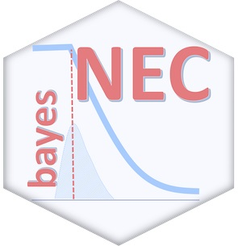

```{r setup, include=FALSE}
knitr::opts_chunk$set(echo = TRUE, cache = TRUE)
library(cmdstanr)
library(posterior)
library(bayesplot)
library(bayesnec)
library(dplyr)
library(ggplot2)
library(tidyr)
set_cmdstan_path("C:/cmdstan")
```


## Background

This course focuses extensively on the use of Bayesian methods for fitting CR models. Throughout the course, and even from the initial process of installing the necessary software, this may seem like an un-necessary complication. We even provide frequentist solutions in most cases, such as for example the use of `drc`.

The greater complexity associated with Bayesian model fitting has likely hindered the uptake of Bayesian statistics for CR threshold derivation across the broader ecotoxicology and toxicology communities, who may not have access to specialist statistical expertise [@Fisher2019].


We have persisted with the the greater overhead of implementing Bayesian inference methods for several reasons,
namely:-

- A stable and flexible model fitting platform

- Intuitive estimates of uncertainty

- The resulting posterior sample

In this tutorial we will go through a non-technical explanation of Bayesian statistics, and the associated fitting methods. We will discuss the importance of carefully considering priors, and how `bayesnec` handles these. Finally, we will showcase how the posterior distribution can be used for comparing toxicity.


```{r etnc_fig2, fig.align='tight', out.width="80%", echo=FALSE}
knitr::include_graphics("images/bayesian_stats.jpg")
```

## Bayesian statistics

Without going into to much detail, let's cover the basic principles of Bayesian statistics. Rather than trying to explain this from scratch, we've decided to use a good introductory youtube tutorial instead - there is a lot of helpful statistics material aimed at beginners now developed into short youtube videos. Here we link a video that is associated with the statistical software `Stata`, but it is of good length and level of technical detail. (view only 0-5:22)


## Estimating uncertainty

Hopefully one thing you took away from that video is that in Bayesian inference, model parameters and their inherent uncertainty are estimated as statistical probability distributions. 

Estimates of uncertainty in parameters and derived thresholds are critical for effective integration of threshold estimates into risk assessment and formal decision frameworks [@fisher2018c]. 

Bayesian methods allow robust quantification of uncertainty with intuitive and direct probabilistic meaning [@Ellison1996], and are therefore an excellent platform for CR modelling in most settings. 

There is considerable debate on the topic of frequentist versus Bayesian statistics and their relative resulting probability interpretation. Some potentially useful and/or amusing reads include
[wiki](https://en.wikipedia.org/wiki/Probability_interpretations)
and 
[stackexchange](https://stats.stackexchange.com/questions/2272/whats-the-difference-between-a-confidence-interval-and-a-credible-interval).

In the simplest way of thinking about the two paradigms, you can say that:

- In Bayesian statistics, you estimate the probability of the parameters directly, given the observed data (and prior information).

- In frequentist statistics, you are estimating the probability of the data, given the parameters.

It is this subtle, but key difference that makes Bayesian methods yield more *intuitive* estimates of probability, that are generally more useful than the frequentist equivalent, providing you have adequately handled the problem of *priors*, which we will discuss in more detail later.


## Bayesian fitting methods (MCMC)

To re-cap the earlier video, estimation of the statistical probability distributions of the parameters in Bayesian statistics is achieved by combining an a-priori probability distribution for each parameter (the 'priors', $p(\theta)$) with the likelihood of the observed data, $D$, given the model parameters, $p(D | \theta)$, to yield a so-called posterior probability distribution, $p(\theta | D)$

\begin{equation}
  p(\theta | D) = \frac{p(D | \theta) p(\theta)}{\int_{\theta} p(D | \theta) p(\theta) d \theta} \propto p(D | \theta) p(\theta).
  \label{eqn1}
\end{equation}

Defining the prior distribution is critical, and as was explained in the video, can influence the outcome, particularly when there is not very much data. We will discuss priors in detail shortly.

For now, let's stick with another technical issue - the fact that in many cases, the denominator (a.k.a. "evidence" or "marginal") is usually analytically intractable. For this reason Bayesians resort to numerical approximations such as Markov Chain Monte Carlo (MCMC). The following video contains a short, relatively non-technical explanation of MCMC (view only 0-6:35).


## Bayesian packages


There is a wide array of packages available for Bayesian model fitting via Markov chain Monte Carlo methods, including `WinBUGS` [@Lunn2000], `JAGS` [@Plummer2003] and `Stan` [@Carpenter2017], that seamlessly interface with R through packages such as `R2WinBUGS`, `R2jags` [@Su2015] and `rstan` [@rstan2021]. 

```{r mctools, fig.align='tight', out.width="30%", echo=FALSE}
knitr::include_graphics("images/mctools.jpg")
```

These packages require coding in `R` and additional model specification in custom languages---which might involve non trivial coding, extensive debugging and optimisation that is often time consuming and requires specialist expertise. All of which might add a learning/application barrier to many potential users. 

Several extension packages which aim to reduce that barrier have recently become available, principally `brms` [@Burkner2017], that allow a broad range of models to be easily fitted using `rstan`[@rstan2021] or `cmdstanr` [@cmdstanr2022] through simpler `lme4`-like formula syntax. 

However, even with packages like `brms`, Bayesian model fitting can be difficult to automate across all potential usage cases, particularly with respect to specifying valid initial parameter values and appropriate priors. 

In addition, as was the motivation for the development of the `drc` package in the frequentist setting, the `R` code required for fitting non-linear models and extracting the relevant outputs (e.g. NEC, ECx) and their standard errors can be cumbersome in practice, and even more so in the Bayesian setting where model fits contain multiple posterior draws.

## `bayesnec`

As we mentioned in our [Getting started]() tutorial `bayesnec` uses the extensive functionality of the `brms` package to write model code as well as fit models via `Stan` [@stan2021]. `Stan` employs Hamiltonian Monte Carlo (HMC)---a type of MCMC algorithm---for its fitting mechanism, and automatically optimizes the discretization time parameter to match an acceptance-rate target using the no-U-turn sampling (NUTS) algorithm [@hoffman2014]. Explaining this algorithm in detail is beyond the scope of this course.

We have done our best to make `bayenec` user friendly, but it's use will always require some expertise and effort. Most importantly, it is critical that you evaluate the models fit by `bayesnec` by evaluating if the statistical family adopted was appropriate (including checking for overdispersion), inspecting your chains, and ensuring the priors are appropriate.

```{r bayesnec_logo, fig.align='tight', out.width="30%", echo=FALSE}

```

## Priors

We you have seen, to undertake a Bayesian analysis, prior probability densities of the parameters of the model must first be defined. 

Sometimes there may be substantial prior knowledge, for example when pilot data or data from a previous experiment exist for a given response curve. In this case the prior probability distribution may be quite narrow (highly "informative") and will therefore be influential in the characterisation of the posterior, especially when subsequent data are scarce or highly variable. 

However, in our experience in ecology and related disciplines, such prior knowledge is generally the exception. Where no quantitative prior information exists, it is common in Bayesian statistics to use "vague" or "weakly" informative priors. 

The use of "vague", "diffuse", "flat" or otherwise so-called "uninformative" priors is no longer recommended [@Banner2020]. Such priors generally form the default for many Bayesian packages, and are often used in practice without critical thought or evaluation, possibly as a result of fear of being too subjective [@Banner2020].

However, even vague priors can have a substantial influence on the outcome of an analysis [@depaoli2020importance; @gelman2017entropy]. 

Instead, it is now considered better to use weakly informative, "generative" priors - that is priors that are based on probability distributions that interact sensibly with the likelihood to produce a meaningful data generating mechanism [@gelman2017entropy].


## Priors and `bayesnec`

Considerable thought has gone into development of an algorithm to build "weakly" informative priors for fitting models in `bayesnec`. 

The priors are "weakly" informative in that in addition to specifying the relevant statistical family that appropriately captures the parameter's theoretical statistical distribution, we also use information contained within the observed data to centre the probability density near the most likely parameter space and/or constrain priors to sensible bounds. 

These weakly informative priors are used to help constrain the underlying routines so that they are less likely to consider what the researcher would deem highly improbable estimates, that may also cause the routines to become unstable. 

Weakly informative priors can be particularly helpful in complex non-linear modelling to ensure reliable convergence. In testing against `drc` for some examples, we have found that `bayesnec` often finds a very sensible fit, where `drc` does not, and this is in part due to the bounds created on the parameter space by defining sensible priors.

These types of priors specify the general shape and bounds of the probability distribution for a given parameter, whilst remaining sufficiently broad so as not to influence the parameter's estimated posterior distribution (given a reasonable amount of observed data). 

In this sense, appropriately weak priors should yield analytical outcomes that share the same level of *objectivity* as equivalent Frequentist approaches, whilst yielding robust parameter estimates with probabilistically interpretable uncertainty bounds. 

Note, however that it is critical for users to critically interrogate these default priors, using for example, sensitivity analysis [@depaoli2020importance] and ensure they are appropriate given the data [@gelman2017entropy].

As a general rule, the priors in `bayesnec` are usually pretty good, provided there are sufficient data (which includes a reasonable number of treatment concentrations). When the data are poor, the default priors may have a substantial influece on the outcome. But when data are "poor", you may find that you need informative priors to provide a sensible fit in any case. Just be aware these are being influence by your prior knowledge.

## Priors for response-scaled parameters

Only the parameters $\tau = \text{top}$ and $\delta = \text{bottom}$ relate directly to the response variable's distribution. The priors on these parameters are therefore defined depending on the family defined by the response distribution.

For Gaussian-distributed responses (or any response variable for which the link ensures valid values of the response can take from -$\infty$ to $\infty$, including `log` and `logit`) priors are Gaussian with a mean set at the 90^th^ and 10^th^ quantiles of the response for parameters $\tau = \text{top}$ and $\delta = \text{bottom}$, respectively, and a standard deviation of 2.5 * the standard deviation of the response (on the appropriate link scale). In this way `bayesnec` attempts to construct a prior that scales appropriately with the observed data, with greatest density near the most likely region of the response for both $\tau = \text{top}$ and $\delta = \text{bottom}$. By setting the standard deviation of the prior at 2.5 times the observed standard deviation of the response, these priors should be very broad and have little influence on each parameter's posterior density.

For Poisson-, Negative-binomial- and Gamma-distributed response variables, the response cannot take negative values and therefore Gaussian priors are unsuitable. Instead, we use Gamma priors with a mean scaled to correspond to the 75^th^ and 25^th^ quantiles of the response for $\tau = \text{top}$ and $\delta = \text{bottom}$, respectively. The mean ($\mu$) is linked mathematically to the shape (s) and rate parameters (r) by the equation $$ \mu = s * (1/r) $$ [@Becker1988] with the shape parameter being set to 2 by default. The value of 2 was selected based on trial and error through initial testing, as this appeared to produce relatively broad priors that were still centered around feasible values for these parameters.

For the Binomial, Beta, and Beta-binomial families, estimates for $\tau = \text{top}$ and $\delta = \text{bottom}$ must necessarily be constrained between 0 and 1 when modelled on the identity link. Because of this constraint, there is no need to adjust scaling based on the response. In this case `bayesnec` uses `beta(5, 2)` and `beta(2, 5)` priors to provide a broad density centred across the upper and lower 0 to 1 range for the $\tau = \text{top}$ and $\delta = \text{bottom}$ parameters respectively.

## Priors for predictor-scaled parameters

The parameters $\eta = \text{NEC}$ and $\eta = \text{ec50}$ scale according to the predictor variable because both of these are estimated in units of the predictor (usually concentration). To stabilise model fitting, the $\eta = \text{NEC}$ and $\eta = \text{ec50}$ parameters are bounded to the upper and lower observed range in the predictor, under the assumption that the range of concentrations in the experiment were sufficient to cover the full range of the response outcomes. Note that this assumption may not always hold if the data are from an experiment that is badly designed, and the outcome of any analysis resulting in either $\eta$ or $\eta$ being estimated at the bounds of the predictor data range should be interpreted with caution. The priors used reflect the characteristics of the observed data that are used to predict the appropriate family. If the predictor variable is strictly positive, a Gamma prior is used, with maximum density ($\mu$, see above) at the median value of the predictor, and a shape parameter of 5. If the predictor variable is truncated at both 0 and 1, a `beta(2, 2)` prior is used. For predictor variables ranging from -$\infty$ to $\infty$, a Gaussian prior is used, with a mean set at the median of the predictor values and a standard deviation of 10 time the standard deviation of the predictor variable.

## Priors for other parameters

For the parameters $\beta = \text{beta}$, $\alpha = \text{slope}$ and $\epsilon = \text{d}$ we first ensured any relevant transformations in the model formula such that theoretical values with the range -$\infty$ to $\infty$ are allowable, and a `normal(0, 5)` (location and scale) prior is used. For example in the `nec3param` model, $\beta = \text{beta}$ is an exponential decay parameter, which must by definition be bounded to 0 and $\infty$. Calling `exp(beta)` in the model formula ensures the exponent meets these requirements. Note also that a mean of 0 and standard deviation of 5 represents a relatively broad prior on this exponential scaling, so this is usually a weakly informative prior in practice.

## When default priors or inadequate

In `bayesnec` we chose to provide default priors that are data-dependent. 

As explained previously, they were designed to be somewhat informative (relative to each parameter's region) but that would, in data-sufficient cases, return fits without HMC divergent transitions in `Stan`. 

Default "blanket" priors are not currently provided for non-linear models by the model-building underlying package `brms`, and we note that defining the extent to which a prior is vague or weakly/strongly informative ultimately depends on the likelihood [@gelman2017entropy]. 

There may be situations where the default `bayesnec` priors do not behave as desired.

For example, the default priors may be too informative, yielding unreasonably tight confidence bands (although this is only likely where there are few data or unique values of the predictor variable). 

Conversely, priors may be too vague, leading to poor model convergence. 

Alternatively, the default priors may be of the wrong statistical family if there was insufficient information in the provided data for `bayesnec` to correctly predict the appropriate ones to use. 

## Checking the priors used in `bayesnec`

The priors used in the default model fit can be extracted using `pull_prior`, and a sample or plot of prior values can be obtained from the individual `brms` model fits through the function `sample_priors` which samples directly from the `prior` element in the `brmsfit` object (`sample_priors(pull_brmsfit(fit)$prior)`, see \autoref{fig:sampleprior}).

```{r sampleprior, echo=FALSE, fig.height = 3.5, fig.width = 4.5, fig.cap = "Frequency histograms of samples of the default priors used by \`bayesnec` for fitting the \\texttt{nec4param} model to the example data."}
sample_priors(pull_brmsfit(fit)$prior)
```

We can also use the function `check_priors` (based on the `hypothesis` function of `brms`) to assess how the posterior probability density for each parameter differs from that of the prior. Here we show the prior and posterior probability densities for the parameters in the `nec4param` model fit (`check_priors(fit)`, see \autoref{fig:checkpriorsingle}). There is also a `bayesmanecfit`-specific method that can be used to sequentially view all plots in a `bnec` call with multiple models, or write to a pdf as in `check_chains`.

```{r checkpriorsingle, echo=FALSE,fig.height = 3.5, fig.width = 6, fig.cap = "A comparison of the prior and posterior parameter probability densities for the \\texttt{nec4param} model fit to the example data."}
check_priors(fit)
```

## User specified priors for a single *bayesnecfit* model

To set specified priors, it is simplest to start by letting `bnec` find the priors on its own, i.e. by not specifying the `brm` argument `prior` at all.

```{r echo = FALSE, warning = FALSE, message = FALSE, results = "hide"}
library(bayesnec)
library(brms)
options(mc.cores = parallel::detectCores())
```

```{r, results = "hide"}
library(brms)
library(bayesnec)
data(nec_data)

# a single model
set.seed(333)
exmp_a <- bnec(y ~ crf(x, model = "nec3param"), data = nec_data,
               family = Beta(link = "identity"),
               iter = 1e4, control = list(adapt_delta = 0.99))
```

```{r}
class(exmp_a)
```

We can then take advantage of the function `pull_prior` to inspect what `bnec` came up with on its own, and decide how best to modify those priors to be more desirable.

```{r}
pull_prior(exmp_a)
```

`bnec` chose a `gamma` prior on the *NEC* parameter of **nec3param** because the predictor `nec_data$x` is non-zero positive. However, imagine that in theory the predictor could have had negative values, it just happened to not have in this particular dataset. So let's go ahead and specify something else, say a normal with larger variance.

```{r, results = "hide"}
set.seed(333)
my_prior <- c(prior_string("beta(5, 1)", nlpar = "top"),
              prior_string("normal(1.3, 2.7)", nlpar = "nec"),
              prior_string("gamma(0.5, 2)", nlpar = "beta"))
exmp_b <- bnec(y ~ crf(x, model = "nec3param"), data = nec_data,
               family = Beta(link = "identity"), prior = my_prior,
               iter = 1e4, control = list(adapt_delta = 0.99))
```

Two things are of note. If the user is specifying their own priors, `bnec` requires them to specify priors for **all** parameters. The `pull_prior` function shows the priors *after* the model was fitted, but suppose the user does not know what parameters were comprised in a particular model. In those instances, the user can call the function `show_params(model = "all")` to inspect the parameters of each function, or some targeted function in particular.

```{r}
show_params(model = "nec3param")
```

### User specified priors for a *bayesmanecfit* containing multiple models

The user can also specify a named list of priors when one or more models are being fitted to the same dataset.

```{r, results = "hide"}
set.seed(333)
my_priors <- list(nec3param = c(prior_string("beta(5, 1)", nlpar = "top"),
                                prior_string("normal(1.3, 2.7)", nlpar = "nec"),
                                prior_string("gamma(0.5, 2)", nlpar = "beta")),
                  nec4param = c(prior_string("beta(5, 1)", nlpar = "top"),
                                prior_string("normal(1.3, 2.7)", nlpar = "nec"),
                                prior_string("gamma(0.5, 2)", nlpar = "beta"),
                                prior_string("beta(1, 5)", nlpar = "bot")))
exmp_c <- bnec(y ~ crf(x, model = c("nec3param", "nec4param")), data = nec_data,
               family = Beta(link = "identity"), prior = my_priors,
               iter = 1e4, control = list(adapt_delta = 0.99))
```

`pull_prior` also works for an object of class `bayesmanecfit`, as does `check_priors` which allows an option of passing a filename to save the prior and posterior probability density plots to a pdf.

```{r eval = FALSE}
pull_prior(exmp_c)
check_priors(exmp_c, filename = "Check_priors")
```

```{r echo = FALSE}
pull_prior(exmp_c)
```

The user can also specify priors for one model only out of the entire set, `bayesnec` will return a message stating that it is searching for priors on its own when they are either ill-formed (e.g. incomplete or have a typo), or the user simply decided not to specify priors for a particular model, e.g.

```{r,  results = "hide"}
set.seed(333)
my_priors <- list(nec3param = c(prior_string("beta(5, 1)", nlpar = "top"),
                                prior_string("normal(1.3, 2.7)", nlpar = "nec"),
                                prior_string("gamma(0.5, 2)", nlpar = "beta")),
                  nec4param = c(prior_string("beta(5, 1)", nlpar = "top"),
                                prior_string("normal(1.3, 2.7)", nlpar = "nec"),
                                prior_string("gamma(0.5, 2)", nlpar = "beta"),
                                prior_string("beta(1, 5)", nlpar = "bot")))
exmp_d <- bnec(y ~ crf(x, model = c("nec3param", "nec4param")), data = nec_data,
               family = Beta(link = "identity"), prior = my_priors[1],
               iter = 1e4, control = list(adapt_delta = 0.99))
```

`prior = my_priors[[1]]` would also have worked because the argument priors can either take a `brmsprior` object directly, or a named list containing model-specific `brmsprior` objects.

Finally the user can also extend an existing `bayesmanecfit` object with the function `amend`, also by specifying custom-built `priors`.

```{r,  results = "hide"}
set.seed(333)
necsigm_priors <- c(prior_string("beta(5, 1)", nlpar = "top"),
                    prior_string("gamma(2, 6.5)", nlpar = "beta"),
                    prior_string("normal(1.3, 2.7)", nlpar = "nec"),
                    prior_string("normal(0, 2)", nlpar = "d"))
exmp_e <- amend(exmp_d, add = "necsigm", priors = necsigm_priors)
```


