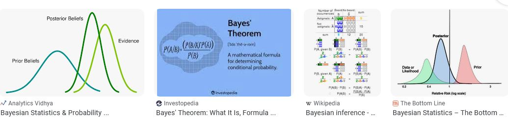

```{r}
#| label: setup
#| include: false
knitr::opts_chunk$set(echo = TRUE)
library(bayesnec)
library(brms)
library(ggplot2)
options(brms.backend = "cmdstanr")
options(mc.cores = 4)
set.seed(333)
data(nec_data)
```

## Background

This course uses Bayesian methods throughout, and from the installation onwards
that can look like an unnecessary complication — frequentist solutions exist for
most of it, `drc` among them. The extra overhead has probably held back the use
of Bayesian methods for threshold derivation in ecotoxicology, where specialist
statistical support is not usually available [@Fisher2019].

Three things justify the overhead: a stable and flexible fitting platform,
estimates of uncertainty that mean what people assume they mean, and the
posterior sample itself, which every estimate in this course is read from.

{width=100% fig-align="center"}

## Estimating uncertainty

In Bayesian inference the parameters and their uncertainty are estimated as
probability distributions. Uncertainty in a derived threshold is what makes it
usable in risk assessment and formal decision frameworks [@fisher2018c], and
Bayesian methods quantify it with a direct probabilistic meaning
[@Ellison1996].

The distinction between the two paradigms, stated as simply as it can be:

- Bayesian inference estimates the probability of the parameters, given the
  observed data and the prior information.
- Frequentist inference estimates the probability of the data, given the
  parameters.

That difference is why a Bayesian interval answers the question most people
think a confidence interval answers. It holds provided the priors have been
handled properly, which is the subject of this module.

This introduction covers the principles without the mathematics:



## The posterior sample

A Bayesian fit returns draws from the joint posterior of every parameter, and
what follows in an analysis is done on those draws rather than on a point
estimate and a standard error.

A derived quantity is computed once per draw, so it arrives with an interval of
its own. `ecx()`, `nsec()` and `ecnsec()` each evaluate the fitted curve draw by
draw and return the distribution that results. The interval on the estimate
therefore follows from the parameter draws with no separate approximation.
Maximum likelihood needs the delta method or a bootstrap for the same interval,
and the [`drc` reference](drc-reference.qmd) page derives an *NSEC* that has no
interval at all for that reason.

A question about two estimates becomes a proportion of draws.
`compare_posterior()` pairs the draws of two fits and reports the probability
that one estimate exceeds the other. *Using posterior distributions*, at the end
of this module, works that through on two equations fitted to `nec_data`, and
module 8 uses it to compare the toxicity of copper and zinc. The same count
answers whether a threshold falls below a guideline value, which is the form a
risk assessment usually needs [@fisher2018c].

Model averaging is done on the draws as well. `bnec()` weights the candidate
equations by their leave-one-out predictive performance and draws from each in
proportion to its weight, so an estimate taken from a model-averaged fit
includes the uncertainty about which equation describes the data. Module 4
covers how the weights are computed.

The draws also travel into work downstream of the fit. A species sensitivity
distribution fitted to point estimates treats each species value as known
exactly, and fitting it to the draws instead propagates the uncertainty in each
species into the hazard concentration that comes out
[@Charles2020a; @Gottschalk2013].

None of this removes the overhead. A fit takes minutes rather than seconds and
needs a working toolchain. The priors are a further assumption that a maximum
likelihood fit does not make, and stating them, checking them and knowing how
much they matter is the subject of the middle of this module. *Using posterior
distributions* returns to the draws at the end, once the machinery that produced
them has been set out.

## Sampling

The posterior combines a prior distribution for each parameter, $p(\theta)$,
with the likelihood of the observed data given those parameters, $p(D | \theta)$:

$$
p(\theta | D) = \frac{p(D | \theta)\, p(\theta)}{\int_{\theta} p(D | \theta)\, p(\theta)\, d\theta} \propto p(D | \theta)\, p(\theta)
$$ {#eq-bayes}

The denominator is usually analytically intractable, which is why Bayesian
fitting relies on numerical approximation by Markov chain Monte Carlo.



Many packages implement MCMC — `WinBUGS` [@Lunn2000], `JAGS` [@Plummer2003] and
`Stan` [@Carpenter2017], reached from R through `R2WinBUGS`, `R2jags` [@Su2015]
and `rstan` [@rstan2021].

{width=100% fig-align="center"}

These require the model to be specified in a separate language, which is a real
barrier. `brms` [@Burkner2017] removes it for a wide range of models by
generating that code from `lme4`-like formula syntax, fitting through `rstan`
[@rstan2021] or `cmdstanr` [@cmdstanr2022]. Even so, automating Bayesian fits
across arbitrary use cases is difficult, particularly the initial values and the
priors, and extracting NEC or ECx estimates with their uncertainty from a set of
posterior draws is cumbersome without dedicated code. Those are the gaps
`bayesnec` fills, as module 1 described.

`Stan` uses Hamiltonian Monte Carlo, tuning the discretisation time to an
acceptance-rate target with the no-U-turn sampler [@hoffman2014].

## Priors

A Bayesian analysis requires a prior probability density for every parameter.

Where real prior knowledge exists — pilot data, or a previous experiment on the
same response — the prior may reasonably be narrow, and will then be influential,
especially if the new data are scarce or noisy. In ecology and ecotoxicology that
situation is the exception.

Where no quantitative prior information exists it is common to use vague or
weakly informative priors. The use of vague, diffuse or flat priors described as
"uninformative" is no longer recommended [@Banner2020]. Such priors are the
default in many packages and are often used without evaluation, sometimes from a
concern about appearing subjective [@Banner2020], and they can still influence
the outcome substantially [@depaoli2020importance; @gelman2017entropy].

The current recommendation is weakly informative, generative priors: priors that
interact sensibly with the likelihood to produce a plausible data-generating
mechanism [@gelman2017entropy].

## Priors in `bayesnec`

`bayesnec` builds weakly informative priors by algorithm, on two principles:

- use a statistical family appropriate to the parameter's theoretical
  distribution;
- use the observed data to centre the density near the plausible parameter space,
  and to constrain it to sensible bounds.

The purpose is to keep the sampler away from values the researcher would regard
as implausible, which is also where non-linear fits become unstable. For complex
non-linear models this matters for convergence rather than only for inference.
In comparisons against `drc`, `bayesnec` often finds a sensible fit where `drc`
does not, and the bounds these priors place on the parameter space are part of
the reason.

Priors of this kind describe the shape and bounds of a parameter's density while
staying broad enough not to determine its posterior, given a reasonable amount of
data. Used that way they give results about as objective as the frequentist
equivalent, while yielding intervals that can be read as probabilities.

They still need interrogating — by sensitivity analysis [@depaoli2020importance]
and by checking they suit the data [@gelman2017entropy]. As a rule the defaults
behave well where there are enough data, which includes a reasonable number of
treatment concentrations. Where data are sparse the defaults can be influential;
but sparse data usually need informative priors to fit at all, and then the
influence of prior knowledge should be acknowledged rather than avoided.

Two sets are supplied, and `prior_type` selects between them:

```{r}
#| label: prior-types
#| comment: ""
formals(bnec)$prior_type
```

`"uninformative"` is the default. `"regularizing"` is a deliberately narrower
set, and it is the one to reach for where a default fit is unstable. The
narrower set is not the default for a reason that has nothing to do with which
performs better: `"uninformative"` reproduces the priors described in the paper
documenting the package [@fisheretal2024], so it is what a published `bayesnec`
analysis was run under, and changing the default would silently change the
result of re-running one.

On the evidence so far the narrower set is the better choice for a new analysis.
Measured over 420 `top` and `bot` entries built from simulated responses across
ten seeds, three designs and five families, the true value fell outside the
central 95% of its own prior in 12 entries under the narrower set and in 127
under `"uninformative"`. Expect it to become the default in a later version, and
state which set was used either way. One assumption is worth checking before
selecting it: the rule assumes the lowest concentration tested sits at the level
`top` describes and the highest sits at the level `bot` describes, so on a
design whose decline is incomplete, use `"uninformative"`.

How each prior is constructed, parameter by parameter and family by family, is
in the [`bayesnec` priors
article](https://open-aims.github.io/bayesnec/dev/articles/example3.html). Two
consequences of the construction reach how an analysis is run. The prior on
`nec` is truncated to the observed range of the predictor, so an estimate
sitting at the edge of the tested range should be treated with suspicion rather
than reported. And its width is set by the two extreme concentrations, so it
responds to what is entered for the control: on one dilution series the standard
deviation is 2.30 with the control recorded as `0` and 6.11 with it recorded as
`1e-6`, because each smaller value states that a smaller concentration was
applied. Record a control as `0`.

## Limits of the default priors

The defaults are data-dependent and are designed to be informative enough,
relative to each parameter's plausible region, to return fits without divergent
transitions where the data are sufficient. `brms` provides no blanket defaults
for non-linear models, and how vague a prior is depends on the likelihood in any
case [@gelman2017entropy].

Three ways they can fail. They may be too informative, giving unreasonably tight
bounds, which happens mainly with few data or few unique predictor values. They
may be too vague, giving poor convergence. Or they may be of the wrong family, if
the data did not contain enough information for `bayesnec` to infer the right one.

## Inspecting the priors

`get_priors()` builds the priors from a formula and a dataset without fitting
anything, which is the order they are wanted in when a fit takes minutes:

```{r}
#| label: get-priors
data(nec_data)
get_priors(y ~ crf(x, model = "nec3param"), data = nec_data,
           family = Beta(link = "identity"))
```

That is the set `bnec()` would use, and it can be edited and passed back through
the `prior` argument, which the next section does. `pull_prior()` reports the
same thing for a model already fitted.

A fitted model to work from:

```{r}
#| label: fit-base
#| eval: false
set.seed(333)
data(nec_data)
bnec_fit <- bnec(y ~ crf(x, model = "nec3param"), data = nec_data)

save(bnec_fit, file = "vignettes/fits/m6_bnec_fit.RData")
```

```{r}
#| label: load-fit-base
load("vignettes/fits/m6_bnec_fit.RData")
```

`sample_priors()` draws from the priors held in the `brms` fit, which shows their
shape directly:

```{r}
#| label: fig-sample-priors
#| fig-height: 4
sample_priors(pull_brmsfit(bnec_fit)$prior)
```

`check_priors()`, which builds on the `hypothesis()` function of `brms`, plots
the prior against the posterior for each parameter. That comparison is the
check the whole module turns on.

```{r}
#| label: fig-check-priors
#| fig-height: 4.5
check_priors(bnec_fit)
```

Read each panel as a pair of densities. A posterior concentrated well inside its
prior was determined by the data; one that follows the shape of its prior was
not. All three parameters here are determined by the data. Each posterior is a
narrow spike, and each prior is broad beneath it: `nec` is located at about 1.5
under a prior spread across the whole tested range, and `top` at about 0.9 under
a `beta(5, 2)` spanning most of the interval from 0.25 to 1. The `beta` panel is
the one to read carefully, because its spike sits at about 0, which is also
where its `normal(0, 5)` prior is centred. Agreement between a posterior and the
centre of its prior is not evidence that the prior determined it; what settles
that is the width, and this posterior is narrower than its prior by more than an
order of magnitude.

`check_priors()` works on a `bayesmanecfit` as well, and takes a `filename` to
write the plots for a whole set to a PDF rather than to the screen.

Two things the plot does not settle. A narrow interval is not evidence of a
well-determined parameter: a parameter the likelihood is flat in will report a
narrow posterior if its prior was narrow. **Prior-to-posterior contraction**, one
minus the ratio of the posterior variance to the prior variance, distinguishes
the two, and runs from 0 where the data added nothing to 1 where the posterior is
far narrower than the prior. It is computed from `pull_prior()` and the
posterior draws. And whether a *different* reasonable prior would have given a
different answer is a question the plot cannot ask. `prior_type` makes that
sensitivity analysis one argument:

```{r}
#| label: sensitivity
#| eval: false
set.seed(333)
exmp_reg <- bnec(y ~ crf(x, model = "nec4param"), data = nec_data,
                 family = Beta(link = "identity"),
                 prior_type = "regularizing")
```

`nec4param` is used rather than `nec3param` because the two sets differ most in
`bot`, which `nec3param` does not have. Posteriors that agree between the two
sets are being determined by the data. Posteriors that differ are being
determined by the priors, and the influence of the prior then belongs in the
reporting rather than being left implicit.

## Specifying priors

The simplest way to write custom priors is to let `bnec` build its own first and
then modify them.

```{r}
#| results: hide
#| label: fit-a
#| eval: false
set.seed(333)
exmp_a <- bnec(y ~ crf(x, model = "nec3param"), data = nec_data,
               family = Beta(link = "identity"),
               iter = 1e4, control = list(adapt_delta = 0.99))

save(exmp_a, file = "vignettes/fits/m6_exmp_a.RData")
```

```{r}
#| label: load-fit-a
load("vignettes/fits/m6_exmp_a.RData")
```

`pull_prior()` reports what it chose:

```{r}
#| label: pull-prior-a
pull_prior(exmp_a)
```

The prior on `nec` is a lognormal, because `nec_data$x` is strictly positive.
Suppose the predictor could in principle have been negative and simply was not in
this dataset. A normal with a larger variance can be substituted:

```{r}
#| results: hide
#| label: fit-b
#| eval: false
set.seed(333)
my_prior <- c(prior_string("beta(5, 1)", nlpar = "top"),
              prior_string("normal(1.3, 2.7)", nlpar = "nec"),
              prior_string("gamma(0.5, 2)", nlpar = "beta"))
exmp_b <- bnec(y ~ crf(x, model = "nec3param"), data = nec_data,
               family = Beta(link = "identity"), prior = my_prior,
               iter = 1e4, control = list(adapt_delta = 0.99))

save(exmp_b, file = "vignettes/fits/m6_exmp_b.RData")
```

```{r}
#| label: load-fit-b
load("vignettes/fits/m6_exmp_b.RData")
```

Two things follow from that. Priors must be given for **every** parameter of the
model, not only the ones being changed. And to find out what those parameters
are before anything is fitted, use `show_params()`:

```{r}
#| label: show-params
show_params(model = "nec3param")
```

Where several equations are fitted together, `prior` takes a named list with one
entry per equation, and equations left out of it get the defaults. `amend()`
takes priors for the equation being added to a set. Both are set out in the
[`bayesnec` priors
article](https://open-aims.github.io/bayesnec/dev/articles/example3.html), with
worked examples of each.

### Comparison of the fits

```{r}
#| label: fig-compare-priors
#| fig-height: 4
par(mfrow = c(1, 2))
hist(exmp_a$ne_posterior, main = "Default priors", xlab = "NEC")
hist(exmp_b$ne_posterior, main = "User priors", xlab = "NEC")
```

The posteriors are similar, which is what should happen when the data are
informative enough that the priors are not driving the result. A large difference
would be the signal to look harder.

## Fixing a parameter

A parameter can be held at a known value rather than estimated, by giving it a
`constant()` prior. This works wherever a user-specified prior works and needs no
other change. `bayesnec` has no `fixed` argument of the kind `drc` provides,
because a point-mass prior expresses the same thing through machinery that
already exists.

```{r}
#| label: constant-prior
#| eval: false
fixed_prior <- get_priors(y ~ crf(x, model = "nec3param"), data = avoid_data,
                          family = Beta(link = "identity"))
fixed_prior$prior[fixed_prior$nlpar == "top"] <- "constant(0.5)"

bnec(y ~ crf(x, model = "nec3param"), data = avoid_data,
     family = Beta(link = "identity"), prior = fixed_prior)
```

Stan does not declare a parameter whose prior is constant, so `top` is reported
with an estimate of exactly 0.5 and no error, because it was never sampled.

The case where this is defensible is an asymptote that is structural rather than
measured. In a two-choice avoidance assay, animals are offered a treated and an
untreated container, and the expected proportion in the treated container at zero
dose is 0.5 *by design*, because at zero dose the two containers are identical.

### The consequences of fixing a parameter

Two things, and both are easy to miss because the fit looks better rather than
worse.

The first is a diagnostic. In the assay above, 0.5 is a null expectation rather
than a design constant: it holds only if there is no baseline preference between
the two containers arising from position, lighting, handling order or substrate.
Fitting with `top` free gives a credible interval that either covers 0.5 or does
not, and that is positive evidence about whether the assay was unbiased before
the contaminant was involved. No other output of the model supplies it. Where a
real baseline preference is present, fixing `top` at 0.5 produces a fit that
looks exactly as sound as one where it is absent; the disagreement does not
disappear when it is forbidden from appearing in `top`, but is absorbed into
`beta` and `nec` instead, and so into the toxicity estimate.

The second is uncertainty. A constant asserts that the value is known exactly, so
none of it propagates into an **EC~x~** or the *NEC*, and the credible intervals
narrow. That reads as a better analysis and is the opposite of one.

A tight informative prior is the better tool in most cases, because it states
what is known while still letting the data revise the parameter and still
propagating the uncertainty forward. `beta(6, 6)` has a mean of 0.5 and a standard deviation
of 0.14, concentrating `top` around the design expectation without asserting it:

```{r}
#| label: tight-prior
#| eval: false
fixed_prior$prior[fixed_prior$nlpar == "top"] <- "beta(6, 6)"
```

@Weimer2012 reach the same conclusion from the frequentist side. A linear
transformation of the data changes neither the EC50 nor the slope estimate,
provided the fitting function is kept, but fixing parameters in a reduced model
can produce erroneous estimates. Their case is data corrected for background and
normalised to a control, then fitted with the response range fixed between 100%
and 0%. Fix a parameter only where there is a compelling reason.

That case is the one to refuse outright. A response divided by its control mean
has a maximum of 1 by construction, and fixing `top` at 1 is a common reflex.
Normalising to an *estimated* control already discards the sampling variability
of the divisor, as module 5 sets out, and fixing the asymptote afterwards makes
that loss invisible rather than merely present, because the intervals it narrows
were already too narrow.

## Using posterior distributions

The posterior draws a Bayesian fit produces are useful well beyond a point
estimate. They support the study of synergistic and antagonistic effects
[@Fisher2019d; @flores2021], the propagation of endpoint uncertainty
[@Charles2020a; @Gottschalk2013], and tests of hypotheses of no effect
[@Thomas2006].

This section works through one of those uses on the fit above. A comparison
between two estimates is a count of draws rather than a test statistic, because
both estimates arrive as whole distributions. `compare_posterior()` does this
for a named list of fits, and returns both the posteriors it used and the
probability that one estimate exceeds the other.

There is one fit so far, so the comparison needs a second. `ecxll3` is a smooth
equation with the same three free parameters as `nec3param` and the same lower
asymptote fixed at zero, so the two fits differ in the shape of the curve rather
than in what each is free to estimate.

```{r}
#| label: fit-ecxll3
#| eval: false
set.seed(333)
ecxll3_fit <- bnec(y ~ crf(x, model = "ecxll3"), data = nec_data)

save(ecxll3_fit, file = "vignettes/fits/m6_ecxll3_fit.RData")
```

```{r}
#| label: load-ecxll3
load("vignettes/fits/m6_ecxll3_fit.RData")
```

Both equations support an **EC~x~**, which is the estimate compared here. Their
no-effect estimates are not the same quantity as each other, and module 3 covers
that difference.

```{r}
#| label: compare
post_comp <- compare_posterior(
  list("nec3param" = bnec_fit, "ecxll3" = ecxll3_fit),
  comparison = "ecx", ecx_val = 10)

names(post_comp)
```

`posterior_data` holds the draws of both estimates in long form, which is what a
figure is drawn from:

```{r}
#| label: fig-compare-post
#| fig-height: 4.5
#| fig-cap: "Posterior EC10 from two equations fitted to the same data. Each curve is the whole distribution of the estimate rather than a point and a standard error."
ggplot(post_comp$posterior_data, aes(x = value)) +
  geom_density(aes(group = model, colour = model, fill = model), alpha = 0.3) +
  labs(x = "Concentration", y = "Density") +
  theme_classic()
```

The two densities overlap over a narrow region and neither is contained in the
other, which is a statement a pair of point estimates could not make.

```{r}
#| label: compare-quantiles
sapply(post_comp$posterior_list, quantile, c(0.025, 0.5, 0.975))
```

The EC10 is `r sprintf("%.2f", median(post_comp$posterior_list[["nec3param"]]))`
from the `nec3param` fit and
`r sprintf("%.2f", median(post_comp$posterior_list[["ecxll3"]]))` from the
`ecxll3` fit, with the intervals above.

`prob_diff` is the proportion of paired draws in which the first estimate
exceeds the second, and `diff_list` holds the differences those proportions are
taken from:

```{r}
#| label: prob-diff
post_comp$prob_diff

quantile(post_comp$diff_list[["nec3param-ecxll3"]], c(0.025, 0.5, 0.975))
```

The probability is
`r sprintf("%.3f", post_comp$prob_diff$prob[1])`, so the `nec3param` EC10 is the
higher of the two in almost every paired draw. The difference is
`r sprintf("%.2f", median(post_comp$diff_list[["nec3param-ecxll3"]]))`, with a
95% interval from
`r sprintf("%.2f", quantile(post_comp$diff_list[["nec3param-ecxll3"]], 0.025))`
to
`r sprintf("%.2f", quantile(post_comp$diff_list[["nec3param-ecxll3"]], 0.975))`,
which is the size of the disagreement rather than the confidence in it. Read
both: a probability near 1 on a difference of no practical consequence is a
result a large sample can produce on its own.

### Comparing whole curves

`comparison = "fitted"` compares the curves themselves at a grid of
concentrations across the range of the predictor, rather than one estimate read
off each.

```{r}
#| label: compare-fitted
post_fitted <- compare_posterior(
  list("nec3param" = bnec_fit, "ecxll3" = ecxll3_fit),
  comparison = "fitted")
```

```{r}
#| label: fig-fitted-curves
#| fig-height: 4.5
#| fig-cap: "The two fitted curves over the observed data, each with its 95% credible interval, on the 50-point grid the comparison uses."
ggplot(post_fitted$posterior_data, aes(x = x)) +
  geom_point(data = nec_data, aes(x = x, y = y), colour = "grey60", size = 1) +
  geom_ribbon(aes(ymin = Q2.5, ymax = Q97.5), fill = "steelblue", alpha = 0.3) +
  geom_line(aes(y = Estimate), colour = "steelblue") +
  facet_wrap(~ model) +
  labs(x = "Concentration", y = "Response") +
  theme_classic()
```

Both curves pass through the data. `nec3param` holds the control level flat to
its threshold a little below 1.5 and turns sharply there; `ecxll3` has begun to
decline before 1.5 and turns gradually, so it sits below `nec3param` just before
the threshold and above it just after. Reading a separation off two panels stops
at that description, and the difference below puts a number and an interval on
it at every concentration.

```{r}
#| label: diff-data
head(post_fitted$diff_data)
```

```{r}
#| label: fig-compare-fitted
#| fig-height: 4.5
#| fig-cap: "Difference between the two fitted curves across the concentration range, with its 95% credible interval. The difference is taken as `nec3param` minus `ecxll3`, so a positive value is a higher predicted response from the threshold equation."
ggplot(post_fitted$diff_data) +
  geom_hline(yintercept = 0, linetype = 2, colour = "grey50") +
  geom_ribbon(aes(x = x, ymin = diff.Q2.5, ymax = diff.Q97.5),
              fill = "steelblue", alpha = 0.3) +
  geom_line(aes(x = x, y = diff.Estimate), colour = "steelblue") +
  labs(x = "Concentration", y = "Difference in fitted response") +
  theme_classic()
```

Where the band excludes zero the two curves differ at that concentration. These
two agree from 0.03 to 1.14 and differ over 25 of the 50 grid points. The
`nec3param` curve is the higher of the two from 1.20 to 1.53, the lower from
1.72 to 2.05, and the higher again from 2.44 to 3.22. The largest difference is
0.089 at a concentration of 1.85, on a response spanning about 0.95. That is
what the comparison achieved: it located the disagreement between the two
equations on the concentration axis and bounded its size, where the EC10
comparison above gave only that one of them was larger.

`nec_data` was simulated from a four-parameter threshold equation with its
threshold set at 1.5, which `data-raw/nec_data.R` in the `bayesnec` sources
records, and the pattern follows from that. The threshold equation holds the
control level up to 1.5, where the log-logistic has already begun to decline,
and then falls more steeply than the log-logistic immediately above it. Above
2.44 the log-logistic approaches zero the faster of the two.

Two readings of the same pair of fits therefore disagree on how far apart they
are: the EC10 posteriors separate at a probability of
`r sprintf("%.3f", post_comp$prob_diff$prob[1])`, and the curves are
indistinguishable over the lower third of the concentration range. A single
estimate is one point on a curve, and which of the two answers the question
depends on what is being reported.

The draws are paired at random, which approximates the difference of two
independent posteriors. Both fits here are to the same 100 observations, so this
comparison measures the difference between two equations rather than between two
experiments. Module 4 covers averaging over the equations rather than choosing
between them.

The comparison a real analysis makes is between fits to different data, such as
two exposure durations or two levels of a factor. Module 8 does that with
`bnec_group()`, through this same function. `comparison` also takes `"nec"`,
`"nsec"` and `"n(s)ec"`, which compare the no-effect estimates module 3 covers.

## References

::: {#refs}
:::
