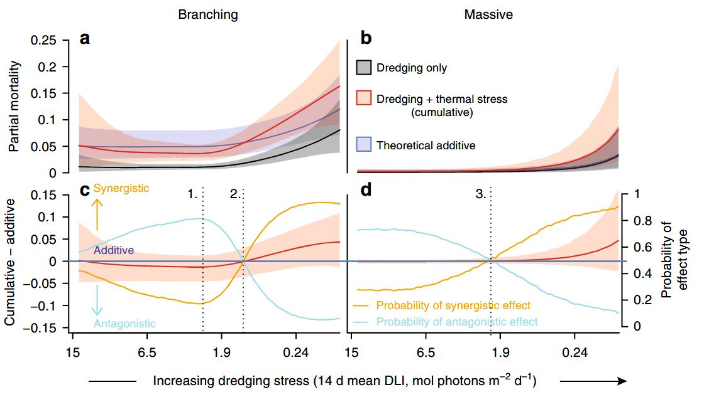
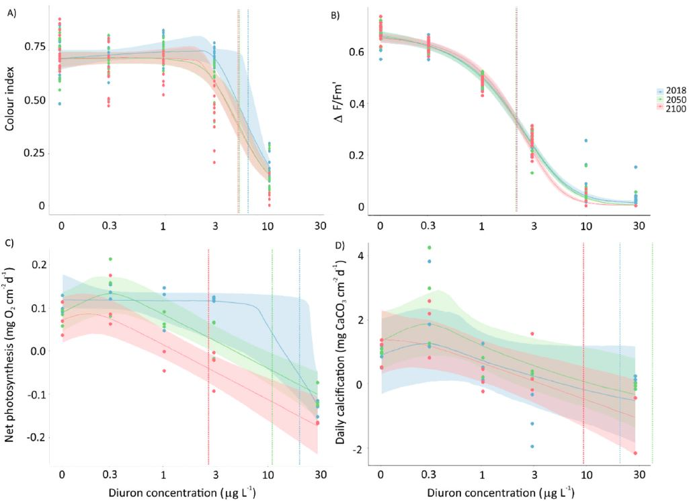
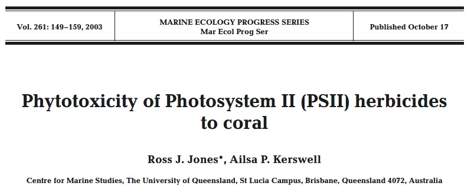
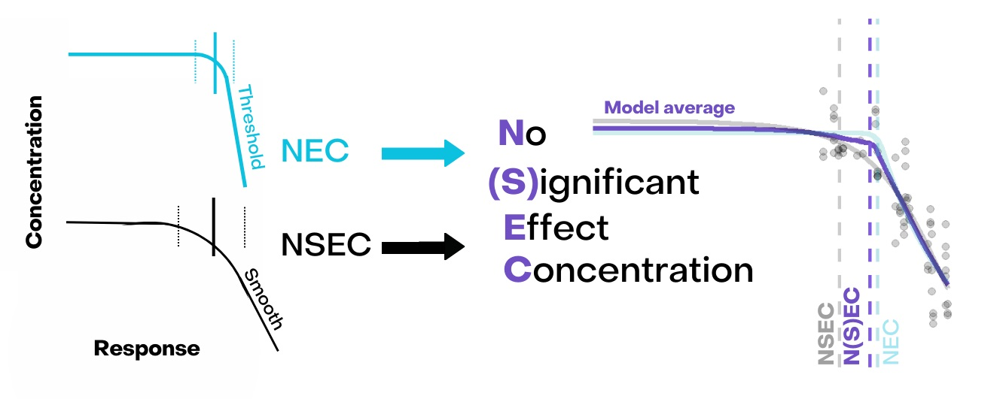

```{r setup, include=FALSE}
knitr::opts_chunk$set(echo = TRUE, cache = F)
library(drc)
library(tidyverse)

load("ametryn.RData")

```

## Background

The posterior draws generated through Bayesian model fitting methods provide a rich resource that can be used to explore synergistic and antagonistic impacts [@Fisher2019d; @flores2021], propagate endpoint uncertainty [@Charles2020a; @Gottschalk2013], and test hypotheses of no-effect [@Thomas2006].

With `bayesnec` we have included a function (`compare_posterior`) that allows bootstrapped comparisons of posterior predictions. This function allows the user to fit several different `bnec` model fits and compare differences in their posterior predictions. Comparisons can be made across the model fits for individual threshold estimates (e.g. NEC, NSEC or ECx) or across a range of predictor values. 

```{r dredging, fig.align='tight', out.width="48%", echo=FALSE}

```
```{r climate, fig.align='tight', out.width="48%", echo=FALSE}

```


## Example case study - herbicide toxicity

We will look at a `drc` comparison to the same herbicide toxicity data used for the `bayesnec` case studyl. The data we analyse in this example are from @jones2003meps, and they are included as an example dataset in `bayesnec`.

```{r jonesnkerswell, out.width="64%", echo=FALSE}

```

## Fitting just one herbicide

We start by describing the analysis workflow for a single herbicide, ametryn. 

- We first filter ametryn from the larger herbicide data set. 

- The concentration data are log transformed prior to analysis to improve model stability and because this is the natural scaling of the concentration series for these data. 


```{r drc_ametryn, eval=FALSE, echo=TRUE}
ametryn <- herbicide %>%
  dplyr::mutate(logconc = log(concentration)) %>%
  dplyr::filter(herbicide == "ametryn")

ametryn_LL3 <-  drm(fvfm~concentration, data=ametryn, fct=LL.3(names = c("Slope","Upper Limit", "Midpoint")))

plot(ametryn_LL3)
```


## Inspecting the fitted model

Following model fitting, we can do our standard checks including:

- `summary` function to make sure the model parameters are significantly different from 0


````{r}
summary(ametryn_LL3)
```

All model parameters significant.

- `residual` check to make sure assumptions of normality of the model residuals is accurate

```{r}
ametryn_residuals<- residuals(ametryn_LL3)
hist(ametryn_residuals)

shapiro.test(ametryn_residuals)
```

No evidence the data are not normally distributed. 

```{r}
mselect(ametryn_LL3, fctList = list(W1.3(),W2.3(), LN.3(), NEC.3(),
                                    W1.4(),W2.4(), LN.4(), NEC.4()),linreg=TRUE) 

```


## All models plot 

We can plot all the models contained within the `bayesmanecfit` using the `autplot` function, with all_models = TRUE (\autoref{fig:fullbayesmanecplotametrynALLplot}):

```{r fullbayesmanec_ametrynALL_code, eval=TRUE, echo=TRUE, fig.width = 6, fig.height = 12}
autoplot(manecfit_ametryn, all_models = TRUE)
```

## Model averaged plot

We can also plot the model averaged fit that is used to derive the model averaged no-effect-concentration for ametryn, as displayed in the summary:

```{r fullbayesmanec_ametryn_code, eval=TRUE, echo=TRUE}
autoplot(manecfit_ametryn)
```


## Fitting multiple herbicides

Above we describe the workflow for a single herbicide. We now show how to use the same workflow across all herbicides to generate full `bayesmanecfit` model averaged fits and no-effect-toxicity estimates, and use this to compare their relative toxicity.

We start by modelling the concentration-response curves for all seven photo toxicity data sets using the `bayesnec` package using the following code:

```{r fullbayesmanec_show, eval=FALSE, echo=TRUE}
manecfit <- herbicide %>%
  dplyr::mutate(concentration = log(concentration)) %>%
  split(f = ~ herbicide) %>%
  purrr::map(function(x) {
    bayesnec::bnec(fvfm ~ crf(concentration, model = "decline"), data = x,
                   seed = 17)
  })
save(manecfit, file = "manecfit.RData")
```

Because we want to run the analysis for all seven herbicides separately we first split the data, then call the `bnec` function for each herbicide using `purrr` [@purrr]. 

We use the same settings and default arguments as for our single herbicide example above (ametryn). 

Note that fitting a large set of models using Bayesian methods can take some time, and we recommend running the analysis at a convenient time, and saving the resulting output to a `.RData` file to work with later.

## Checking all models

Once we have our list of fitted `bayesmanecfit` objects for each herbicide, can use `rhat` to check that all models fitted successfully for each, and find any models that fail the `rhat` criteria of <1.05 and removing these using the function `amend`. 

We achieve this across all the herbicides using `purrr`. Note for the decline model set there are no fits with bad `rhat` values for this example.

```{r fullbayesmanecgoodfits, echo = TRUE, results = "hide", cache = TRUE}
load("manfecfit.RData")
cleaned_fits <- purrr::map(manecfit, function(x) {
  bad_fits <- rhat(x)$failed
  out_fit <- x
  if (length(bad_fits) > 0) {
    out_fit <- bayesnec::amend(x, drop = bad_fits)
  }
  out_fit
})
```

As for the single herbicide fit, we should also check the chains and priors for each fitted model, although we have skipped that step here.

## Comparing model weights across herbicides

To facilitate comparison across the herbicides, we create a collated table of model weights by extracting the`$mod_stats` element from each herbicide's `bayesmanecfit`, again using `purrr`:

```{r weights, echo=TRUE,  dependson="fullbayesmanecgoodfits"}
library("tidyr")
library("stringr")
modtab <- purrr::map_dfr(cleaned_fits, function(x) {
  x$mod_stats %>%
    dplyr::select(model, wi) %>%
    dplyr::mutate(wi = round(wi, 3))
}, .id = "herbicide") %>%
  tidyr::pivot_wider(names_from = herbicide, values_from = wi) |> 
  data.frame()
colnames(modtab) <- stringr::str_to_title(colnames(modtab))
```

This collated table of model weights shows that the best fitting models vary substantially across the CR curves for the seven herbicides. Few herbicides showed any weight for the NEC threshold models, with the exception of ametryn which had some, albeit limited, support. The weights for the various *ECx* models varied substantially, with at least some support for more than one model in all cases. This shows clearly the value of the model averaging approach adopted in `bayesnec`, which effectively accommodates this model uncertainty by seamlessly providing weighted model averaged inferences. Note that for all herbicides there were some models to did not fit successfully using the default `bayesnec` settings. While it should be possible to obtain valid fits for these few failed models using custom priors and/or initial values, the fact that there are already a large number of well fitting models in the model set for each herbicide suggests this would be unlikely to have any impact on inference, and here we proceed only with the currently valid fits. 


```{r weightsTab, echo=FALSE}
knitr::kable(modtab, caption="Fitted valid models and their relative pseudo-BMA weights for CR curves for the effects seven herbicides on maximum effective quantum yield ($\\Delta F / Fm'$) of symbiotic dinoflagellates of the coral \\textit{Seriatopora hystrix}.")
```


## Plotting all herbicides

We use the `bayesnec` `autoplot` , together with `ggpubr` [@ggpubr] to make a panel plot of the weighted model averaged predicted curves for all seven herbicides.


```{r fullbayesmanecpreplot, echo = TRUE, results = "hide", cache = FALSE}
library("ggpubr")
all_plots <- lapply(cleaned_fits, function(x) {
  autoplot(x, xform = exp) +
  scale_x_continuous(trans = "log", labels = round_digits) +
  theme(axis.title.x = element_blank(),
         axis.title.y = element_blank(),
         strip.background = element_blank(),
         strip.text.x = element_blank()) +
    ggtitle("")
})
figure <- ggpubr::ggarrange(
  plotlist = all_plots, nrow = 4, ncol = 2, labels = names(all_plots),
  font.label = list(color = "black", size = 12, face = "plain"), align = "hv"
)
```

```{r fullbayesmanecplot, echo = FALSE, fig.width = 6, fig.height = 8}
ggpubr::annotate_figure(
  figure, left = ggpubr::text_grob(expression(""*Delta*"F"/"F m'"), rot = 90),
  bottom = ggpubr::text_grob(expression("Concentration "~"("*mu*"g/L)"))
)
```


Across the seven herbicides, the `bayesmanecfit` model averaged fits model the input data very well, with predictions generally very confident. The slight uncertainty in the appropriate model form for the ametryn dataset is evident in the weighted average predicted values as a broader confidence band at the estimated position of the NEC threshold point. 

## Toxicity estimation

The values presented on the plot in as N(S)EC are model averaged posterior densities of the NEC parameter obtained from all fitted *NEC* models, and the NSEC values estimated from all smooth **ecx** models. 

These values are the `bayesnec` estimates for the no-(significant)-effect concentration required for the integration of this toxicity data into the relevant regulatory framework in Australia, the Australian and New Zealand Water Quality Guidelines [@anzg]. 

While the recommendation that  NEC is the preferred toxicity estimate in this framework is well established [@Warne2015, @warne2018], use of the NSEC is relatively new [@Fisher2022] and yet to gain formal approval for use in the Australian setting. 

```{r nsecieam, out.width="34%", echo=FALSE}

```

## Comparing posterior toxicity estimates

Finally, we also use the `compare_posterior` function to extract and plot the weighted averaged posterior samples for the N(S)EC toxicity values for all herbicides. This shows clearly that irgarol, diuron and ametryn are the most toxic, and exhibit relatively similar toxicity, with their posterior densities substantially overlapping. The herbicide tebuthiuron is the least toxic of these seven, followed by simazine, atrazine and finally haxinone, which exhibits intermediate toxicity. 

```{r compare_posterior, echo = TRUE, cache = TRUE}
post_comp <- compare_posterior(cleaned_fits, comparison = "nec")
prob_diff <- post_comp$prob_diff %>%
  tidyr::separate(col = comparison, into = c("herbicide", "columns")) %>%
  tidyr::pivot_wider(names_from = columns, values_from = prob)
colnames(prob_diff) <- stringr::str_to_sentence(colnames(prob_diff))
prob_diff$Herbicide <- stringr::str_to_sentence(prob_diff$Herbicide)
```

```{r necplots,  echo = FALSE, fig.width = 6, fig.height = 4, fig.cap = "Posterior distributions for N(S)EC toxicity estimates for the effect of seven herbicides on maximum effective quantum yield ($\\Delta F / Fm'$) of symbiotic dinoflagellates of the coral \\textit{Seriatopora hystrix}. Shown are medians with 80\\%  uncertainty intervals."}
post_comp$posterior_data %>% 
  dplyr::mutate(conc = exp(value)) %>%
  ggplot(data = ., mapping = aes(x = conc)) +
    geom_density(mapping = aes(group = model, colour = model, fill = model),
                 alpha = 0.3) +
    xlab(expression("Concentration "~"("*mu*"g/L)")) +
    scale_x_continuous(trans = "log", breaks = c(0.3, 1, 3, 10, 30),
                       labels = c(0.3, 1, 3, 10, 30)) +
    theme_classic()
```

## Estimating probabilities of difference between estimates

`compare_posterior` also calculates the probability of difference in toxicity across the herbicides, which confirm the visual results and can be used to infer significant differences in toxicity. 

```{r probdiffs, echo=FALSE}
knitr::kable(prob_diff, caption="Probability of differences in no-effect toxicity for seven herbicides. Values are based on the proportional overlap in predicted posterior probability density of the N(S)EC estimates.")
```


