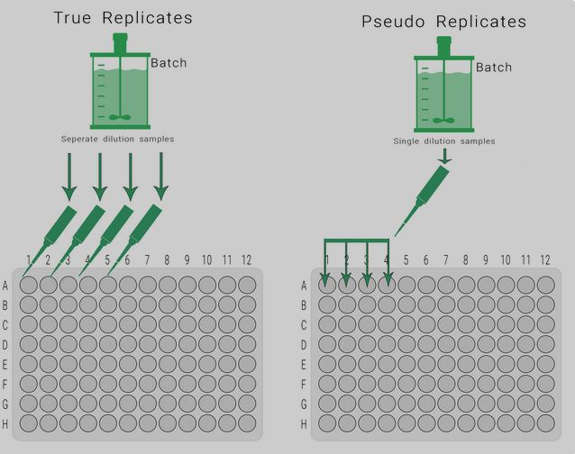

```{r setup, include=FALSE}
knitr::opts_chunk$set(echo = TRUE, cache = TRUE)
library(cmdstanr)
library(posterior)
library(bayesplot)
library(bayesnec)
library(dplyr)
library(ggplot2)
library(tidyr)
set_cmdstan_path("C:/cmdstan")
```

## Background

CR experimental designs are often complex, and may require the addition of multi-level, hierarchical effects. Examples include a random offset to model non-independence of replicates housed together in tanks, or where there are repeated measurements on individual genotypes of a test species.

In addition, there are times when we may have a fixed interaction factor that we are interested in. For example, there may be a CR experiment that has been repeated using different experimental settings, for example, to test a confounding factor on toxicity.

`bnec` does currently not inclusion of an interaction with a fixed factor. Including an interaction term within each of the non-linear models implemented in `bayesnec` is relatively straightforward for a single CR model, and may be introduced in future releases of `bayesnec`. 

We will go through an example of how to leverage `bayesnec` to find an optimal model, and then supply the necessary priors to fit that optimal model directly in `brms` including a factor interaction.

However, in some cases the functional form of the response may change with different levels of a given factor. The substantial complexity of defining all possible non-linear model combinations at each factor level means it unlikely this could be feasibly implemented in `bayesnec` in the short term. In the meantime the greatest flexibility in the functional form of individual model fits can be readily obtained using models fitted independently to data within each factor level.

Here we discuss various ways of accommodating grouping and factor covariates, both within `bayesnec` and directly using `brms`.

## "pseudo-replication" and hierarchical effects

Most ecotoxicological and toxicology experiments include a range of grouping elements, such as tanks, vials or batches of samples that contain multiple measurements that cannot be considered strictly independent (a.k.a. they are pseudo-replicates), but are not directly of interest in and of themselves. 

These types of grouping variables would typically dealt with in ecological statistics using so-called mixed/random/or hierarchical effects. 

In the context of CR modelling, they arise in two different settings, and this is fundamentally important in terms of how they might be dealt with statistically. There are:

- Within concentration groupings

- Across concentration groupings


```{r pr1, out.width="38%", echo=FALSE}

```
```{r pr2, out.width="48%", echo=FALSE}

```

## Within concentration groupings

Tank/vial effects. Here we have multiple replicate individual organisms, housed together in a vial or tank - with each having a single concentration value. In this case the non-independence occurs within the concentrations, and is not spread across the entire CR range (a tank can only have one concentration).

To avoid criticism around potential issues with pseudo-replication, it is often the practice for ecotoxicologists to pool such observations and carry out modelling using, for example, the group mean. 

This has the disadvantage of discarding the within group information - such as the within group variance. 

In addition, where the number of within group observations varies substantially across groups, this will have the undesirable effect of equally weighting the group means even though some may be based on far fewer observations than others.

## Across concentration groupings

In addition, there are often instances of ecotoxicology data from multiple experiments or other grouping factors within an experiment (such as genotype, or plate) that cover the full range of the predictor variable that cannot be averaged prior to modelling. 

Here it is no longer possible to take a within group mean and are a little more difficult to deal with.

Strategies that we have seen include the ecotoxicologist ignoring the potential non-independence, or fitting many independent datasets and subsequently needing to aggregate the threshold estimates, or normalising the experiments and ignoring the within group correlation. 

Carrying out multiple fits on separate datasets is undesirable because each fit is based on fewer data and will have greater uncertainty. 

## An introduction to mixed modelling

Mixed effects models are very common in ecology, and widely implemented in generalised linear mixed modelling (glmm). They are theoretically the best way to deal with non-independence issues in experimental designs.

A detailed introduction into hierarchical, mixed or "random" effects models is beyond the scope of the current course. However, we have included a short non-technical video to introduce the key concepts of mixed models, so you have an intuitive understanding of how they work and can think about how they might be applied. The example they use is based on a field study, but the key concepts are the same as we face in ecotoxicology. 


## Random effects for non-linear models

Hopefully that video gave you a reasonable intuitive understanding of what random effects models are doing. 

One of the distinctions that is important, is the difference between a random **intercept** only model, and a random **slope and intercept** model. Hopefully the video convinced you that there is not much sense in a random **slope** only model.

This difference between these two types of random effects and when they should be applied relates directly to the distinction we touched on earlier between **Within concentration groupings** and **Across concentration groupsings**.

Implementing random effects in a non-linear modelling setting can take a bit more thought than the linear mixed model in the video. There are two main things to consider:

- 1. in non-linear models we don't simply have a random slope and intercept, we have other parameters as well.

- 2. in non-linear models we recommend using an "identity" link, and many of the appropriate statistical distributions for our ecotox modelling are bounded at `0`, `1` or both and this can make a random intercept models difficult to interpret and/or fit.


## **Intercept** only random effects

Probably the most common grouping scenario in ecotoxicology is the use of replicate *tanks*, *vials* or some other container, within which multiple *replicate* individual organisms are housed. These are the **within concentration groupings** we touched on earlier.

For example, you might be measuring larval growth rates, and you place five individual larvae in each of your treatment *tanks*, and these are all measured separately.

As mentioned earlier, probably the most common strategy for dealing with this is to take a mean of the group, and model these as the data.

Again, to reiterate our earlier point, this has two main disadvantages 

- 1. You are discarding the within group information - such as the within group variance. 

- 2. You are inferring that your groups are equally weighted even though some may be based on far fewer observations than others.

If you think about our growth experiment, if there is some mortality, the number of individuals from which you can measure growth now vary among the treatments, possibly substantially. Taking a group mean ignores the fact that some of these groups have a lot of information, and others very little.

This kind of non-independence is best dealt with using a random **slope** only model. It does not make sense to fit a random **slope and intercept** model here, because each *tank* (one level of the group factor) is associated only with one concentration value. Tanks cannot have multiple concentrations. Because of this it would be impossible to estimate the among group variance in all the non-linear model parameters, we can only consider the potential offset associated with each group.


## Intercept only effects example

Including a random intercept in `bayesnec` can be achieved by placing a random effect on the parameter labelled "top" - this is the intercept in our non-linear model. I don't have a good example with a strong tank effect unfortunately, but here we will use a data set relating to experimental exposures to 8–10 to a1-methylnaphthalene (1-MN) on small Acropora millepora (Ehrenberg, 1834) colonies (~11mm fragments) in replicated flow-through exposures.


```{r tanks, fig.align='tight', out.width="60%", echo=FALSE}

```
```{r experiment, fig.align='tight', out.width="39%", echo=FALSE}

```

Partial colony mortality was measured daily for 7 days and following an additional 7-d recovery in uncontaminated seawater to assess potential latent effects. Sublethal effects on colony growth, colour score, photosynthetic efficiency of symbionts (effective quantum yield) and damage to the photosystem II of symbionts (maximum quantum yield) were assessed after 7-d exposures.

Here we use the colour score data as an example.

```{r}
require(tidyverse)
library(bayesnec)
dat <- read.csv("example_ogl.csv") |> 
  dplyr::mutate(y=Perc_change/100,
                groupvar=factor(paste(Replicate, Treatment, sep="_")),
                x=as.numeric(Treatment)) |> 
  na.omit()
head(dat)

```

We are going to model *y* the proportional change in colour index, as a function of *x* - which is our treatment concentrations, which we re-labelled when we read in the data. Our grouping is a combination of "Replicate" and "Treatment" pasted together, to ensure they are uniquely identified (often replicates are labelled 1-5 etc, for each treatment, but they are unique across treatments in this case).

## Intercept only effects in `bayesnec`


```{r}
ggplot2::ggplot(dat, aes(x, y, colour = groupvar)) +
  geom_jitter()
```

For this example, we don't want to run a full `bayesmanec` analysis, as this will take a long time. We will fit the *ecxlin* model to this data, as in testing this example it was one of the better fits anyway. Note that this is in fact a simple linear regression.

We can add the random effect to the "top" parameter (the `bayesnec` version of an intercept), using the usual `brms` syntax for random effects, which is similar to other `glmm` type packages. Let's also fit the equivalent model without any random effects to compare.


```{r, eval=TRUE}
fit.r <- bnec(y~crf(x, model = "ecxlin") + (top | groupvar), data = dat)
fit <-  bnec(y~crf(x, model = "ecxlin"), data = dat)
```

## Assessing intercept only effects

```{r}
cowplot::plot_grid(autoplot(fit), autoplot(fit.r), 
                   labels = c("no random intercept", "random intercept"))
```

```{r}
fit.brms <- pull_brmsfit(fit)
fit.r.brms <- pull_brmsfit(fit.r)
```

```{r}
summary(fit.brms)
summary(fit.r.brms)
```

```{r, eval=TRUE}
loo_model_weights(fit.brms, fit.r.brms, method = "pseudobma")
brms::loo_compare(fit.brms, fit.r.brms)
```

## **Slope and intercept** random effects

For non-linear models we don't simply have a random **slope and intercept** model, because our model includes other parameters to accommodate the non-linearity in the data. This means instead, we are fitting "random" curves within each group. This can be a lot more parameters for which to estimate a variance term for, and it can be hard to get the models to fit well, and with reasonable precision.

For this to work, it is critical that there is reasonable coverage of the full concentration range **within** each leave of the grouping variable. Such random effects should only be applied for grouping variables that represent **across concentration groupings** that we already discussed.

Good examples of this might be when you have replicate runs of an entire experiment that you want to aggregate to estimate a single toxicity value across them all. Another example that is common to our work on corals is a genotype effect - where a single coral head is collected and fragments from that colony distributed across the entire experiment. Finally, and example we will explore is the case where a plate well is used in microtox, and the entire plate repeated multiple times.


## Slope and intercept effects example

luminescent reporter strain we are developing.
microtox.JPG
tropical bacterial reporter strain assay

```{r, eval=TRUE}
dat <- read.csv("example_pgl.csv")
head(dat)
```
```{r}
ggplot2::ggplot(dat, aes(log_x, y, colour = plateRep)) +
  geom_jitter()
```

## Slope and intercept effects in `bayesnec`

```{r, eval=TRUE}
fit.pgl <- bnec(y~crf(log_x, model = "nechorme") + pgl(plateRep), 
                data = dat, seed = 70)
fit <-  bnec(y~crf(log_x, model = "nechorme"), data = dat,
             seed = 70)
```

## Assessing slope and intercept effects

```{r}
cowplot::plot_grid(autoplot(fit), autoplot(fit.pgl), 
                   labels = c("no random intercept", "random intercept"))
```

```{r}
fit.brms <- pull_brmsfit(fit)
fit.pgl.brms <- pull_brmsfit(fit.pgl)
```

```{r}
summary(fit.brms)
summary(fit.pgl.brms)
```

```{r, eval=TRUE}
loo_model_weights(fit.brms, fit.pgl.brms, method = "pseudobma")
brms::loo_compare(fit.brms, fit.pgl.brms)
```


## Factor interaction covariates


```{r}
fit <-  bnec(y~crf(log_x, model = "nechorme4"), data = dat, 
             seed = 70, family = Beta())

fit.brms <- pull_brmsfit(fit)
```

```{r}
fit.brms$formula
priors.fit <- prior_summary(fit.brms)
priors.fit
```
```{r}
bf_fitInt <- brms::bf(y ~ bot + ((top + exp(slope) * log_x) - bot) * 
                          exp(-exp(beta) * (log_x - nec) * step(log_x - nec)), 
                          bot + top + beta + nec + slope ~ plateRep,
                          nl = TRUE)
```

```{r}
fit.brmsInt <- brm(bf_fitInt, data = dat, family = Beta(),
                  prior = priors.fit, iter = 5000,  save_pars = save_pars(all=TRUE), 
                  seed = 700, init = 0)
```


```{r, eval=TRUE}
loo_model_weights(fit.brms, fit.pgl.brms, method = "pseudobma")


```


```{r, eval=TRUE}

brms::loo_compare(fit.brms, fit.pgl.brms)
```

## Fit all individuall

```{r}
plates <- unique(dat$plateRep)
fit.list <- lapply(plates, FUN = function(l){
  dat.l <- dat |> 
    dplyr::filter(plateRep==l)
  fit <-  bnec(y~crf(log_x, model = "nechorme4"), data = dat.l, 
               seed = 70, family = Beta())
  return(fit)
})

```


pred_dat <- expand.grid(list(log.x=log(seq(0.01,20, length=1000)),
                            Treatment=unique(tt2.a$data$Treatment))) |>
  mutate(tot=1,
         Species = "Amphibalanus amphitrite")

pred.aa <- pred_out(tt2.a, pred_dat = pred_dat) |>
  mutate(conc = exp(log.x))
tt.a <- brms::add_criterion(tt.a, "loo")
tt2.a <- brms::add_criterion(tt2.a, "loo")
loo_tab.a <- brms::loo_compare(tt.a, tt2.a)
mod_prob.a <- brms::post_prob(tt.a, tt2.a)
save(tt.a, tt2.a, pred.aa, loo_tab.a, mod_prob.a, file = "brm_fits_a.RData")
load("brm_fits_a.RData")

p_val.a <- 2 * pnorm(-abs((loo_tab.a[2, "elpd_diff"] - 0) / loo_tab.a[2, 'se_diff']))
loo_tab.a[2, "elpd_diff"] + c(-1,1) * 1.96 * loo_tab.a[2, 'se_diff']


## now plot both ----------

all_points_dat2 <-  all_points_dat |> 
  mutate(Treatment = recode(Treatment, 
                            "FSW/PW" = "PW+FSW",  
                            "HIGH CSW/PW" = "PW+CSW (high)", 
                            "LOW CSW/PW"="PW+CSW (median)"))
fitted_dat2 <- bind_rows(pred.aa, pred.tt) |> 
  mutate(Treatment=as.character(Treatment)) |> 
  mutate(Treatment = recode(Treatment, 
                     "FSW/PW" = "PW+FSW",  
                     "HIGH CSW/PW" = "PW+CSW (high)", 
                     "LOW CW/PW"="PW+CSW (median)"))
custom_plot <- 
  ggplot(data = fitted_dat2) +
  geom_line(mapping = aes(x = conc, y = X50., color = Treatment),
            linewidth = 0.5) +
  geom_jitter(data = all_points_dat2, aes(x=conc, y=y, fill = Treatment), 
              pch = 21, size = 3, alpha = 0.6) +
  geom_ribbon(mapping = aes(x = conc, ymin = X2.5., ymax =  X97.5., fill = Treatment),
              alpha = 0.3) +
  labs(x = "Concentration (% PW)", y = "Response") +
  facet_wrap(~ Species) +
  scale_x_continuous(trans = "log", breaks = c(0.05, 1, 20)) +
  theme_bw() +
  theme(strip.text = element_text(size = 11, face = "italic"), 
        strip.background = element_rect(colour = NA))

##pdf("all_fits_postcomp2.pdf", height = 6, width = 10)
png("all_fits_postcomp2.png", height = 6, width = 10, 
    units = "in", res = 1000)
custom_plot
dev.off()


library(ggpubr)
require(grid) 


comb_plot <- ggarrange(post_compplot + rremove("ylab") + rremove("xlab"), 
                       custom_plot + rremove("ylab") + rremove("xlab"), 
                       common.legend = TRUE, labels = NULL, nrow = 2)

pdf("all_plots.pdf", height = 8, width = 10)
annotate_figure(comb_plot, 
                left = textGrob("Response", rot = 90, vjust = 1, gp = gpar(cex = 1.3)),
                bottom = textGrob("Concentration (% PW)"))
dev.off()

## Testing for a factor interaction effect

Sometimes we want to include a factor interaction in our model, because we have purposely applied a treatment effect, and we want to assess the impact on toxicity.

In this case, we will want to estimate out toxicity values for each individual level of the factor, rather than simply mariginalizing over them, in the case were we are just trying to accomode non-independence.

Here we will use a dataset kindly provided by Gwil Price. The data are a subset from the paper: https://doi.org/10.1039/D2EM00063F and describes zinc toxicity to a freshwater microalga (measured as population growth rate expressed as percent of each experiment’s control growth rates) with varied water hardness (4x factors – 5, 31, and 402 mg CaCO3/L) at a fixed pH of 8.3. 

## Example - testing for a factor interaction

Let's start but loading our packages and exploring the case study data. 

```{r}
require(tidyverse)
library(bayesnec)
dat <- read.csv("example_fi.csv") |> 
  na.omit()

head(dat)
range(dat$Pcon)
range(dat$Mean.Zn)
```

The concentration data span a very large range (5 orders of magnitude), so let's model these using a log scaling.

The response data are percentages adjusted relative to control. We know from experience that modelling such agal populations is often a little problematic. This is because the data are often not only zero bounded (most researchers like to assume negative population growth is zero), but often show constrained growth in the upper range as well (due to nutrient limitation, and other other biological factors).

For this reason we have had the most success using a Beta distribution (it being the most commonly available fully bounded distribution). To use the Beta distribution data must be constrained >0 and <1. Specifically, the data cannot contain 0 or 1. `bayesnec` automatically applies an adjustment away from zero and one for use in the Beta distribution, and this is quite a common practice.

Here we first divide by the maximum value in the dataset, then add a small amount to shift the data off zero, and multiply by 0.99 to make sure the values are not quite one.

```{r}
dat <- dat |> 
  mutate(y=(Pcon/max(Pcon)+0.01)*0.99,
         x=log(Mean.Zn),
         hardness=factor(round(Hardness))) |> 
  dplyr::select(x, y, hardness)

range(dat$y)
```

Now that we have a dataset suitable for modelling in `bayesnec` using a Beta, let's take a look at what we are working with.

```{r}
ggplot(data = dat, aes(x=x, y=y, colour=hardness)) +
  geom_jitter()
```

You can definitely see the effect of hardness treatment on the toxicity of algae in this example.

To me it is not obvious which model should fit the data best, so 
let's figure that out using the overall dataset using `bayesnec`.

As there is no evidence of *hormesis* in this data there is need to use any hormesis models, so set lets use `model.set = decline`.

```{r, eval=TRUE}
fit.all <- bnec(y~crf(x, model = "decline"), data = dat)
```

## Evaluting the best model to use

```{r, eval=TRUE}
fit.all$mod_stats |> 
  mutate(wi=round(wi, 2)) |> 
  dplyr::select(model, waic, wi)
```

You can see that there is extremely high weight for *exwb1* model when you fit the data overall, so let's use this model for our factor interaction model.

```{r, eval=TRUE}
plot(fit.all)
```

## Fitting the interaction model in `brms`

First we will extract the brms fit for that model

```{r, eval=TRUE}
fit.brms <- pull_brmsfit(fit.all, model = "ecxwb1")
```

Next, we will copy and paste the brms model formula

```{r, eval=TRUE}
fit.brms$formula
```

Finally we extract the priors to use in our custom `brms` call

```{r}
priors <- prior_summary(fit.brms)
```

With all those pieces from the `bayesnec` fit, we can now fit our custom `brms` model, using `brms`'s main model fitting function `brm`.

```{r, eval=TRUE}
bf_fit <- brms::bf(y ~ bot + (top - bot) * exp(-exp(exp(beta) * (x - ec50))),
                      bot + ec50 + top + beta  ~ 1,
                      nl = TRUE)

brm.fit <- brm(bf_fit, data = dat, family = Beta(link = "identity"),
                  prior = priors, iter = 5000,  save_pars = save_pars(all=TRUE), 
                  seed = 700)

bf_fitInt <- brms::bf(y ~ bot + (top - bot) * exp(-exp(exp(beta) * (x - ec50))),
                      bot + ec50 + top + beta  ~ hardness,
                      nl = TRUE)

brm.fitInt <- brm(bf_fitInt, data = dat, family = Beta(link = "identity"),
                  prior = priors, iter = 5000,  save_pars = save_pars(all=TRUE), 
                  seed = 700)
```

## Assessing the interaction model

summary(fit.brms)
summary(brm.fitInt)

loo_model_weights(brm.fit, brm.fitInt, method = "pseudobma")


