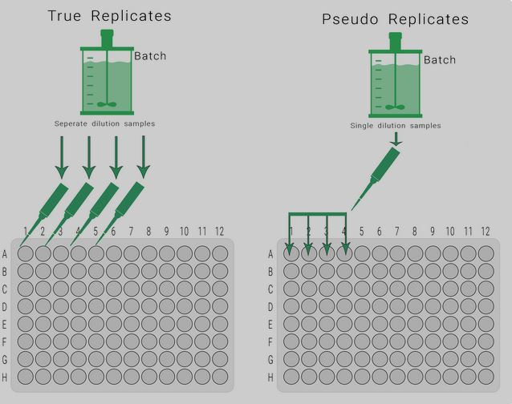
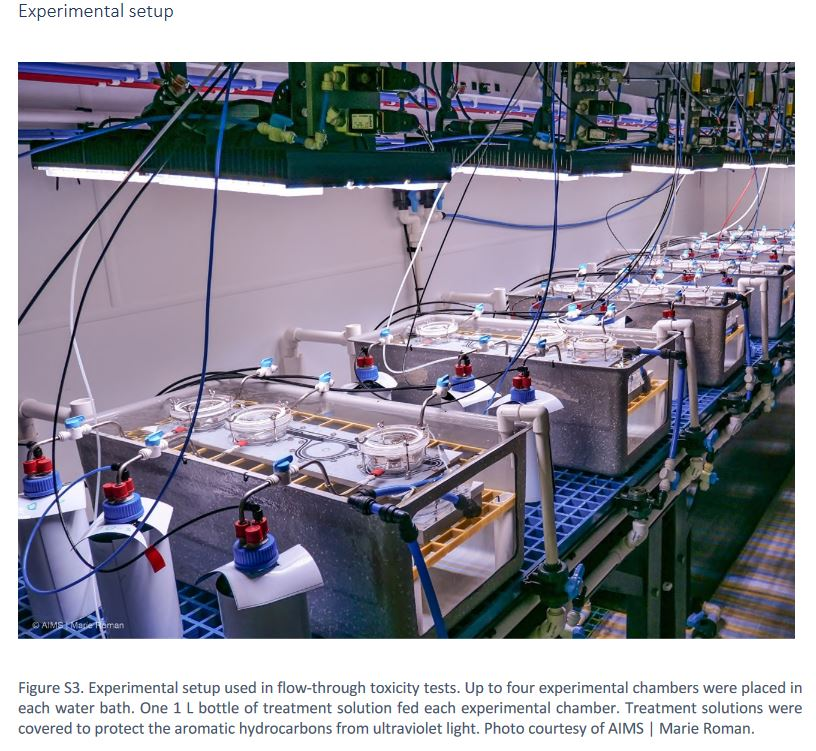

```{r}
#| label: setup
#| include: false
knitr::opts_chunk$set(echo = TRUE)
library(bayesnec)
library(dplyr)
library(ggplot2)
library(tidyr)
library(knitr)
options(brms.backend = "cmdstanr")
```

[e8]: https://open-aims.github.io/bayesnec/dev/articles/example8.html
[gs]: https://github.com/open-AIMS/grouping-structures

## Background

Concentration-response designs are often more complicated than one response
measured once at each of several concentrations. Replicates are housed together
in tanks, a whole experiment is repeated on a second plate, fragments of one
coral colony are spread across the treatments, or the same test is run under
several water chemistries. Each of those puts structure into the data that the
modules so far have ignored.

The same syntax can address two different problems, and the distinction between
them decides almost everything else.

A **grouping** is a factor whose levels are not of interest in themselves. Tanks,
vials, plates and genotypes are groupings: you are not trying to estimate the
toxicity of tank 7, you are trying to stop the tank structure from making your
intervals too narrow.

A **factor covariate** is one whose levels *are* of interest. Water hardness,
temperature and exposure duration are factor covariates: the question is how
toxicity changes across them, and an estimate is wanted for each level.

## Pseudo-replication and hierarchical effects

Most ecotoxicological experiments contain grouping elements, such as tanks, vials
or batches, that hold multiple measurements that cannot be treated as strictly
independent. These are pseudo-replicates. They are handled in ecological
statistics with mixed, hierarchical or random effects.

In concentration-response modelling they arise in two settings, and the
difference is fundamental to how each is handled.

{width=75%}

{width=100%}

### Within-concentration groupings

Tank and vial effects. Several individual organisms are housed together, and the
container has a single concentration. The non-independence occurs *within* a
concentration and does not extend across the concentration range, because a tank
cannot hold two concentrations at once.

To avoid the criticism of pseudo-replication, it is common practice to pool such
observations and model the group mean. That has two disadvantages. It discards
the within-group information, including the within-group variance. And where the
number of observations per group varies, it weights every group mean equally even
though some rest on far fewer observations than others. In a growth experiment
with some mortality, the number of individuals measured differs between
treatments, and a group mean ignores that some groups hold a great deal of
information and others very little.

### Across-concentration groupings

Data also arise from repeated experiments, or from groupings within an experiment
such as genotype or plate, that span the full range of the predictor. A
within-group mean cannot be taken here, because a group is not at one
concentration.

Strategies we have seen include ignoring the non-independence, fitting many
independent datasets and then aggregating the threshold estimates afterwards, or
normalising each experiment and ignoring the within-group correlation. Fitting
separately is undesirable in that each fit rests on fewer data and returns a
wider interval, though it is sometimes the right answer for the reasons set out
below. Normalising each experiment to its own control has the problems module 5
describes, and *Normalising to a control* below measures them on an assay that
does it.

## An introduction to mixed modelling

Mixed effects models are common in ecology and are theoretically the right way to
handle non-independence in an experimental design. A full treatment is beyond
this course, and the short video below introduces the concepts non-technically.
The example is a field study, and the ideas transfer directly.



## Random effects for non-linear models

One distinction from the video matters here: the difference between a random
**intercept** model and a random **slope and intercept** model.

Two things make this harder in a non-linear setting than in the linear models the
video uses.

A non-linear model does not have a slope and an intercept. It has `top`, `bot`,
`nec`, `beta`, `ec50` and others, and a deviation can be placed on any of them.

And `bayesnec` fits on an identity link, so the mean is on the scale of the
response. Most of the families appropriate to this work are bounded at 0, at 1,
or at both. A deviation that pushes the mean outside those bounds describes an
impossible response, which matters below.

The choice between the two follows directly from the distinction above.
Within-concentration groupings take a deviation on the intercept alone, because a
tank sits at one concentration and the data contain no information about how the
rest of the curve varies between tanks. Across-concentration groupings can take a
deviation on the whole curve, because each level spans the concentration range.

## Group-level terms in `bayesnec`

Three forms are available, and they differ in how much of the curve is allowed to
vary.

```{r}
#| label: term-syntax
#| eval: false
y ~ crf(x, model = "nec4param") + ogl(tank)        # the whole curve is displaced
y ~ crf(x, model = "nec4param") + (top | tank)     # one named parameter varies
y ~ crf(x, model = "nec4param") + pgl(plate)       # every parameter varies
```

`ogl()` adds an **o**ffset at the **g**roup **l**evel: the whole fitted curve is
displaced up or down for each level, keeping its shape. `(par | group)` uses the
ordinary `brms` syntax to place a deviation on one named parameter. `pgl()`
places a deviation on every **p**arameter of the equation at the **g**roup
**l**evel, which fits a separate curve shape for each level.

`(par | group)` names a parameter, and a model set is a set of equations that do
not all have the same parameters: `bot` belongs to `nec4param` and not to
`nec3param`. Where the named parameter is absent the term is dropped for that
equation and the fit goes ahead without it, reported by a message that is easily
lost in Stan's compilation output. `check_formula(f, data, run_par_checks =
TRUE)` reports it for every equation of the set before anything is fitted.

### Deviations that cannot leave the support

Here a grouped model in `bayesnec` differs from the same model fitted directly in
`brms`, and the difference governs how any output below should be read.

`brms` declares a group-level deviation unconstrained, which is correct for a
Gaussian response on an identity link and wrong for every other family here. A
deviation added to `top` on a response bounded by 0 and 1 can put the mean
above 1, which no beta distribution can represent, and Stan rejects the proposal
and records a divergent transition. On a boundary-adjacent parameter, most
proposals are rejected and the fit is unusable.

`bayesnec` therefore applies the deviation **multiplicatively** wherever it acts
on the whole curve or on `top` or `bot`. On a 0 to 1 response the deviation
scales the odds of the mean; on a positive response it scales the mean itself. A
deviation of zero leaves the curve exactly as it was, so `top`, `bot`, `nec` and
`beta` keep their meanings, while the mean can no longer leave its support
however far a proposal travels.

The difference is large. On a simulated beta-binomial design with an `ogl()`
term, across three seeds, the multiplicative form gave no divergent transitions
at all, against 70 to 95 per cent of transitions diverging under the additive
form on the same data, and it sampled about twice as fast (`bayesnec` #257). On
the `herbicide` data with a `nec4param` equation, a `(bot | herbicide)` term gave
51 divergent transitions of 2,000 under the additive form at
`adapt_delta = 0.95`, and none at Stan's default of 0.8 under the multiplicative
one (`bayesnec` #294).

A deviation on `nec`, `ec50`, `beta`, `slope`, `d` or `f` is still added
directly, because none of those is bounded by the likelihood: `nec` and `ec50`
are on the predictor axis, and the rest are estimated on a log scale.

One restriction remains. The transformation of the mean is defined only where the
mean is provably inside its range. For `neclin`, `neclinhorme` and `ecxlin`,
whose mean is unbounded below, and on a 0 to 1 response for the hormesis
equations, whose mean can reach or exceed 1, the `ogl()` offset is therefore
added directly, and `bnec()` raises `adapt_delta` to 0.99 to reduce the
divergent transitions that follow. A Gaussian response has no bounds, so there
the offset is always added directly.

### Priors on the group-level terms

A group-level term adds a standard deviation for each parameter it applies to,
and `ogl()` adds an offset as well. Module 6 describes how `bayesnec` builds its
priors, and these follow the same three-way split.

The scale *s* is one tenth of the observed range of the quantity the deviation
is applied to: the predictor range for `nec` and `ec50`, the response range for
a deviation added to the response directly, and 0.5 for the parameters estimated
on a log scale. Some deviations are applied multiplicatively, which is the case for `top`,
`bot` and the whole-curve `ogl` offset on a bounded or a positive response.
Those live on a log or a log-odds scale rather than on the response scale, so
the same rule is converted onto that scale before it is used.

A group-level standard deviation is then given `student_t(3, 0, s)` and the
`ogl` offset `normal(0, s)`. Under the first there is a probability of about
0.39 that the group-level standard deviation exceeds *s*, so it is weakly
informative rather than tight.

*s* comes from the data rather than from the spread of the parameter's
own prior. The two are different quantities, and deliberately so: a prior
standard deviation of 2.5 times that of the response is a reasonable statement of
ignorance about a *level*, and a poor one about the *deviation around* that
level.

## Deviation on the intercept

The common case in ecotoxicology is replicate tanks or vials holding several
organisms each, which is the within-concentration grouping above.

{width=90%}

{width=50%}

The example is an exposure of small *Acropora millepora* colonies, about 11 mm
fragments, to 1-methylnaphthalene in replicated flow-through exposures. Partial
colony mortality was measured daily for seven days and again after a further
seven days in clean seawater. Colour score is used here.

```{r}
#| label: ogl-data
colour <- read.csv("vignettes/example_ogl.csv") |>
  mutate(y = Perc_change / 100,
         groupvar = factor(paste(Replicate, Treatment, sep = "_")),
         x = as.numeric(Treatment)) |>
  na.omit()
c(rows = nrow(colour), concentrations = n_distinct(colour$x),
  containers = n_distinct(colour$groupvar))
```

The response is the proportional change in colour index and the predictor is the
treatment concentration. The grouping combines the replicate and the treatment,
so that each container is uniquely identified; replicates are commonly labelled 1
to 5 within each treatment and are not unique across treatments.

```{r}
#| label: fig-ogl-raw
#| fig-height: 4
ggplot(colour, aes(x, y, colour = groupvar)) +
  geom_jitter(show.legend = FALSE) +
  labs(x = "Concentration", y = "Proportional change in colour index") +
  theme_classic()
```

A deviation on the intercept is what suits this design. The same fit is made with
and without it, so the two can be compared.

```{r}
#| label: ogl-fit
#| eval: false
fit_plain <- bnec(y ~ crf(x, model = "ecxlin"), data = colour, seed = 70)
fit_ogl   <- bnec(y ~ crf(x, model = "ecxlin") + ogl(groupvar),
                  data = colour, seed = 70)
```

`ecxlin` is used rather than a full model set, to keep the example to two fits.
It is a linear decline, so this is a simple linear regression with a group-level
offset.

`ogl(groupvar)` is preferred here to `(top | groupvar)`. Both displace the curve,
and the first states that intention directly. The response here includes
negative values, so it is fitted with a Gaussian family, and the offset is
added directly for the reason *Deviations that cannot leave the support* gives.

```{r}
#| label: tbl-ogl-compare
#| tbl-cap: "The intercept-only deviation compared against the same equation fitted without it."
read.csv("vignettes/data/grouping_ogl_compare.csv") |> kable()
```

The comparison is by leave-one-out cross-validation, as module 4 describes, and
it reports two things that do not say the same. The pseudo-BMA weight favours
the grouped fit at 0.811 against 0.189. The difference in expected log
predictive density is 2.4 with a standard error of 2.2, which is about one
standard error, so these data support the container term weakly rather than
decisively. Twenty containers over five concentrations, holding 97 observations
between them, is a small amount of information about between-container
variation, and the weight on its own would have read as stronger evidence than
that.

Each fit is drawn with the mean of each container marked, since that mean is
the quantity `ogl(groupvar)` gives a deviation to.

```{r}
#| label: fig-ogl-curves
#| fig-height: 4
#| fig-cap: "The linear decline fitted with and without a container offset. Points are the observations, diamonds the container means, the line the fitted curve and the band its 95% credible interval."
ogl_curves <- read.csv("vignettes/data/grouping_ogl_curves.csv") |>
  mutate(fit = factor(fit, levels = c("no group term", "ogl(groupvar)")))

# ggbnec_data() returns three things in one frame and each layer takes the rows
# it needs. `y_ci` traces the credible band as a closed polygon, so it has twice
# as many rows as the curve does and `y_e` is NA on the return half; `x_r` and
# `y_r` hold the observations, on rows where the curve columns are NA. Passing
# the whole frame to every layer draws the right picture and fills the render
# with warnings about removed rows.
ogl_band <- filter(ogl_curves, !is.na(x_e))
ogl_line <- filter(ogl_curves, !is.na(y_e))
ogl_obs <- filter(ogl_curves, !is.na(x_r))

# The container means are drawn on both panels, so that the two panels differ in
# the fit and in nothing else. They are computed from the grouped fit, which is
# the one whose plot data carry the container each observation came from.
ogl_means <- ogl_obs |>
  filter(!is.na(group)) |>
  group_by(group) |>
  summarise(x_r = first(x_r), y_r = mean(y_r), .groups = "drop")

ggplot(ogl_band, aes(x = x_e)) +
  geom_polygon(aes(y = y_ci), fill = "grey80", colour = NA, alpha = 0.6) +
  geom_point(data = ogl_obs, aes(x = x_r, y = y_r), alpha = 0.3, size = 1) +
  geom_point(data = ogl_means, aes(x = x_r, y = y_r), shape = 23,
             fill = "white", size = 2.2) +
  geom_line(data = ogl_line, aes(y = y_e), colour = "#2c6a5a",
            linewidth = 0.8) +
  facet_wrap(~fit) +
  labs(x = "Concentration", y = "Proportional change in colour index") +
  theme_classic()
```

The container means scatter widely within each concentration. Four containers
sit at each of the five, and at 255 their means run from 0.157 to 0.315, a
spread of 0.158 against a whole fitted decline of 0.238 from 0.293 to 0.055.
That scatter is what `ogl(groupvar)` estimates a standard deviation for. The
two credible bands are nonetheless close to the same width, which agrees with an
elpd difference of about one standard error: twenty containers is enough to
estimate the standard deviation and not enough to settle whether it is needed.

## Deviation on every parameter

Where a grouping spans the whole concentration range, the curve can differ
between levels in more than its height. `pgl()` places a deviation on every
parameter of the equation at once, which is what allows that. Which term a
design needs follows from what differs between its levels, and on the assay
below that can be measured before anything is fitted.

{width=75%}

### The assay

The example is the bioluminescent bacterial assay developed at AIMS for tropical
marine conditions [@luter2025]. *Vibrio azureus* strain Lum-31 emits light as a
by-product of metabolism, so anything that interferes with electron transport
reduces the light emitted. Twenty microlitres of cell suspension goes into 180 µL
of sample in a white 96-well plate, and the reading itself is the endpoint, in
relative light units. One plate holds a complete concentration series of eleven
concentrations by four wells, so a plate spans the whole predictor range, and the
assay is run repeatedly on the same reference toxicant.

`lum31` ships with `bayesnec` and holds sixteen copper plates and seventeen zinc
plates, each read at 15 and at 30 minutes of exposure.

```{r}
#| label: pgl-data
data(lum31)
cu15 <- droplevels(subset(lum31, toxicant == "Cu" & minutes == 15))
str(cu15)
```

Copper at 15 minutes is used throughout this section, for two reasons. Copper's
mean response falls below the control at every concentration on every plate, so
no hormesis equation is needed to describe it, where zinc rises above its
control at low concentrations. And the 15-minute read has fewer readings at the
instrument floor than the 30-minute read of the same plates, so the censoring
bound decides less of the answer.

The design replicates at three scales, and each is a different problem.

| unit | what it is | spans the series | route |
|---|---|---|---|
| `conc_group` | the four wells at one concentration on one plate | no | `ogl()` |
| `plate` | one complete test | yes | `ogl()`, `pgl()`, `(par \| group)` |
| `toxicant` | copper or zinc | yes, and of interest in itself | `bnec_group()` |

The first is the within-concentration case the coral colour example above
covers. This section takes the second, and the section on factor covariates
takes the third.

```{r}
#| label: fig-pgl-raw
#| fig-height: 4.5
ggplot(cu15, aes(x = conc, y = rlu_cens, group = plate)) +
  geom_point(alpha = 0.3, size = 1) +
  stat_summary(fun = mean, geom = "line", linewidth = 0.3) +
  scale_x_continuous(transform = "log10", labels = function(x) signif(x, 2)) +
  labs(x = "Dissolved copper (mg/L)", y = "Relative light units") +
  theme_classic()
```

Luminescence declines gently over the lower half of each series and then falls
to near zero over a fourfold range of concentration. The sixteen plates are
separated vertically at the control and stay in much the same order until the
response reaches its floor, which is what a per-plate multiplicative constant
looks like. Concentrations are measured dissolved copper rather than nominal,
and each batch was dosed separately, so the plates are not on a common
concentration grid.

### Normalising to a control

The plate reader sets its gain per read, so absolute luminescence is a property
of the read rather than of the assay.

```{r}
#| label: tbl-gain
#| tbl-cap: "Median control-well luminescence across the sixteen copper plates."
cu15 |>
  group_by(plate) |>
  filter(conc == min(conc)) |>
  summarise(control_rlu = median(rlu_cens), .groups = "drop") |>
  summarise(plates = n(), lowest = min(control_rlu),
            highest = max(control_rlu),
            ratio = round(max(control_rlu) / min(control_rlu), 1)) |>
  kable()
```

Gain is a per-plate multiplicative constant, so dividing each plate by a
per-plate quantity does remove it. That is what the analysis published with
these data does: @luter2025 divide each reading by the median of its plate's
four control wells, and then divide the result by the plate maximum.

Module 2 argues against dividing a response by an estimated control mean, and
@Ritz2026 measure the bias and the coverage that follow from it. Every
observation sharing a denominator becomes correlated with every other, and an
analysis treating them as independent reports effect doses biased upwards on
intervals that are too narrow. In their second simulation scenario, fitting the
normalised response as though the observations were independent gave ED10 bias
of 2.6 to 6.8 per cent, on intervals covering the true value 0.88 to 0.91 of the
time against a nominal 0.95. Modelling the raw growth rates gave 0.7 to 2.1 per
cent and 0.94 to 0.96. They report that weights do not remedy it, and that
normalising each curve by its own few control measurements introduces more
correlation than a control average pooled across curves. This assay normalises
each plate by four control wells.

A group-level term on the plate is the alternative. It targets the same
per-plate constant the division removes, and estimates that constant with its
uncertainty attached rather than conditioning on a point estimate. The response
stays as recorded, and the control level becomes `top`, a parameter of the
equation, which is what `ecx()` and `nsec()` are measured from.

Which term matches depends on what the constant multiplies. Gain scales the
whole reading, the lower asymptote included, so `ogl()` is the form that matches
it: the deviation is applied to the fitted value. `(top | plate)` would scale
`top` and leave `bot` common between plates, which is a different claim about
the instrument. For a three-parameter equation whose curve is `top` times a
function of the predictor the two coincide.

Whether gain is the whole of the difference between tests can be asked of the
recorded data before any model is fitted. If two plates differ only by a
multiplicative constant, then dividing each by its own control removes that
constant, and both must cross half their own control at the same concentration.

```{r}
#| label: tbl-halfctl
#| tbl-cap: "Concentration at which each plate falls to half its own control, interpolated between the two bracketing concentrations, summarised over the plates of each batch."
half_control <- cu15 |>
  mutate(rank = as.integer(sub(".*-c", "", as.character(conc_group)))) |>
  group_by(batch, plate, rank) |>
  summarise(conc = first(conc), m = mean(rlu_cens), .groups = "drop_last") |>
  mutate(rel = m / m[rank == 1]) |>
  summarise(half_ctl = {
    i <- which(rel < 0.5)[1]
    exp(log(conc[i - 1]) + (0.5 - rel[i - 1]) *
          (log(conc[i]) - log(conc[i - 1])) / (rel[i] - rel[i - 1]))
  }, .groups = "drop")

half_control |>
  group_by(batch) |>
  summarise(plates = n(), lowest = signif(min(half_ctl), 3),
            highest = signif(max(half_ctl), 3), .groups = "drop") |>
  kable()
```

Within a batch the plates agree. The four plates of 19Mar24 cross between 0.110
and 0.115 mg/L and the two of 28Mar24 between 0.136 and 0.139, which is the
multiplicative constant doing all the work. Between batches they do not: the
batch medians run from 0.081 to 0.193, a factor of 2.4, and 92 per cent of the
variance in the logged crossing lies between batches rather than within them.

Each batch was dosed separately, so a difference in the concentration at which
the response falls is a difference between preparations of the test rather than
between reads of the plate reader. It is a real feature of the data and it is
not gain, so `ogl()` cannot represent it.

The plate term has one limit. Gain and genuine plate-to-plate biological
variation are confounded in the estimated per-plate factor, and nothing in these
data separates them. That does not affect the N(S)EC or an ECx, for which both
are nuisance plate effects, but the plate-level standard deviation is not a
biological quantity and should not be reported as one.

### Preparing the response

Two properties of the recorded response are settled before any fit, and both
follow from how the instrument works.

Readings were blank-corrected against wells of artificial seawater, so a well
emitting less light than the blank gives a negative value, and the source
replaced such a value by zero. Luminescence cannot be negative, so a zero here
is measurement noise about a small positive value rather than an absence of
light. These readings are left-censored. A `Gamma` likelihood requires a
strictly positive response, so the censoring bound is the smallest positive
reading on the plate. `rlu_cens` holds the response in that form and `censoring`
marks which readings reached the floor.

```{r}
#| label: tbl-censoring
#| tbl-cap: "Readings at the instrument floor, for both reads of the sixteen copper plates."
lum31 |>
  filter(toxicant == "Cu") |>
  group_by(minutes) |>
  summarise(readings = n(), left_censored = sum(censoring == "left"),
            per_cent = round(100 * mean(censoring == "left"), 1),
            .groups = "drop") |>
  kable()
```

A `Gamma` with a single shape parameter has a constant coefficient of
variation, and these data do not. Taking the four wells at each concentration on each plate,
and the median across the sixteen plates of their within-cell coefficient of
variation, gives the table below. Concentration is summarised the same way,
because the plates are not on a common concentration grid.

```{r}
#| label: tbl-cv
#| tbl-cap: "Response and within-cell coefficient of variation at each of the eleven concentrations, summarised across the sixteen plates."
cu15 |>
  mutate(rank = as.integer(sub(".*-c", "", as.character(conc_group)))) |>
  group_by(rank, plate) |>
  summarise(conc = first(conc), mean_rlu = mean(rlu_cens),
            cv = sd(rlu_cens) / mean(rlu_cens), .groups = "drop_last") |>
  group_by(rank) |>
  summarise(median_conc = signif(median(conc), 3),
            mean_rlu = signif(mean(mean_rlu), 3),
            cv = round(median(cv), 3), .groups = "drop") |>
  kable()
```

Mean luminescence falls from 734,000 relative light units at the lowest
concentration to 505,000 at 0.084 mg/L and 6,940 at 0.33, so most of the decline
happens over a fourfold range of concentration. The coefficient of variation
rises as the response falls, from 0.045 at the lowest concentration to 0.58 at
0.33 mg/L and about 0.95 at the top three, where the readings are at the
instrument floor. One shape parameter cannot serve a series that does that, and
the compromise it reaches is dominated by the noisy low end. `disp("power")`
writes the dispersion parameter as a function of the fitted mean instead of
holding it constant, which module 5 covers. Every fit below includes it, so that
what differs between them is the group-level term alone.

### The plate term compared

One equation is fitted four ways, so that what is compared is the group-level
term and not the equation. Comparing two model averages by leave-one-out would
confound the two. The fourth names the structure the table above found: a
displacement on the plate for the gain, and a deviation on the concentration at
which the curve falls for the batch.

```{r}
#| label: plate-fits
#| eval: false
plate_plain <- bnec(rlu_cens | cens(censoring) ~ crf(log(conc), "ecxll4") +
                      disp("power"),
                    data = cu15, family = Gamma(link = "identity"), seed = 70)
plate_ogl   <- bnec(rlu_cens | cens(censoring) ~ crf(log(conc), "ecxll4") +
                      ogl(plate) + disp("power"),
                    data = cu15, family = Gamma(link = "identity"), seed = 70)
plate_pgl   <- bnec(rlu_cens | cens(censoring) ~ crf(log(conc), "ecxll4") +
                      pgl(plate) + disp("power"),
                    data = cu15, family = Gamma(link = "identity"), seed = 70)
plate_batch <- bnec(rlu_cens | cens(censoring) ~ crf(log(conc), "ecxll4") +
                      ogl(plate) + (ec50 | batch) + disp("power"),
                    data = cu15, family = Gamma(link = "identity"), seed = 70)
```

Two group-level terms on two different groupings go into one formula, and
`make_brmsformula()` shows what they become: `ogl ~ 1 + (1 | plate)` and
`ec50 ~ 1 + (1 | batch)`.

`ecxll4` is the equation the whole model set gives most weight to on these
readings. That set is the copper level of the `bnec_group()` fit under *Factor
covariates* below, which is the same 704 readings with the same plate term and
the same dispersion sub-model, and its weights are reported there. Three
equations sit within 0.02 of each other in it, so the selection is weak and
`ecxll4` stands here for a group of equations the data support about equally.
Holding it fixed is what makes the comparison below a comparison of terms.

```{r}
#| label: tbl-plate-compare
#| tbl-cap: "The plate terms compared against the same equation fitted without one."
read.csv("vignettes/data/grouping_plate_compare.csv") |> kable()
```

The expected log predictive density of `ogl(plate)` exceeds the ungrouped fit's
by 266.5, and adding the batch term raises it by a further 225.3. That second
step is the positional shift the table above measured, now recovered by a fitted
model: one deviation on five batches accounts for three quarters of the
difference in expected log predictive density between `ogl(plate)` and the best
fit of the four.

`pgl(plate)` takes the weight nonetheless, exceeding the batch fit by 72.6 with
a standard error of 19.7. Every difference here is several times its standard
error, which is a different situation from the coral colour comparison above,
where the same test could not separate two fits.

Two of the 704 observations have a Pareto k above 0.7 under `pgl(plate)` and
none do under the other three. The estimate for those two points rests on the
importance-sampling approximation rather than on a refit, and two points of 704
will not reverse a difference of this size.

```{r}
#| label: fig-plate-curves
#| fig-height: 6
#| fig-cap: "The same equation fitted with no grouping term and with three. Points are the observed readings, the line the fitted curve, the band its 95% credible interval and the dashed line the N(S)EC."
plate_levels <- c("no group term", "ogl(plate)", "pgl(plate)",
                  "ogl(plate) + (ec50 | batch)")
plate_curves <- read.csv("vignettes/data/grouping_plate_curves.csv") |>
  mutate(fit = factor(fit, levels = plate_levels))
plate_obs <- read.csv("vignettes/data/grouping_plate_obs.csv")
plate_nsec <- read.csv("vignettes/data/grouping_plate_estimates.csv") |>
  filter(estimate == "NSEC") |>
  mutate(fit = factor(fit, levels = plate_levels))

ggplot(plate_curves, aes(x = x)) +
  geom_ribbon(aes(ymin = Q2.5, ymax = Q97.5), fill = "grey80", alpha = 0.6) +
  geom_point(data = plate_obs, aes(x = conc, y = rlu_cens), alpha = 0.25,
             size = 0.8) +
  geom_line(aes(y = Estimate), colour = "#2c6a5a", linewidth = 0.8) +
  geom_vline(data = plate_nsec, aes(xintercept = Q50), linetype = 2,
             colour = "grey40") +
  facet_wrap(~fit, ncol = 2) +
  scale_x_continuous(transform = "log10", labels = function(x) signif(x, 2)) +
  labs(x = "Dissolved copper (mg/L)", y = "Relative light units") +
  theme_classic()
```

The panels differ in the width of the credible band and in where the N(S)EC
rule falls. Ungrouped, the band around the control is narrow, because the spread
between tests has nowhere to go but the residual and the curve is reported as
well determined. With any of the three grouped terms that spread is attributed
to the grouping instead, and the control band widens towards the range the
control readings themselves span.

That is the mechanism behind the threshold estimates. The N(S)EC is read
where the fitted curve leaves the lower bound of the control, so a narrow
control band is crossed early and a wide one late. The rule sits well to the
left of the shoulder in the ungrouped panel and at the shoulder in the other
three.

The standard deviations say what differs. `ecxll4` is
`bot + (top - bot) / (1 + exp(exp(beta) * (x - ec50)))`, so `pgl()` estimates
four of them.

```{r}
#| label: tbl-plate-sd
#| tbl-cap: "Group-level standard deviations, on the scale each deviation is applied on. ogl() estimates one; pgl() estimates one for every parameter of the equation; the batch fit estimates one on each of its two groupings."
read.csv("vignettes/data/grouping_plate_sd.csv") |> kable()
```

`ogl(plate)` puts the between-plate difference at 0.424 on the log scale the
deviation is applied on, a factor of 1.53 in luminescence. The batch fit keeps a
displacement of much the same size, 0.476 on the plate, and adds a batch
deviation of 0.509 on `ec50`, a factor of 1.66 in the concentration at which the
curve reaches its midpoint. Those two numbers are the two effects separated: the
plate term is the gain and the batch term is the shift in potency.

Under `pgl(plate)` the same deviations appear on one grouping. The largest are
on the asymptotes, `botgl` at 0.648 and `topgl` at 0.465, and `ec50` takes 0.356
against the batch fit's 0.509. A per-plate deviation can encode a per-batch
shift, because the sixteen plates sit within five batches, so `pgl(plate)`
reaches the positional difference without being told where it lives. `beta`, the
slope, is the most nearly common at 0.116.

What `pgl(plate)` has and the batch fit does not is a deviation on `bot`, and it
is the largest of the four. Copper falls to near zero and 106 of its 704
readings are at the instrument floor, so the level the curve settles to is the
part of it the plates are least likely to share. The deviation on `bot`, rather
than the positional shift, is what accounts for the remaining 72.6 of expected
log predictive density.

```{r}
#| label: tbl-plate-estimates
#| tbl-cap: "Toxicity estimates from each fit, back-transformed to mg/L."
read.csv("vignettes/data/grouping_plate_estimates.csv") |> kable()
```

The N(S)EC more than doubles across the four fits, from 0.041 mg/L ungrouped to
0.073, 0.084 and 0.095, and its lower bound rises from 0.009 to between 0.030
and 0.054. EC10 changes much less, from 0.056 to 0.054, 0.063 and 0.068. A
threshold is the estimate the grouping decides, because it is read where the
curve leaves the control and that is where the between-test spread is largest;
an EC10 is read further down a curve the tests agree about more closely.

An analysis that treated these 704 readings as independent would report a
no-effect concentration less than half the one the structure supports, on a
lower bound a factor of four to six too low.

### The choice between the grouped forms

The batch fit is the more exact statement and `pgl(plate)` is the one this
module uses, for two reasons beyond the predictive density.

`(ec50 | batch)` names a parameter, and the parameter that sets where a curve
falls does not have one name across the model set. Ten of the 23 equations have
`ec50`, ten have `nec`, and `ecxlin`, `ecxexp` and `ecxsigm` have neither. In
the `decline` set that is eight, three and three. A term written `(ec50 | batch)`
would therefore be fitted on eight equations of that set, dropped with a message
on three, and have nothing to attach to on the remaining three, so the set would
be averaged over equations making different claims about the batches.
`check_formula()` reports which, as *Group-level terms in `bayesnec`* describes.

`pgl()` places a deviation on every parameter the equation has, whatever they
are called, so it makes the same claim about every equation of a set. That is
what recommends it for a workflow that fits a model set rather than one
equation.

That generality has two consequences. The first is the one *The number of
levels a deviation needs* gives: four standard deviations estimated from sixteen
levels here, where `ogl()` estimates one. The second is run time, because those four
bring 64 deviations with them against `ogl()`'s 16, and a model set multiplies
that by the number of equations. On one equation the difference is minutes; on a
set fitted at each level of a factor it is the difference between a job that
runs while you work and one that runs overnight.

Where a design has enough levels of the grouping the shift belongs to, naming
it is better. Five batches is exactly the minimum this module gives for
estimating a group-level standard deviation, and the batch deviation's interval,
0.243 to 1.067, is correspondingly wide.

## The number of levels a deviation needs

A group-level standard deviation is estimated from the variation between levels,
so it needs levels to estimate it from. The consensus is that five should be
treated as a minimum, and a fit in Stan may need more.

That minimum is easy to reach for tank effects, where there are usually several
tanks per concentration and often twenty or thirty in total. Whether an
across-concentration grouping reaches it depends on the design: the copper
plates above are sixteen levels, and four genotypes or three seasons is a
commoner situation and below the minimum.

The count is not the only constraint. `ogl()` estimates one standard deviation
however many parameters the equation has, and `pgl()` estimates one for each of
them, so the same number of levels supports the first and may not support the
second. Where the levels are too few for either, and where they are of interest
in themselves, the routes below apply instead.

## Factor covariates

Where the levels are of interest in themselves, a deviation is the wrong tool
entirely. A group-level term marginalises over the levels and returns one curve;
a factor covariate asks for a curve, and a toxicity estimate, for each level.

`bnec_group()` is the route. It fits the model set independently within each
level of a factor and model-averages within each level, so the equation
describing one level need not be the equation describing another.

An interaction term written inside a `bayesnecformula` remains unavailable, and
the reason is the one `bnec_group()` addresses. A model set is a set of
different equations, so an interaction would have to be defined separately for
each of them at every level, and where the levels differ in functional form the
result is not one curve with level-specific parameters. Fitting the levels
separately lets each level take its own equation rather than assuming that they
share one.

Two routes are used below, and they answer different questions.

### Fitting each level separately

`bnec_group()` takes the formula, the data and the name of the grouping column,
and returns one model-averaged fit per level.

```{r}
#| label: tox-group-fit
#| eval: false
zn_cu_15 <- droplevels(subset(lum31, minutes == 15))

fits_tox <- bnec_group(
  rlu_cens | cens(censoring) ~ crf(log(conc), "all") + ogl(plate) +
    disp("power"),
  data = zn_cu_15, group_var = "toxicant",
  family = Gamma(link = "identity"),
  chains = 4, iter = 5000, warmup = 4000, seed = 228,
  control = list(adapt_delta = 0.99))
```

That is the bioluminescent assay again, now taking its third scale of
replication. Copper and zinc are two contaminants of interest rather than a
sample from a population of metals, so they are levels and not a grouping. The
plate term stays, because gain differs between plates within each metal; a plate
term is not placed across the copper-against-zinc contrast, since the two arms
were read at different gains and their relative light units are not comparable.
`model = "all"` rather than `decline`, because zinc rises above its control at
low concentrations.

The term is `ogl(plate)` although the section above found `pgl(plate)` the
better description of the copper plates, and the first reason is run time.
`ogl()` estimates one standard deviation and one deviation per level. `pgl()`
estimates one of each for every parameter of the equation, so on a
four-parameter equation over sixteen plates it samples 4 standard deviations and
64 deviations where `ogl()` samples 1 and 16. Here that is asked of fifteen
equations at each of two levels, which is thirty fits. The
[`open-AIMS/grouping-structures`][gs] compendium, which runs the fits behind the
`bayesnec` grouping vignette, measured 22.2 hours of sampling across the 189
fits of that vignette, thirty of which are this call; a `pgl()` version would
add those parameters to each of the thirty.

The second reason is that this is the call the [grouping and factor covariates
vignette][e8] in `bayesnec` makes, so the estimates below can be read against
the ones published with it.

This is the one `bayesnec` call in the module that names its sampler settings,
and it names them for the same reason. That vignette's fits are run as cluster
jobs and stored, and this module reads the stored fit rather than sampling. The
closing section says how. Every other `bnec()` fit in this module samples at
`bnec()`'s defaults.

```{r}
#| label: tbl-tox-weights
#| tbl-cap: "Model weights at each level. Equations below 0.01 at both levels are omitted."
read.csv("vignettes/data/grouping_tox_weights.csv") |>
  pivot_wider(names_from = toxicant, values_from = wi) |>
  filter(if_any(-model, ~ .x >= 0.01)) |>
  kable()
```

The two metals do not agree on which equation describes them. Zinc puts 0.853 of
its weight on `ecxll5` and the remaining 0.147 on `ecxwb1`. Copper spreads its
weight over four, with 0.322 on `ecxll4`, 0.311 on `ecx4param`, 0.305 on
`ecxll5` and 0.058 on `ecxwb1`, so the two equations taking most of copper's
weight take none of zinc's. That is the case for fitting the levels separately:
the single curve they would be shrunk towards is not one the data agree on.

No equation of the `nec` group takes weight at either level, so the
model-averaged threshold reported below is an NSEC throughout rather than a
mixture of NEC and NSEC estimates.

```{r}
#| label: fig-tox-curves
#| fig-height: 5.5
#| fig-cap: "Copper and zinc fitted separately, with the observed readings. The dashed vertical line is the N(S)EC of the table above. Each panel has its own axes, because the two metals differ in potency by an order of magnitude and the two arms were read at different gains."
# The N(S)EC is taken from the estimates table rather than from the `nec_vals`
# column of the plot data, so that the line and the table are the same number.
# Both are posterior summaries of the same quantity, computed from different
# draws, and they differ in the third significant figure.
tox_nsec <- read.csv("vignettes/data/grouping_tox_estimates.csv") |>
  filter(estimate == "NSEC") |>
  rename(fit = toxicant)

tox_curves <- read.csv("vignettes/data/grouping_tox_curves.csv")

ggplot(filter(tox_curves, !is.na(x_e)), aes(x = x_e, colour = fit, fill = fit)) +
  geom_polygon(aes(y = y_ci), colour = NA, alpha = 0.3) +
  geom_point(data = filter(tox_curves, !is.na(x_r)), aes(x = x_r, y = y_r),
             alpha = 0.4, size = 1) +
  geom_line(data = filter(tox_curves, !is.na(y_e)), aes(y = y_e)) +
  geom_vline(data = tox_nsec, aes(xintercept = Q50), linetype = 2,
             colour = "grey40") +
  facet_wrap(~fit, ncol = 1, scales = "free") +
  scale_x_continuous(transform = "log10", labels = function(x) signif(x, 2)) +
  scale_colour_hue(guide = "none") +
  scale_fill_hue(guide = "none") +
  labs(x = "Dissolved metal (mg/L)", y = "Relative light units") +
  theme_classic()
```

The fitted band follows the observations down in both panels, and the readings
scatter widely at every concentration while the band stays narrow, which is the
plate term holding the between-plate spread out of the population curve. The two
panels put the metals an order of magnitude apart on the concentration axis.

```{r}
#| label: tbl-tox-estimates
#| tbl-cap: "Toxicity estimates for each metal, back-transformed to mg/L."
read.csv("vignettes/data/grouping_tox_estimates.csv") |> kable()
```

Copper is the more potent of the two on every estimate, by a factor of 6.5 on
EC10, 10.6 on the N(S)EC and 15.5 on EC50.

The EC50 is where this can be checked against a published result. @luter2025
fitted each plate separately on the normalised response and report EC50s
averaging 0.109 mg/L for copper over sixteen plates and 1.546 for zinc over
seventeen. One pooled fit with a plate term on the recorded readings gives 0.103
and 1.592. The two analyses agree to within six per cent on copper and three on
zinc, on responses that are not on the same scale. What differs is where
the variation between plates has gone: into the spread of sixteen and seventeen
separate estimates there, and into a group-level standard deviation here.

The three estimates are not equally well determined, and the reason is where
each sits on the curve. The copper EC50 interval runs 0.099 to 0.106 mg/L, a
factor of 1.07 from end to end, and its N(S)EC interval 0.031 to 0.091, a factor
of 3.0. A half-effect concentration sits in the middle of the concentration
series where the observations are densest and the curve steepest; a threshold
sits where the curve leaves the control, which is the part of a response the
data constrain least.

`compare_posterior()` reduces the two posteriors to the probability that one
exceeds the other, and returns the posteriors it used.

```{r}
#| label: tox-compare
#| eval: false
cmp_tox <- compare_posterior(fits_tox, comparison = "nec")
cmp_tox$prob_diff
```

```{r}
#| label: fig-tox-posterior
#| fig-height: 3.5
#| fig-cap: "Posterior N(S)EC for each metal, back-transformed to mg/L."
read.csv("vignettes/data/grouping_tox_posterior.csv") |>
  ggplot(aes(x = value, group = model, colour = model, fill = model)) +
  geom_density(alpha = 0.3) +
  scale_x_continuous(transform = "log10", labels = function(x) signif(x, 2)) +
  labs(x = "Dissolved metal (mg/L)", y = "Density",
       colour = "Toxicant", fill = "Toxicant") +
  theme_classic()
```

```{r}
#| label: tbl-tox-prob
#| tbl-cap: "Probability that the copper N(S)EC exceeds the zinc one."
read.csv("vignettes/data/grouping_tox_prob_diff.csv") |> kable()
```

The two posteriors barely overlap, and they differ in width as well as in
position: copper's runs from 0.031 to 0.091 mg/L, a factor of 3.0 from end to
end, and zinc's from 0.226 to 1.243, a factor of 5.5. Copper is both the more
potent metal and the better determined one on these data, and the pairwise
probability of 0.014 is what that separation reduces to. Two levels an order of
magnitude apart in median can still overlap where one of them is poorly
determined, which is the reason to read the densities alongside the probability.

`bnec_group()` does what a hand-written loop over the levels of the factor would
do, and adds two things a loop does not.

It gives each level its own seed, realised in the calling session and stored on
the returned object as `level_seeds`, so a grouped call repeats exactly.

And it can use a `future` plan across either the levels or the models within a
level, choosing whichever arrangement takes fewer rounds and reporting which it
took; module 4 covers the plans.

Each level's fit is a `bnec()` fit, so it has the `failed_models` element that
`bnec()` records, naming the equations that did not fit there and the message
each returned. A level that lost part of its set is therefore visible rather
than silently averaged over fewer equations. Both levels here lost
`ecxhormebc5`, which is the initial-value problem of `bayesnec` #344 on a logged
predictor that reaches negative values, so each average is over 14 of the 15
equations rather than all of them.

### An interaction on a single equation

The alternative estimates the parameters of a *single* equation separately for
each level, which is fewer parameters than a deviation on each and does not need
five levels to work. `bayesnec` is used to choose the equation and to build the
priors, and `brms` fits the interaction directly.

The case study is a subset of the data behind
[doi:10.1039/D2EM00063F](https://doi.org/10.1039/D2EM00063F), describing zinc
toxicity to a freshwater micro-alga at three water hardnesses, at a fixed pH of
8.3. The response is population growth rate as a percentage of the control growth
rate for each experiment. The data were supplied by Gwil Price.

```{r}
#| label: fi-data
zinc <- read.csv("vignettes/example_fi.csv") |>
  na.omit() |>
  mutate(y = (Pcon / max(Pcon) + 0.01) * 0.99,
         x = log(Mean.Zn),
         hardness = factor(round(Hardness))) |>
  select(x, y, hardness)

range(zinc$y)
table(zinc$hardness)
```

Two preparation decisions are worth naming, because earlier modules argue against
one of them.

The concentrations span more than four orders of magnitude and are logged, which is the
decision module 7 covers under the scale of the predictor.

The response is divided by the maximum observed value and then shifted off 0 and
1. This is exactly the practice module 5 recommends against, and it is done here
because these are the data as supplied: the response is already a percentage of
each experiment's own control, so the sampling variability of that control has
already been discarded before the analysis began. Where you have the underlying
growth rates, model those instead and read the decline from the fitted control.
The shift off the boundaries is needed because `brms` is called directly below
and does not make the adjustment `bnec()` makes.

```{r}
#| label: fig-fi-raw
#| fig-height: 4
ggplot(zinc, aes(x = x, y = y, colour = hardness)) +
  geom_jitter() +
  labs(x = "Log zinc concentration", y = "Response", colour = "Hardness") +
  theme_classic()
```

The effect of hardness on toxicity is clear.

Which equation to use is not, so the whole `decline` set is fitted to the pooled
data. `screen_models()`, from module 7, then drops every equation that fails
`check_sampling()` and recomputes the weights over those that remain, and the
best-supported equation is taken from the screened set.

```{r}
#| label: fi-fit-all
#| eval: false
fit_all <- bnec(y ~ crf(x, model = "decline"), data = zinc, seed = 70)
fit_all <- screen_models(fit_all)
best <- pull_best(fit_all)
```

```{r}
#| label: tbl-fi-weights
#| tbl-cap: "Model weights for the pooled zinc data, over the equations that pass `check_sampling()`."
read.csv("vignettes/data/grouping_zinc_weights.csv") |>
  mutate(wi = round(wi, 3)) |>
  kable()
```

`pull_best()`, from module 4, returns the highest-weighted equation and reports
the weight alongside the number of candidates, which is what says whether the
selection means anything. On these data it returns `ecxwb1` with a weight of
0.902 out of the six candidates that passed the screen, so one equation holds
almost all the weight and the route below is a route for that equation rather
than for the set.

The `brms` formula and the priors are then read off that fit:

```{r}
#| label: fi-extract
#| eval: false
best_brms <- pull_brmsfit(best)
best_brms$formula
priors <- brms::prior_summary(best_brms)
```

```{r}
#| label: fi-brms
#| eval: false
# The right-hand side of each parameter line is what changes: `~ 1` fits one
# value for every level, and `~ hardness` fits one per level.
bf_plain <- brms::bf(
  y ~ bot + (top - bot) * exp(-exp(exp(beta) * (x - ec50))),
  bot + ec50 + top + beta ~ 1, nl = TRUE)

bf_inter <- brms::bf(
  y ~ bot + (top - bot) * exp(-exp(exp(beta) * (x - ec50))),
  bot + ec50 + top + beta ~ hardness, nl = TRUE)
```

The priors need one change before the interaction can be fitted, and it is the
step most easily missed. `bayesnec` writes each parameter's prior with no `coef`,
so it applies to every population-level coefficient belonging to that parameter.
Under `~ 1` that is the intercept alone, and the prior is exactly what was
intended. Under `~ hardness` it is the intercept plus one coefficient per
non-reference level, and each of those would take a prior written to describe
the parameter's own value rather than a difference between levels. For `ecxwb1`
that puts `beta(5, 2)` on the `top` differences, and a beta density is zero
outside (0, 1), so no level could have a `top` below the reference level's.

Set the intercept and the level differences separately. The intercept keeps
whatever `bayesnec` chose; the differences are centred on zero, meaning no
difference between levels, and scaled to what the parameter measures:

```{r}
#| label: fi-priors
#| eval: false
inter_priors <- c(
  # the intercept, as bayesnec set it
  prior(beta(5, 2), nlpar = "top",  coef = "Intercept"),
  prior(beta(2, 5), nlpar = "bot",  coef = "Intercept"),
  prior(normal(2.387, 24.803), nlpar = "ec50", coef = "Intercept"),
  prior(normal(0, 5), nlpar = "beta", coef = "Intercept"),
  # the differences between hardness levels
  prior(normal(0, 0.25), nlpar = "top"),   # a proportion
  prior(normal(0, 0.1),  nlpar = "bot"),   # a proportion, near zero
  prior(normal(0, 2),    nlpar = "ec50"),  # the log predictor scale
  prior(normal(0, 2),    nlpar = "beta"))  # a log slope
```

```{r}
#| label: fi-brms-fit
#| eval: false
fit_plain <- brms::brm(bf_plain, data = zinc, family = Beta(link = "identity"),
                       prior = priors, iter = 5000, seed = 700,
                       save_pars = brms::save_pars(all = TRUE))
```

`fit_plain` keeps the priors as read, because under `~ 1` they are already
right. Only the interaction needs the replacement, and it needs one more thing:
somewhere to start. Each parameter starts at its pooled estimate and each level
difference starts at zero.

```{r}
#| label: fi-init
#| eval: false
fx <- brms::fixef(fit_plain)
init_fun <- function() {
  list(b_bot  = as.array(c(fx["bot_Intercept",  "Estimate"], 0, 0)),
       b_ec50 = as.array(c(fx["ec50_Intercept", "Estimate"], 0, 0)),
       b_top  = as.array(c(fx["top_Intercept",  "Estimate"], 0, 0)),
       b_beta = as.array(c(fx["beta_Intercept", "Estimate"], 0, 0)))
}
```

Leave that out and three of the four chains fail before they start. The Beta
family with an identity link requires the fitted mean to lie inside (0, 1) at
every observation, and a randomly chosen starting point does not. `bnec()`
supplies starting values of its own, which is why the model set fitted earlier
gave no trouble; a formula handed straight to `brm()` does not inherit them.
`brms` returns whichever chains survived, so check how many there are rather
than reading the summary and assuming four.

```{r}
#| label: fi-brms-inter
#| eval: false
fit_inter <- brms::brm(bf_inter, data = zinc, family = Beta(link = "identity"),
                       prior = inter_priors, iter = 5000, seed = 700,
                       init = init_fun, control = list(adapt_delta = 0.99),
                       save_pars = brms::save_pars(all = TRUE))

posterior::nchains(brms::as_draws_array(fit_inter))
```

```{r}
#| label: fi-sampling
#| echo: false
#| comment: ""
cat(readLines("vignettes/data/grouping_zinc_inter_sampling.txt"), sep = "\n")
```

All four chains finish and the largest rhat is 1.0017, but the fit reports 323
divergent transitions in 10000 draws, well above the threshold of ten that
`check_sampling()` applies in module 7. Raising `adapt_delta` further does not
remove them, and the estimates are the same with and without the ones that
remain. `bot` is estimated at 0.025, close to the boundary the identity link
imposes, and that is where the divergences arise. Fitting the levels separately,
below, does not meet the problem at all.

Whether the interaction is supported at all is the first thing to read, and
leave-one-out weights answer it on the same footing module 4 used:

```{r}
#| label: tbl-fi-interaction
#| tbl-cap: "The interaction model against the same equation fitted without it."
read.csv("vignettes/data/grouping_zinc_model_weights.csv") |> kable()
```

Weight on the interaction says the levels differ by more than one shared curve
describes; weight on the simpler fit says one curve is enough. Here the
interaction takes 0.982 against 0.018, so hardness changes the response by more
than a single curve accounts for.

```{r}
#| label: fig-fi-curves
#| fig-height: 4.5
#| fig-cap: "The interaction model, one curve per hardness level, with the observations."
# read.csv() returns hardness as an integer, because the levels are numbers.
# The observations carry it as a factor, and ggplot cannot put a continuous and
# a discrete scale on one aesthetic, so it is made a factor here to match.
preds <- read.csv("vignettes/data/grouping_zinc_preds.csv") |>
  mutate(hardness = factor(hardness, levels = levels(zinc$hardness)))

ggplot(preds) +
  geom_ribbon(aes(x = x, ymin = Q2.5, ymax = Q97.5, fill = hardness),
              alpha = 0.3) +
  geom_line(aes(x = x, y = Estimate, colour = hardness)) +
  geom_jitter(data = zinc, aes(x = x, y = y, fill = hardness),
              pch = 21, size = 2, alpha = 0.6) +
  labs(x = "Log zinc concentration", y = "Response",
       colour = "Hardness", fill = "Hardness") +
  theme_classic()
```

The three curves have the same shape and sit at different concentrations, which
is what this route assumes and the reason both routes are shown. Fitting an
interaction holds the functional form the same at every level and lets only the
parameter values differ, so a level whose response has a different shape cannot
be accommodated. Whether that assumption holds here is a question the
interaction model cannot answer about itself, and the subsection below puts it
to a fit that can.

The alternative, generalised additive models with a factor interaction term, is
outside this course.

### The hardness levels fitted separately

The same data go through `bnec_group()`, so the two routes can be read against
each other on one experiment.

```{r}
#| label: zinc-group-fit
#| eval: false
zinc_group <- bnec_group(y ~ crf(x, model = "decline"), data = zinc,
                         group_var = "hardness", seed = 70)
```

```{r}
#| label: tbl-zinc-group-weights
#| tbl-cap: "Model weights at each hardness. Equations below 0.01 at every level are omitted."
read.csv("vignettes/data/grouping_zinc_group_weights.csv") |>
  mutate(hardness = paste0("H", hardness)) |>
  pivot_wider(names_from = hardness, values_from = wi) |>
  filter(if_any(-model, ~ .x >= 0.01)) |>
  kable()
```

The weights are what the interaction model cannot report, and on these data they
qualify it. The three levels do not settle on the same equation. Hardness 406
puts the whole of its weight on `ecxwb1`. Hardness 30 splits 0.535 to `ecxwb1p3`
and 0.434 to `ecxwb1`. Hardness 5 spreads its weight over eight equations of at
least 0.01 each, the largest being `ecxll3` at 0.403, and gives `ecxwb1` 0.146.

`ecxwb1` is the only equation with weight at every level, and it is the equation
the pooled fit selected and the interaction was fitted on, so the interaction is
a defensible description rather than an arbitrary one. It is not a description
the three levels agree on. An interaction holds one equation and lets its
parameters differ, so it has no way to report a disagreement of this kind.
`bnec_group()` reports it in the per-level weights.

```{r}
#| label: tbl-zinc-group-estimates
#| tbl-cap: "Toxicity estimates at each hardness, back-transformed to zinc concentration."
read.csv("vignettes/data/grouping_zinc_group_estimates.csv") |> kable()
```

The estimates follow the ordering the interaction model gave. The N(S)EC runs
0.41, 0.50 and 4.31 across the three hardnesses and EC10 runs 0.52, 0.97 and
8.73, so the first two levels are close together and the third is an order of
magnitude above both.

```{r}
#| label: fig-zinc-group-curves
#| fig-height: 4
#| fig-cap: "Each hardness fitted separately. The axis is the same as the interaction figure above, so the two routes can be read against each other."
# The level names are numbers, so read.csv() returns them as integers and ggplot
# maps them to a continuous colour scale. As a factor they take the same
# discrete scale the interaction figure uses, and `geom_polygon()` gets one
# closed band per level rather than one polygon over all three.
zinc_group_curves <- read.csv("vignettes/data/grouping_zinc_group_curves.csv") |>
  mutate(fit = factor(fit, levels = levels(zinc$hardness)))

ggplot(filter(zinc_group_curves, !is.na(x_e)),
       aes(x = x_e, colour = fit, fill = fit, group = fit)) +
  geom_polygon(aes(y = y_ci), colour = NA, alpha = 0.3) +
  geom_line(data = filter(zinc_group_curves, !is.na(y_e)), aes(y = y_e)) +
  geom_point(data = filter(zinc_group_curves, !is.na(x_r)),
             aes(x = x_r, y = y_r), alpha = 0.6, size = 1.5) +
  labs(x = "Log zinc concentration", y = "Response",
       colour = "Hardness", fill = "Hardness") +
  theme_classic()
```

The curves show the difference the weights describe. Hardness 30 and hardness
406 fall as one shape displaced along the concentration axis, which is what an
interaction fits. Hardness 5 falls earlier and over a wider range of
concentration, on a credible band several times the width of the other two,
which is the shape `ecxll3` gives it and the interaction model cannot.

## Comparing levels

The copper-against-zinc comparison above reduced two levels to one probability.
Three levels give three pairs, and `compare_posterior()` also compares the
fitted curves themselves, which answers a question the threshold comparison does
not: whether the levels differ, and over which part of the concentration range.

The levels of a `bnec_group()` fit share no parameters, so their posteriors are
independent and the pairwise probabilities are read directly. A contrast between
parts of a single fit is a different quantity and needs draw-wise differencing,
so it must not be routed through this function.

```{r}
#| label: compare-shown
#| eval: false
post_comp <- compare_posterior(zinc_group, comparison = "n(s)ec")
post_fitted <- compare_posterior(zinc_group, comparison = "fitted")
```

```{r}
#| label: fig-compare-nec
#| fig-height: 4
#| fig-cap: "Posterior densities of the no-effect estimate at each hardness."
# compare_posterior() returns the level names as data frame column names, which
# R prefixes with "X" where they begin with a digit. Stripped here so the legend
# reads as the hardness values the experiment used.
read.csv("vignettes/data/grouping_zinc_ne_posterior.csv") |>
  mutate(model = sub("^X", "", model)) |>
  ggplot(aes(x = value, group = model, colour = model, fill = model)) +
  geom_density(alpha = 0.3) +
  labs(x = "Log zinc concentration", y = "Density",
       colour = "Hardness", fill = "Hardness") +
  theme_classic()
```

The densities are on the scale the model was fitted on, which is the logged
concentration, so these are the same estimates the table above reports in zinc
concentration. The three sit in two groups. Hardness 5 and 30 overlap over
almost their whole length, with medians of -0.901 and -0.688 and intervals of
-1.918 to -0.219 and -1.508 to -0.082. Hardness 406 sits apart at 1.461 (0.221
to 1.971), which is 2.1 to 2.4 units of natural logarithm above the other two,
or a factor of 9 to 11 in concentration.

```{r}
#| label: tbl-compare-prob
#| tbl-cap: "Probability that the no-effect estimate at the hardness named in the row exceeds that at the hardness named in the column."
read.csv("vignettes/data/grouping_zinc_prob_diff.csv") |>
  separate(col = comparison, into = c("hardness", "against"), sep = "-") |>
  pivot_wider(names_from = against, values_from = prob) |>
  kable()
```

The probabilities say the same. Hardness 5 against 30 is 0.332, which is not far
from the 0.5 that would mean no separation at all; both against 406 are 0.012
and 0.013. Hardness protects against zinc toxicity, and on these three levels
the effect is visible between 30 and 406 and not between 5 and 30.

```{r}
#| label: fig-compare-fitted
#| fig-height: 4
#| fig-cap: "Difference between the fitted curves across the concentration range, with the 95% credible interval of each difference."
read.csv("vignettes/data/grouping_zinc_diff.csv") |>
  ggplot() +
  geom_hline(yintercept = 0, linetype = 2, colour = "grey50") +
  geom_ribbon(aes(x = x, ymin = diff.Q2.5, ymax = diff.Q97.5,
                  fill = comparison), alpha = 0.3) +
  geom_line(aes(x = x, y = diff.Estimate, colour = comparison)) +
  labs(x = "Log zinc concentration", y = "Posterior difference") +
  theme_classic()
```

A difference band that excludes zero over part of the concentration range says
the curves differ there, and one that contains zero throughout says they do not.
Both pairs involving hardness 406 exclude zero over 26 of the 50 grid points: 30
against 406 from log concentration 0.18 to 5.53, and 5 against 406 from -2.18 to
4.89.

Hardness 5 against 30 is the pair worth reading carefully, because the two
comparisons give different answers about it. Their threshold posteriors overlap, at a pairwise
probability of 0.332, and their fitted curves nonetheless differ over 15 of the
50 grid points, from 0.82 to 3.82. The two are not in conflict: a threshold is
one point on a curve and the fitted comparison is the whole curve, so two levels
whose thresholds cannot be told apart can still differ in the response at
concentrations above it. Which of the two answers the question depends on
whether a threshold or the response at a given exposure is being reported.

## Provenance of these fits

None of the fitting above runs when this page is built. The two `bnec_group()`
calls are dozens of fits between them, the copper plate comparison is four fits
of about half an hour each, and the interaction models add to that.

They are produced by `scripts/generate_grouping_fits.R`, which writes the compact
results this module reads into `vignettes/data/`. The code shown is the code that
was run. The summaries of `lum31` itself are computed on this page, from the data
set as it ships.

One fit is not made by that script. The copper-against-zinc `bnec_group()` call
is the call the [grouping and factor covariates vignette][e8] in `bayesnec`
makes, and that vignette's fits are run as cluster array tasks by the
[`open-AIMS/grouping-structures`][gs] compendium and kept in a store keyed on the
call and a digest of the data. The script reads
the stored fit where `LUM31_TOX_FIT` names it, and samples the call itself
otherwise. Either way the call is the one shown, sampler settings included,
because a stored fit answers a call only where both the call and the data match.

Every other `bnec()` fit samples at its defaults: 4 chains at 10000 iterations
with 8000 warmup, under `seed = 70`. `bnec()` raises `adapt_delta` from Stan's
0.8 of its own accord wherever a group-level term could still push a constrained
mean outside its support, and it does not do so for any fit here: `ecxll4` holds
its mean between `bot` and `top`, and both are given their deviations on a scale
the mean cannot leave, so every plate fit runs at 0.8.

`lum31` reached the `dev` branch of `bayesnec` with pull request #228 and is not
in the release on CRAN, so this module needs the development version that
module 1 describes. The links above to the grouping and factor covariates
vignette point to the development site for the same reason.

```{r}
#| label: provenance
#| echo: false
#| comment: ""
cat(readLines("vignettes/data/grouping_provenance.txt"), sep = "\n")
```

## References

::: {#refs}
:::
