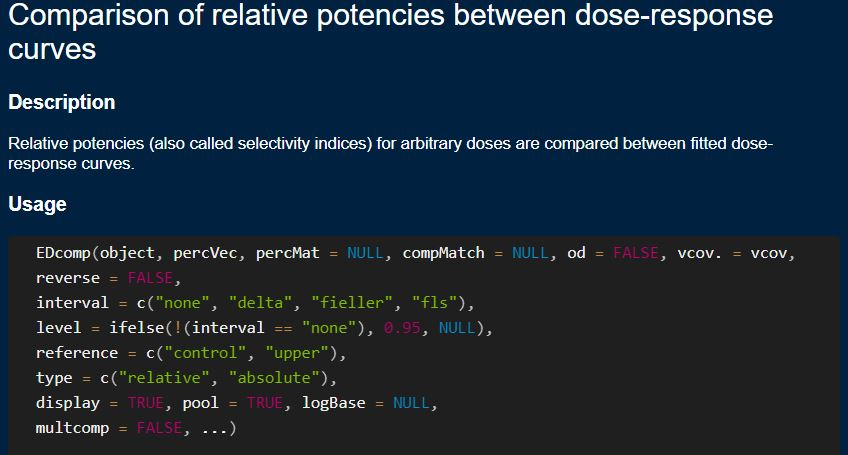

```{r setup, include=FALSE}
knitr::opts_chunk$set(echo = TRUE, cache = F)
library(tidyverse)
library(drc)
```

## Background

A common experimental design in ecotoxicology involves understanding how toxicity changes given a changing factor. In these circumstances, being able to test whether there is a difference in ECx values will be useful.

`drc` has a function, *EDcomp*,  to do this. From the help file `?EDcomp`: 

_Relative potencies (also called selectivity indices) for arbitrary doses are compared between fitted dose-response curves._

The function takes a range of inputs: 

```{r drm_help, fig.align='tight', out.width="80%", echo=FALSE}

```

The key ones are: 

- *object*  is our `drm` model object where we have specified a factor for the function to group our data to fit separate models (i.e., our time column in the daphnid example)

- *percVec* is the ECx values we wish to compare. A minimum of two numbers should be provided in the form `percVec = c(50,50)`

- *interval* specifies the approach to calculating confidence intervals

- *reference* allows us to specify whether the `upper` asymptote or `control` response is the upper limit.  

There are some other handy features that let us quickly analyse and compare ECx's built into the `drc` package that we will also explore. 

## Setting up our example 

Let's revisit the `daphnids` dataset. 

```{r daphnids}
data(daphnids)
head(daphnids, 3)
```

We can fit our log-logistic 2-parameter model where we specify **curveid** as the factor *time* in our dataset. The plot confirms individual dose models were applied to the 24h and 48h data. 

```{r}
daphnids.m1 <- drm(no/total~dose, weights = total,curveid = time,
                   data = daphnids, fct = LL.2(), type = "binomial")

plot(daphnids.m1, type='all')

```

## ED function

We can use the *ED* function to calculate ECx values for both models. If *curveid* is defined then this is automatic. 

```{r}
ED(daphnids.m1, c(10), "delta")
```
Note that we didn't define the arguments (e.g., `respLev = c(10)`). R will match the input to the argument based on the order that the arguments are given and their datatype.   


## Using the EDcomp function 

We can now use the EDcomp function to do a significance test to determine if there is a statistical difference. 

```{r}
EDcomp(daphnids.m1, percVec=c(10, 10), interval="delta")
```

Confidence intervals of the ratios of effect doses (i.e., the range of lower and upper) that contain 1 are not considered significantly different. So there is no evidence of a significant difference at the EC10 level. Let's check the EC50 level.

```{r}
EDcomp(daphnids.m1, percVec=c(50, 50), interval="delta")
```

The confidence intervals do not overlap 1 so there is a significant difference at the EC50 level. 

We can plot how the ratio response level changes over the range of effect concentrations using the *relpot* function: 

```{r}
relpot(daphnids.m1, scale='percent', interval="delta")
```


